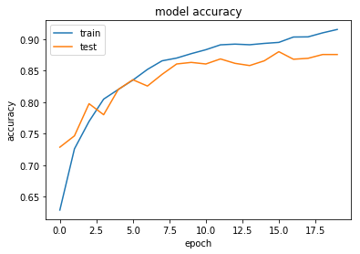

  

**Airbus Ship Detection**

  

**GOAL**

  

To detect if there is a ship in the image. For that I have built a Convoluional Neural Network and solved the problem as a binary classification problem.

  

**DATASET**

  

https://www.kaggle.com/competitions/airbus-ship-detection/data

  

**DESCRIPTION**

  

This project will help us in detecting the airbus ship using the dataset given

  

**WORK DONE**

* Analyzed the data and found insights such as correlation, missing values and plotted different plots and compared them.
* Next trained model with algorithms using Convoluional Neural Network and solved the problem as a binary classification problem.

**LIBRARIES NEEDED**

* Numpy
* Pandas
* Matplotlib
* scikit-learn
* keras
* seaborn
* tqdm
* zipfile
  
  

**PLOTS**

**CONTRIBUTION BY**

*Bhanupriya Gupta*

  
 
