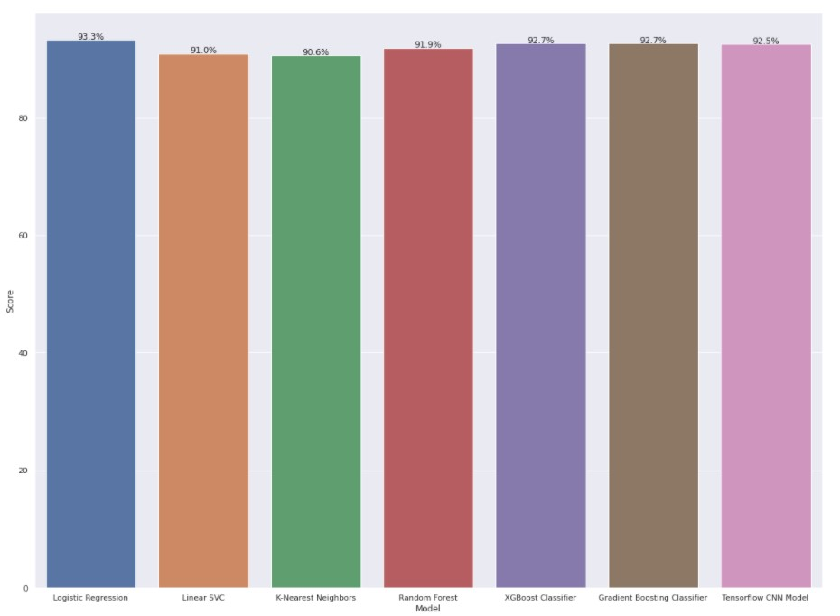
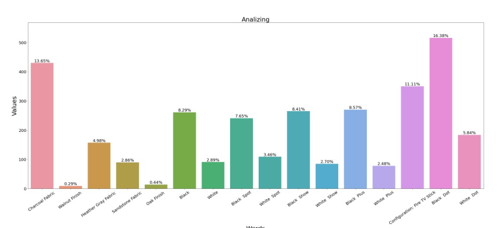

  

**Amazon Alexa Reviews**

  

**GOAL**

  
Finding out different patterns in the reviews of the Alexa.
  

**DATASET**

  

https://www.kaggle.com/sid321axn/amazon-alexa-reviews

  

  

**WORK DONE**

* Analyzed the data and found insights and plotted graphs accordingly etc.
* Preprocessed the data to make it fit for training for ML models.
* Next trained model with algorithms with default parameters:
	* Logistic Regression
	* Linear SVM
	* KNN Classifier
	* Random Forest
	* XGBoost
	* Gradient Boosting Classifier
	* Tensorflow CNN Model
* In this 	Logistic Regression performed the best with 93.33% accuracy. (Refer : `EDA and Model Training on Alexa Reviews.ipynb`)
  

**MODELS USED**

1. Logistic Regression : Logistic regression is easier to implement, interpret, and very efficient to train. It is **very fast at classifying unknown records**.
2. Linear SVM : SVM performs well on classification problems when size of dataset is not too large.
3. KNN Classifier : The KNN algorithm can compete with the most **accurate models because it makes highly accurate predictions**. Therefore, we use the KNN algorithm for applications that require high accuracy but that do not require a human-readable model.
4. Random Forest : It **provides higher accuracy through cross validation**. Random forest classifier will handle the missing values and maintain the accuracy of a large proportion of data. If there are more trees, it won't allow over-fitting trees in the model.
5. XGBoost : XGBoost is **a library for developing fast and high performance gradient boosting tree models**. XGBoost achieves the best performance on a range of difficult machine learning tasks.
6. Gradient Boosting Classifier : Gradient boosting algorithm can be used for predicting not only continuous target variable (as a Regressor) but also categorical target variable (as a Classifier). When it is used as a regressor, the cost function is Mean Square Error (MSE) and when it is used as a classifier then the cost function is Log loss.

**LIBRARIES NEEDED**

* Numpy
* Pandas
* Matplotlib
* scikit-learn
* xgboost
* seaborn
* Tensorflow
  
  

**PLOTS**

  

**CONCLUSION**

  

We investigated the data, checking for data unbalancing, visualizing the features, and understanding the relationship between different features. We then investigated two predictive models. The data was split into two parts, a train set and a test set.

We started with Logistic Regression, SVM, KNN, Random Forrest Classifier, XGBoost Clssifier , Gradient Boosting Classifier and Tensorflow CNN and Logisitic Regression had the higgest accuracy followed by XGBoost Classifier.

  

**CONTRIBUTION BY**

*Sankalp Srivastava*

  
  
