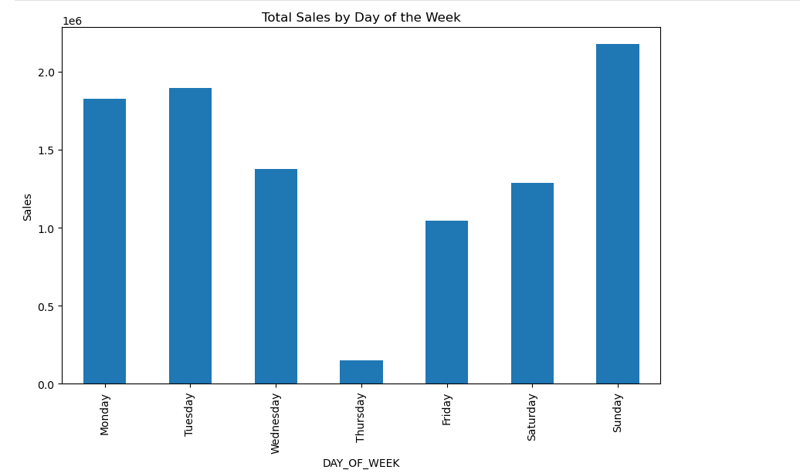
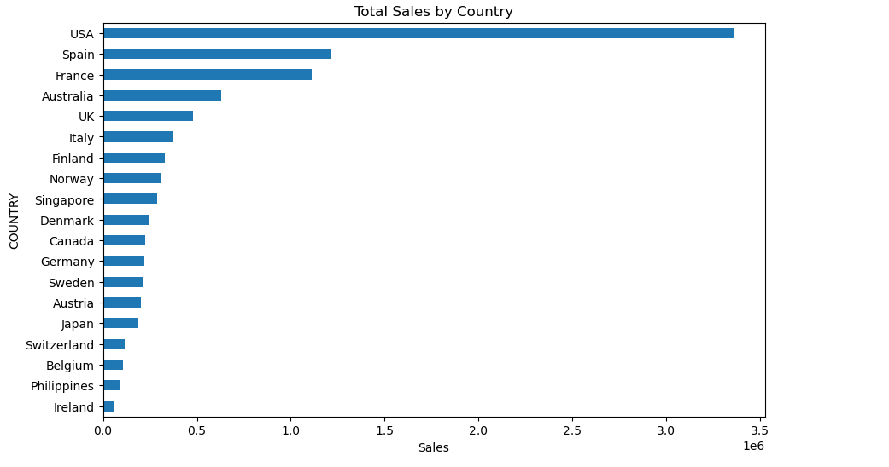
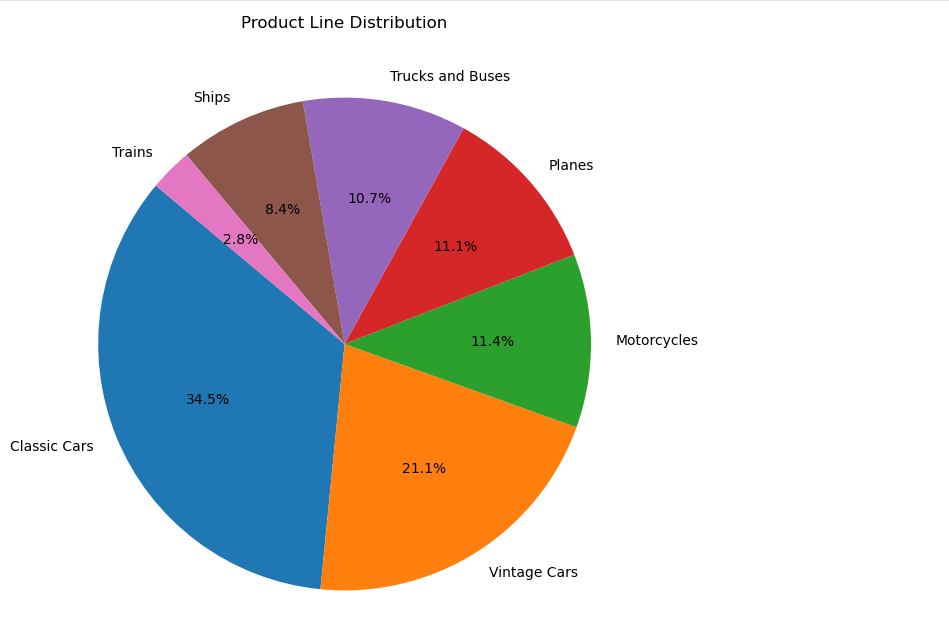
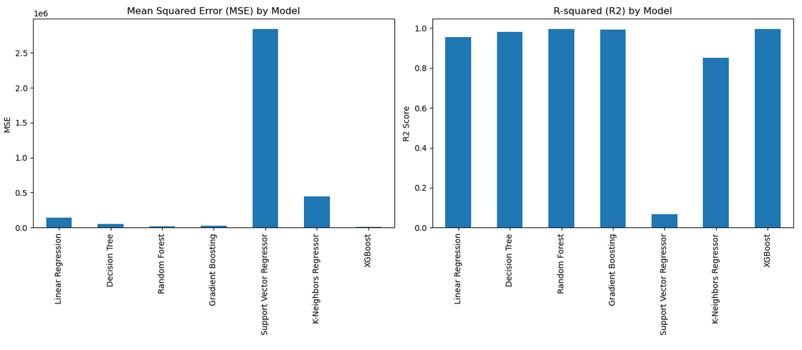

# Sales Data Analysis and Prediction

This project involves analyzing and predicting sales data. The dataset contains information about orders, products, customers, and sales figures. The goal is to clean, analyze, and model the data to gain insights and make predictions.

## Table of Contents
- [Overview](#overview)
- [Data Description](#data-description)
- [Data Cleaning](#data-cleaning)
- [Exploratory Data Analysis](#exploratory-data-analysis)
- [Modeling](#modeling)
- [Conclusions](#conclusions)

## Overview
This project analyzes sales data to extract meaningful insights and build predictive models. The dataset used in this analysis includes various attributes related to orders, products, and customers. The main tasks involved in this project are:
1. Data Cleaning
2. Exploratory Data Analysis (EDA)
3. Building Predictive Models
4. Visualizing the results

## Data Description
The dataset used in this project includes the following columns:
- `ORDERNUMBER`: Order number
- `QUANTITYORDERED`: Quantity ordered
- `PRICEEACH`: Price per item
- `ORDERLINENUMBER`: Order line number
- `SALES`: Total sales amount
- `ORDERDATE`: Date of the order
- `DAYS_SINCE_LASTORDER`: Days since the last order
- `STATUS`: Order status
- `PRODUCTLINE`: Product line
- `MSRP`: Manufacturer's Suggested Retail Price
- `PRODUCTCODE`: Product code
- `CUSTOMERNAME`: Customer name
- `PHONE`: Customer phone number
- `ADDRESSLINE1`: Customer address line 1
- `CITY`: Customer city
- `POSTALCODE`: Customer postal code
- `COUNTRY`: Customer country
- `CONTACTLASTNAME`: Contact last name
- `CONTACTFIRSTNAME`: Contact first name
- `DEALSIZE`: Deal size (Small, Medium, Large)

## Data Cleaning
The initial step involves cleaning the data to ensure accuracy and consistency. This includes:
- Handling missing values
- Converting data types
- Standardizing date formats

## Exploratory Data Analysis
EDA involves visualizing and summarizing the main characteristics of the data. Key analyses include:
- Distribution of sales
- Sales trends over time
- Top products by sales
- Customer segmentation

Examples:

## Modeling
Several predictive models are built and evaluated to forecast sales and identify factors influencing sales. Models used include:
- Linear Regression
- Decision Trees
- Random Forests
- Gradient Boosting
- SVR
- K-neighbour Regressor
- XGBoost

## Conclusions
1. XGBoost performs the best.
2. SVR performs the worst.
