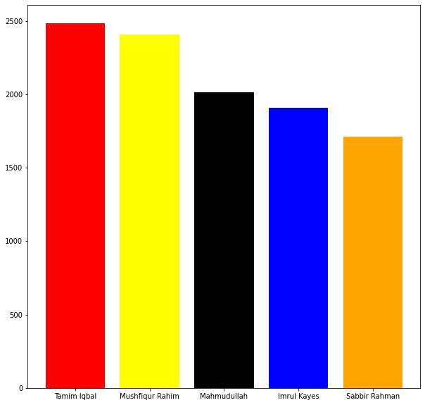
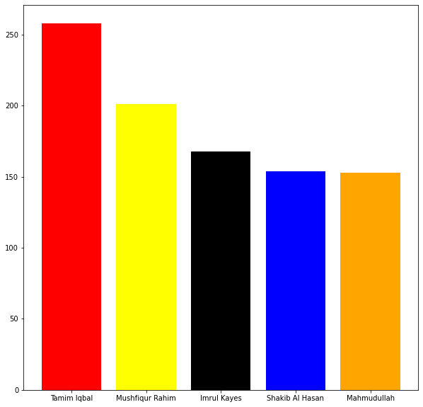
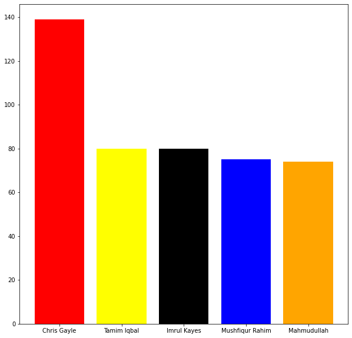

**Bangladesh Premier league Analysis**

  

**GOAL**

  
 Analysing Bangladesh Premier League Analysis with the help of python.

  

**DATASET**

 https://www.kaggle.com/abdunnoor11/bpl-data

  

**DESCRIPTION**

  
The main aim of the project is to analysis the dataset by taking different criterias in to account.

  

**WORK DONE**

* Analyzed the dataset, analysis are as follows
* Analyzed for the man of the match awards and plotted the top 5 ones.
* Analyzed for the batsman with maximum number of runs fours and sixes
* Analyzed the tosses and the teams that have won most number of tosses and the decisions taken by the them.
* Analyzed the bowlers with most number of wickets.
* Analyzed the umpires and plotted the top 5 ones based on the number of matches.
  

**LIBRARIES NEEDED**

* pandas
* matplotlib

  
  

## **VISUALIZATION.**
_________________________________________
## **Maximum runs top 5 batsman**

## **Most fours**

## **Most sixes**

## **Most wickets**

**CONCLUSION**

  

The dataset was analysed and the above analysis were made , which can be used by teams in analysing their opponents.
  

**CONTRIBUTION BY**

*Vishnu Bhaarath*

  
  
