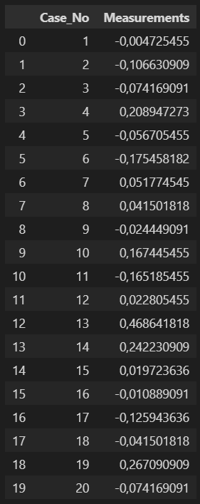
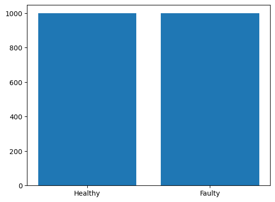

# Bearing Classification using ML 

## PROJECT TITLE

Bearing Classification

## GOAL

To identify faulty and healthy bearing. 

## DATASET

The link for the dataset used in this project:  https://www.kaggle.com/datasets/zlemglsmklkaya/healthy-vs-faulty-bearings/data?select=Healthy-bearing.csv

## EDA:

Shape: (1998,2)

## DESCRIPTION

This project aims to identify the faulty and helthy bearings.

## WHAT I HAD DONE

1. Data collection: From the link of the dataset given above. 
2. Data preprocessing: Preprocessed the data to create valid features.
3. Model selection: XGBC,Random Forest,Logestic Regression,Gaussian Bayes,AdaBoost Classifier.
4. Comparative analysis: Compared the accuracy score of all the models.

## MODELS SUMMARY

- XGBC
- Logistic Regression
- Adaboost Classifier
- Random Forest Classifier
- Gaussian Bayes

## LIBRARIES NEEDED

The following libraries are required to run this project:

- matplotlib
- numpy
- pandas
- sklearn

## EVALUATION METRICS

The evaluation metrics I used to assess the models:

- Accuracy 

It is shown using Confusion Matrix in the Images folder

## RESULTS
Results on Val dataset:
XGBC: 77%
Random Forest: 74.33%
Adaboost: 75.67%
Logistic Regression: 52%
Gaussian Bayes: 73%

## CONCLUSION
Based on results we can draw following conclusions:

1.The XGBC worked the best