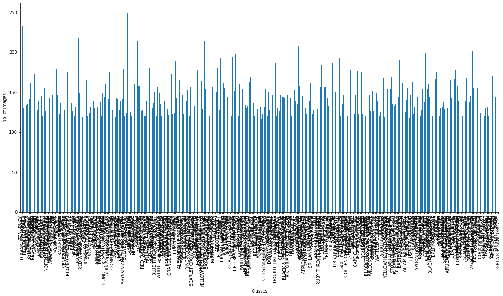
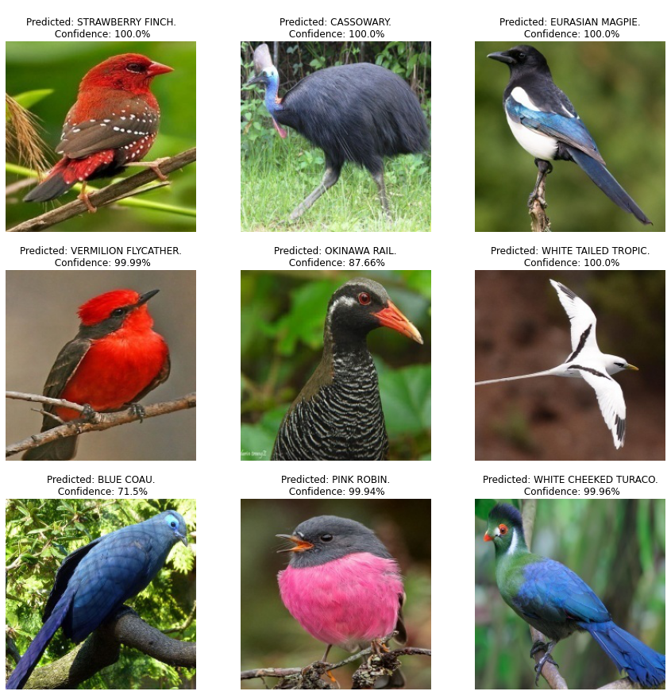

# Birds Images Classification

**Goal**

The Main Aim of the this project to build a deep learning model that can correctly classify birds images.

**Dataset**

The Kaggle Dataset link [Click Here](https://www.kaggle.com/gpiosenka/100-bird-species)

**Description**

In this project we have build a deep learning model using CNN which is build using a Transfer learning keras model known as DenseNet201 to train our dataset and after training the model is used for classification of birds images.

**Work Done**

- Importing the Dependencies.
- Performed data augmentation and loading the dataset.
- We have used `.flow_from_directory()` from tensorflow to load the labels and images together from `train-valid-test` folder.
- Stored the classes used in the dataset.
- find the datatye and shape of the dataset.
- Performed visualization of number of each classes in the dataset. 
- Used Transfer learning model i.e DenseNet201 for this project to create the CNN.
- We have taken the base layer of DenseNet201 and with that we add our own tail layer for build the model.
- Then after compiling and running our model we performed inferencing on the test data.
- Finally save the model.

**Model Used**

- Transfer learning model i.e **DenseNet201** from keras with that we applied functional api.

**Libraries Used**

- Tensorflow
- Seaborn
- Matplotlib
- Numpy
- Pandas
- os
- warnings

**Visualization**

*Number of images per category*

*Inference Images*

**Accuracies**

The model gave a training accuracy of 94% after 7 epochs

**Conclusion**

The conclusion that can be drawn after performing the experiment is that when the model trained with a transfer learning model it provided an accuracy of 94% on training set when epoched for 7 times. But When we are training the dataset with custom CNN architecture we get a less accuracy of around 60%. As the dataset has many classes to classify the the model need to be complex so that's why we chose a pretrained model i.e DenseNet201 which has got 201 layers.
***********************************************************
**Contributor**

Contributed by - Arya Sarkar

