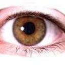
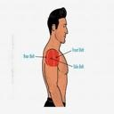

**Image Classification**

  

**GOAL**

  

Identifying the images of different body parts.Algorithm used for this purpose was CNN.

  

**DATASET**

https://www.kaggle.com/linkanjarad/body-parts-dataset

  

**DESCRIPTION**

  
The main aim of the project is to implement an algorithm which detects the different body parts.

  

**WORK DONE**

* Analyzed the dataset and it turns out to be a balanced one.
* Rescaled all the images and also applied different image augumentation technique on the training data.
* After applying augumentation defined an CNN architecture and train the model.

  

**LIBRARIES NEEDED**

* tensorflow
* keras
  
  

## **VISUALIZATION.**
_________________________________________
## **Elbow Sample Image**

## **Eye Sample Image**

## **Shoulder Sample Image**

**CONCLUSION**

  

The dataset was analysed and checked for class imbalance, then different image augumentation techniques were applied and CNN was used for the training purpose and an accuracy of around 98% was observed on the training dataset.
  

**CONTRIBUTION BY**

*Vishnu Bhaarath*

  
  
