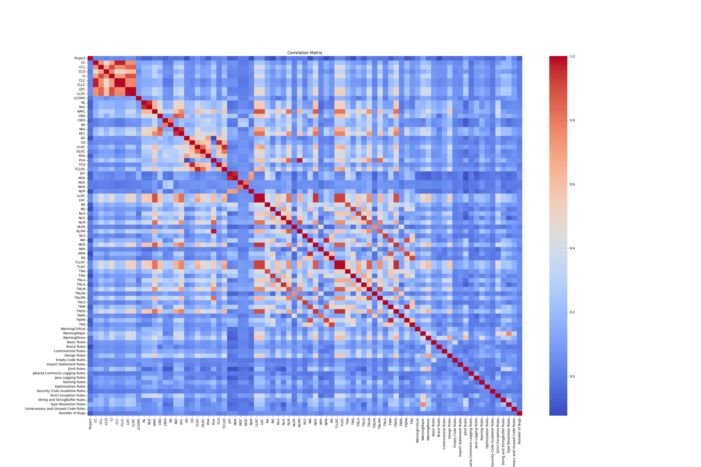
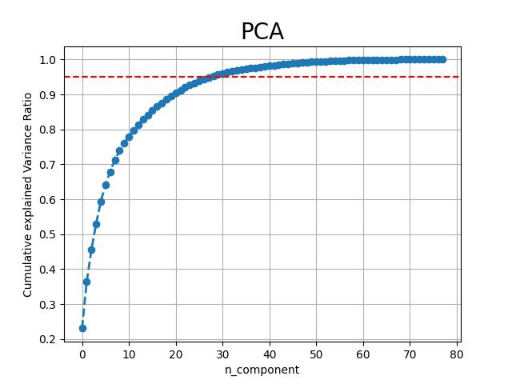
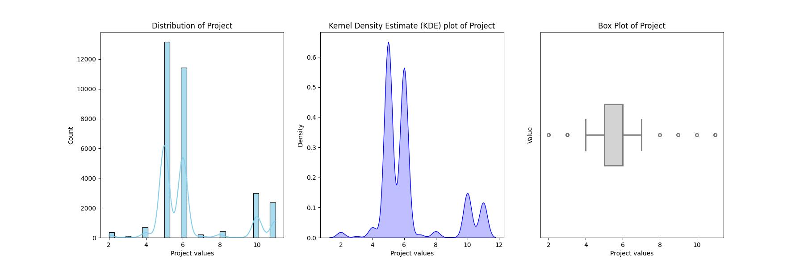
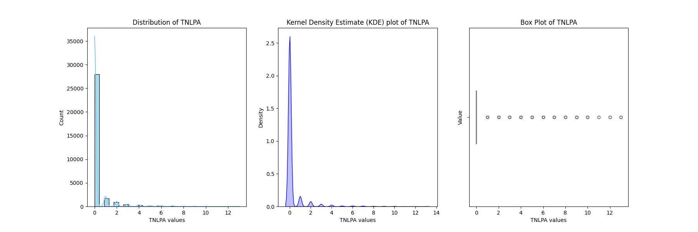
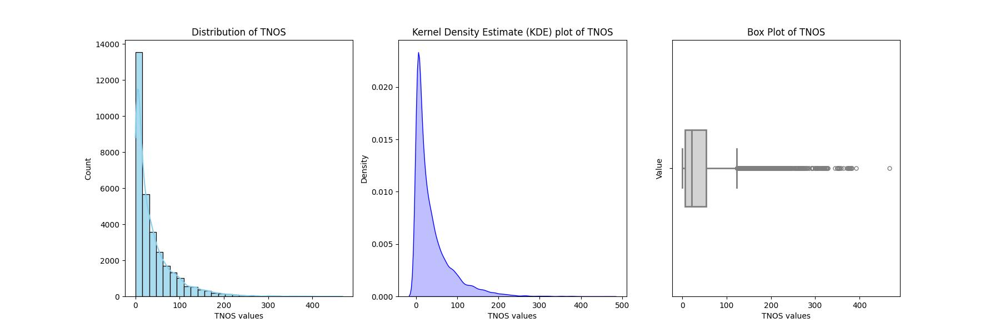
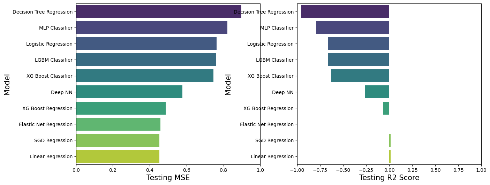

<h1>Bug Hunter Analysis</h1>

**GOAL**

To build a machine learning model for analysis the bug status of the current commit history or not.

**DATASET**

https://www.kaggle.com/datasets/vellyy/bug-hunter/data

**DESCRIPTION**

To analyze the dataset of Bug hunter analysis and build and train the model on the basis of different features and variables.

Dataset is explained properly in Dataset [README](./Dataset/README.md) file.

### Visualization and EDA of different attributes:

**MODELS USED**

| Model                   | MSE_train | R2_train | MSE_test | R2_test  |
|-------------------------|-----------|----------|----------|----------|
| Linear Regression       | 0.443452  | 0.018401 | 0.452234 | 0.013536 |
| SGD Regression          | 0.443768  | 0.017702 | 0.452410 | 0.013152 |
| Elastic Net Regression  | 0.451765  | 0.000000 | 0.458479 | -0.000086|
| XG Boost Regression     | 0.270672  | 0.400858 | 0.487303 | -0.062960|
| Deep NN                 | 0.262022  | 0.420003 | 0.578382 | -0.261633|
| XG Boost Classifier     | 0.408444  | 0.095894 | 0.746341 | -0.628005|
| LGBM Classifier         | 0.601353  | -0.331119| 0.761605 | -0.661299|
| Logistic Regression     | 0.747010  | -0.653535| 0.762707 | -0.663702|
| MLP Classifier          | 0.556185  | -0.231137| 0.821400 | -0.791732|
| Decision Tree Regression| 0.125428  | 0.722360 | 0.897956 | -0.958724|

**WHAT I HAD DONE**

* Load the dataset which contains 84562 entries in it and having 99 columns in it.
* Checked for missing values and cleaned the data accordingly.
* Analyzed the data, found insights and visualized them accordingly.
* Plotting heatmap using correlation and checking the relation between different features.
* Found detailed insights of different columns with target variable using plotting libraries.
* Train the datasets by different models and tune the hyper-parameters to get maximum efficiency.
* Saves their accuracies into a dataframe.

**LIBRARIES NEEDED**

1. Pandas
2. Matplotlib
3. Sklearn
4. NumPy
5. XGBoost
6. Tensorflow
7. Keras
8. Sci-py
9. Seaborn

**CONCLUSION**

- Linear & SGD Regression models show promising performance with lower MSE and higher R2 values.
- Decision Tree Regression achieved perfect R2 on the training set but performed poorly on the test set, indicating overfitting.
- Deep Neural Network (NN) has an accuracy of 46%.

**YOUR NAME**

*Avdhesh Varshney*

  

