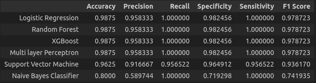

**Cardio Vascular Dataset Analysis**

**GOAL**

Implementation of different algorithms like logistic regression, SVM, Naive Bayes, Random Forest, XGBoost, and Multi Layer Perceptron to see which gives better accuracy.

**DATASET**

The dataset used in this project is related to cardiovascular diseases and contains various features such as age, gender, cholesterol levels, and more.

**DESCRIPTION**

The main aim of the project is to use multiple algorithms to implement models and compare their performance to determine the best-fitted algorithm by checking the accuracy score.

**WORK DONE**

* Analyzed the data to find insights such as correlation and missing values.
* Plotted different visualizations to understand the data distribution and relationships.
* Trained models using the following algorithms:
    * Logistic Regression
    * SVM
    * Naive Bayes
    * Random Forest
    * XGBoost
    * Multi Layer Perceptron
* Evaluated the models based on accuracy, precision, recall, F1 score, and confusion matrix.
* Identified that XGBoost performed the best with high accuracy.

**MODELS USED**

1. **Logistic Regression:** A statistical model that in its basic form uses a logistic function to model a binary dependent variable.
2. **SVM:** Support Vector Machine performs well on classification problems when the dataset is not too large. It can also be used for regression tasks.
3. **Naive Bayes:** A probabilistic classifier based on Bayes' Theorem with strong independence assumptions between the features.
4. **Random Forest:** Provides higher accuracy through cross-validation. It handles missing values and maintains accuracy with large datasets.
5. **XGBoost:** A library for developing fast and high-performance gradient boosting tree models. It achieves the best performance on a range of difficult machine learning tasks.
6. **Multi Layer Perceptron:** MLPClassifier used to train a Multi Layer Perceptron for classification tasks.

**LIBRARIES NEEDED**

* numpy
* pandas
* matplotlib
* seaborn
* scikit-learn
* xgboost

**EDA RESULTS**
<h4>Column Information</h4>
<pre>
 #   Column                             Non-Null Count  Dtype
---  ------                             --------------  -----
 0   sex (F=0,M=1)                      399 non-null    int64
 1   age                                399 non-null    int64
 2   Family history of heart disease    399 non-null    int64
 3   History of heart disease           399 non-null    int64
 4   echotype-mass                      399 non-null    int64
 5   echotype-myxoma                    399 non-null    int64
 6   echotype-thrombose                 399 non-null    int64
 7   echotype-fibroma                   399 non-null    int64
 8   echotype-vegetation                399 non-null    int64
 9   echotype-papillary fibroelastoma   399 non-null    int64
 10  echomasstype                       399 non-null    int64
 11  echoposition                       399 non-null    int64
 12  echomalignancy                     399 non-null    int64
 13  echosize                           399 non-null    int64
 14  echonumbers                        399 non-null    int64
 15  echoconsistency                    399 non-null    int64
 16  surgeryposition                    399 non-null    int64
 17  surgerysize                        399 non-null    int64
 18  surgerynumbers                     399 non-null    int64
 19  pathotype-myxoma                   399 non-null    int64
 20  pathotype-thrombose                399 non-null    int64
 21  pathotype-fibroma                  399 non-null    int64
 22  pathotype-sarcoma                  399 non-null    int64
 23  pathotype-carci0ma                 399 non-null    int64
 24  pathotype-lypoma                   399 non-null    int64
 25  pathotype-vegetation               399 non-null    int64
 26  pathotype-endocarditis             399 non-null    int64
 27  pathotype-NBTE                     399 non-null    int64
 28  pathotype-papillary fibroelastoma  399 non-null    int64
 29  pathomalignancy                    399 non-null    int64
</pre>

<!-- <h4>Statistical Information</h4>
<pre>
	sex (F=0,M=1)	age	Family history of heart disease	History of heart disease	echotype-mass	echotype-myxoma	echotype-thrombose	echotype-fibroma	echotype-vegetation	echotype-papillary fibroelastoma	...	pathotype-thrombose	pathotype-fibroma	pathotype-sarcoma	pathotype-carci0ma	pathotype-lypoma	pathotype-vegetation	pathotype-endocarditis	pathotype-NBTE	pathotype-papillary fibroelastoma	pathomalignancy
count	399.000000	399.000000	399.000000	399.000000	399.000000	399.000000	399.000000	399.000000	399.000000	399.000000	...	399.000000	399.000000	399.000000	399.000000	399.000000	399.000000	399.000000	399.000000	399.000000	399.000000
mean	0.448622	50.854637	0.170426	0.355890	0.546366	0.195489	0.125313	0.030075	0.022556	0.080201	...	0.095238	0.067669	0.185464	0.095238	0.017544	0.037594	0.025063	0.012531	0.075188	0.373434
std	0.497978	23.437052	0.376479	0.479383	0.498471	0.397074	0.331489	0.171009	0.148671	0.271944	...	0.293912	0.251493	0.389161	0.293912	0.131451	0.190451	0.156512	0.111379	0.264025	0.484323
min	0.000000	3.000000	0.000000	0.000000	0.000000	0.000000	0.000000	0.000000	0.000000	0.000000	...	0.000000	0.000000	0.000000	0.000000	0.000000	0.000000	0.000000	0.000000	0.000000	0.000000
25%	0.000000	37.000000	0.000000	0.000000	0.000000	0.000000	0.000000	0.000000	0.000000	0.000000	...	0.000000	0.000000	0.000000	0.000000	0.000000	0.000000	0.000000	0.000000	0.000000	0.000000
50%	0.000000	51.000000	0.000000	0.000000	1.000000	0.000000	0.000000	0.000000	0.000000	0.000000	...	0.000000	0.000000	0.000000	0.000000	0.000000	0.000000	0.000000	0.000000	0.000000	0.000000
75%	1.000000	70.000000	0.000000	1.000000	1.000000	0.000000	0.000000	0.000000	0.000000	0.000000	...	0.000000	0.000000	0.000000	0.000000	0.000000	0.000000	0.000000	0.000000	0.000000	1.000000
max	1.000000	91.000000	1.000000	1.000000	1.000000	1.000000	1.000000	1.000000	1.000000	1.000000	...	1.000000	1.000000	1.000000	1.000000	1.000000	1.000000	1.000000	1.000000	1.000000	1.000000
</pre>
-->

**PLOTS**

Correlation Matrix 

Univariate Analysis 

Target class counts 

Top 5 positively correlated features 

 
Top 5 negatively correlated features 

**RESULTS**

**CONCLUSION**

We investigated the dataset, checking for missing values, visualizing the features, and understanding the relationships between different features. We trained and evaluated multiple predictive models, including Logistic Regression (LR), SVM, Naive Bayes (NB), Random Forest, XGBoost and Multi Layer Perceptron (MLP). We found that LR, Random Forest, XGBoost and MLP all achieved the highest accuracy on the test dataset.
We also concluded that age and cholesterol levels are significant features in predicting cardiovascular diseases.

**CONTRIBUTION BY**

*Arijit De*

  

