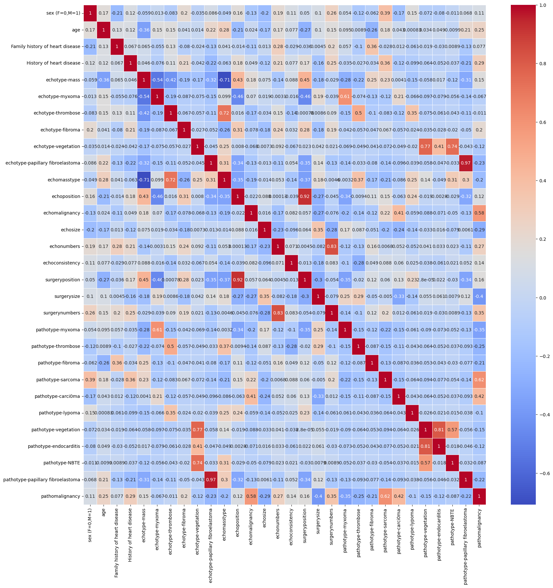
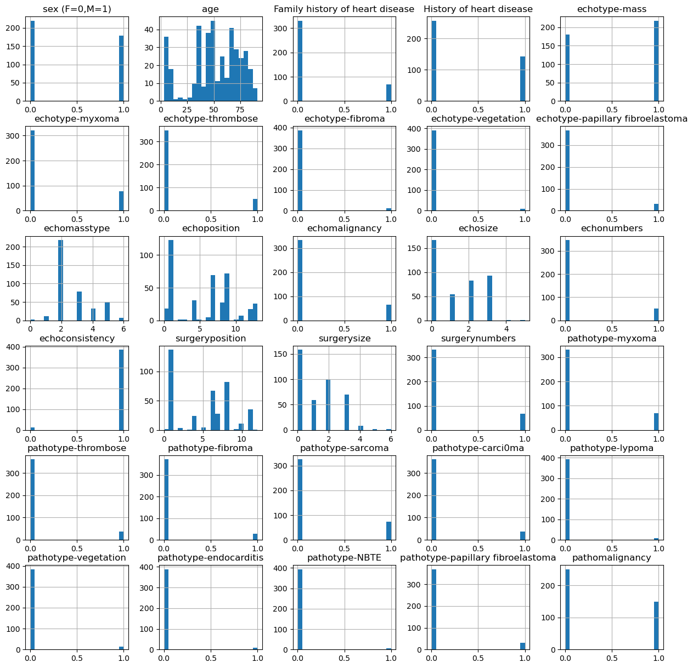
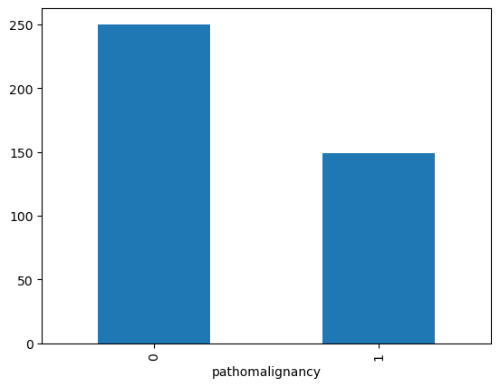
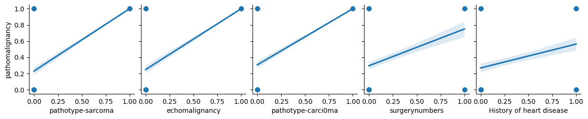
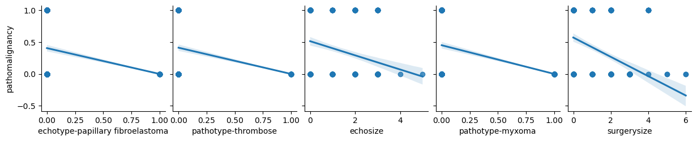

p**Cardio Vascular Dataset Analysis**

**GOAL**

Implementation of different algorithms like logistic regression, SVM, Naive Bayes, Random Forest, XGBoost, and Multi Layer Perceptron to see which gives better accuracy.

**DATASET**

The dataset used in this project is related to cardiovascular diseases and contains various features such as age, gender, cholesterol levels, and more.

**DESCRIPTION**

The main aim of the project is to use multiple algorithms to implement models and compare their performance to determine the best-fitted algorithm by checking the accuracy score.

**WORK DONE**

* Analyzed the data to find insights such as correlation and missing values.
* Plotted different visualizations to understand the data distribution and relationships.
* Trained models using the following algorithms:
    * Logistic Regression
    * SVM
    * Naive Bayes
    * Random Forest
    * XGBoost
    * Multi Layer Perceptron
* Evaluated the models based on accuracy, precision, recall, F1 score, and confusion matrix.
* Identified that XGBoost performed the best with high accuracy.

**MODELS USED**

1. **Logistic Regression:** A statistical model that in its basic form uses a logistic function to model a binary dependent variable.
2. **SVM:** Support Vector Machine performs well on classification problems when the dataset is not too large. It can also be used for regression tasks.
3. **Naive Bayes:** A probabilistic classifier based on Bayes' Theorem with strong independence assumptions between the features.
4. **Random Forest:** Provides higher accuracy through cross-validation. It handles missing values and maintains accuracy with large datasets.
5. **XGBoost:** A library for developing fast and high-performance gradient boosting tree models. It achieves the best performance on a range of difficult machine learning tasks.
6. **Multi Layer Perceptron:** MLPClassifier used to train a Multi Layer Perceptron for classification tasks.

**LIBRARIES NEEDED**

* numpy
* pandas
* matplotlib
* seaborn
* scikit-learn
* xgboost

**PLOTS**

Correlation Matrix 

Univariate Analysis 

Target class counts 

Top 5 positively correlated features 

 
Top 5 negatively correlated features 

**CONCLUSION**

We investigated the dataset, checking for missing values, visualizing the features, and understanding the relationships between different features. We trained and evaluated multiple predictive models, including Logistic Regression (LR), SVM, Naive Bayes (NB), Random Forest, XGBoost and Multi Layer Perceptron (MLP). We found that LR, Random Forest, XGBoost and MLP all achieved the highest accuracy on the test dataset.
We also concluded that age and cholesterol levels are significant features in predicting cardiovascular diseases.

**CONTRIBUTION BY**

*Arijit De*

  

