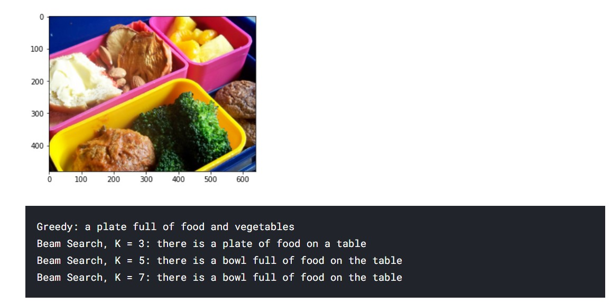
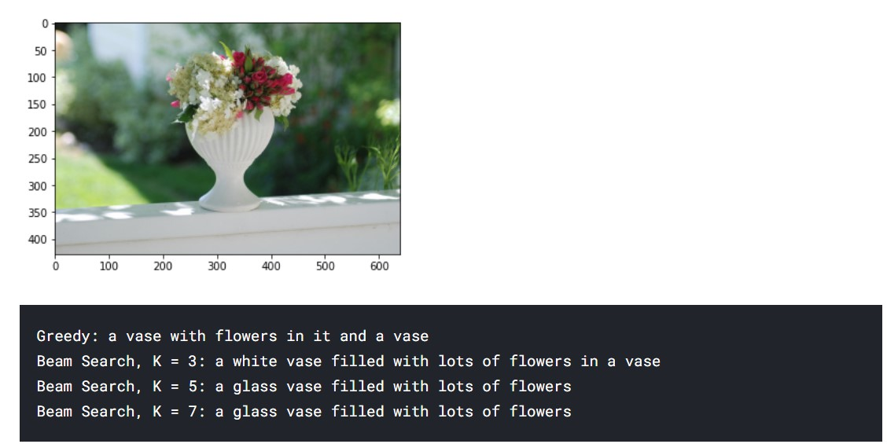
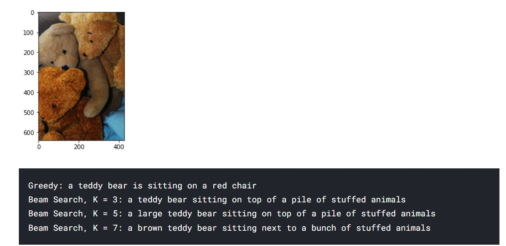
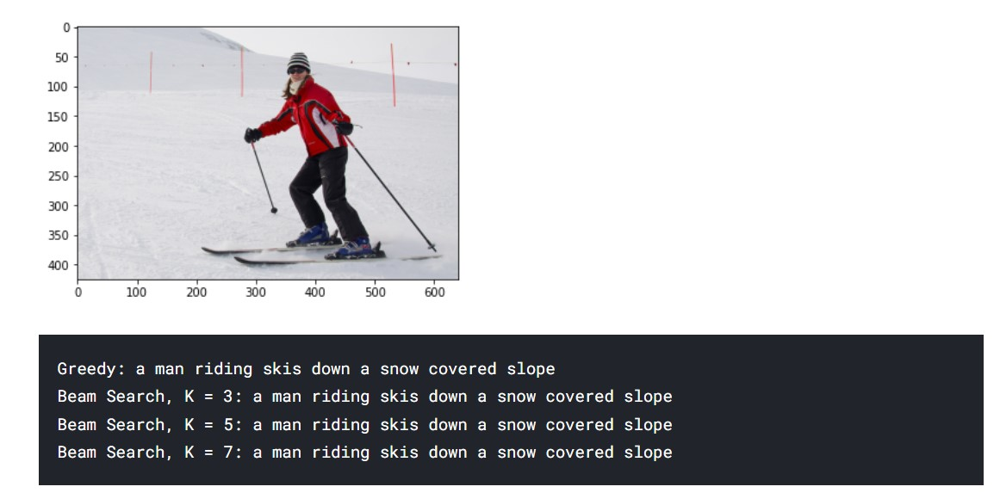

**Caption Generation from Images**
-

**GOAL**

Detect objects from the image and then generate captions for them. LSTM (Long short term memory) network is responsible for generating sentences in English and CNN is used to extract features from image. To build a caption generator we have to combine these two models. 

**DATASET**

  
http://cocodataset.org/#home

**DESCRIPTION**

The main aim of the project is to create a model that can describe an image by generating suitable captions.

  

**WORK DONE**

* Preprocessed the dataset via grouping the images with same id together, removing puncutation and lowercase.
* Created a set with unique words in our caption data and creating an embedding matrix.
* Next used InceptionV3 model and removed its last two output layers and added few embedding , dropouts and lstm layers.
* After Training, output of the model on random data is seen with greedy approach and with beam search with k = 3,5 and 7.
* Trained model is saved with .h5 extension to be used for later.(refer : `image-caption-generator.ipynb`)

  

**MODELS USED**

*Inception v3* : 
Inception v3 is a widely-used image recognition model that has been shown to attain greater than 78.1% accuracy on the ImageNet dataset. The model is the culmination of many ideas developed by multiple researchers over the years. It is based on the original paper: "Rethinking the Inception Architecture for Computer Vision" by Szegedy, et. al.

The model itself is made up of symmetric and asymmetric building blocks, including convolutions, average pooling, max pooling, concatinations, dropouts, and fully connected layers. Batch normalization is used extensively throughout the model and applied to activation inputs. Loss is computed using Softmax.

**LIBRARIES NEEDED**

* Numpy
* Matplotlib
* tensorflow
* keras
  
  

**EXAMPLES**

  

**CONCLUSION**

  

We created a model which takes an image and generate appropriate captions for the same.

  

**CONTRIBUTION BY**

*Sankalp Srivastava*

  
  
