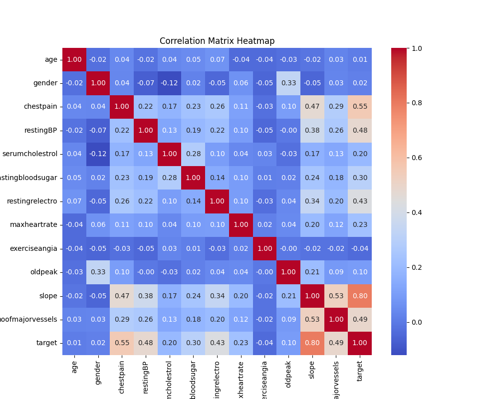
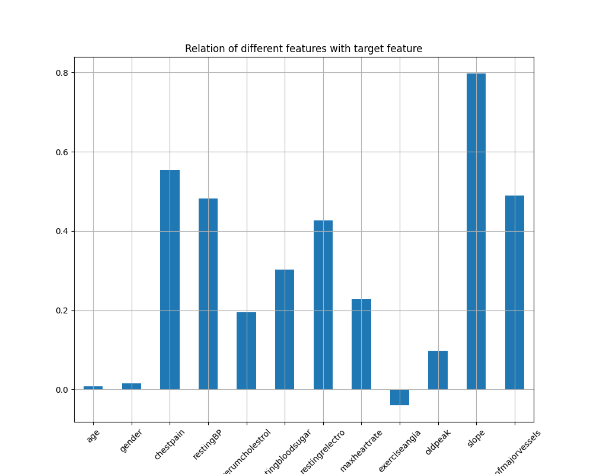
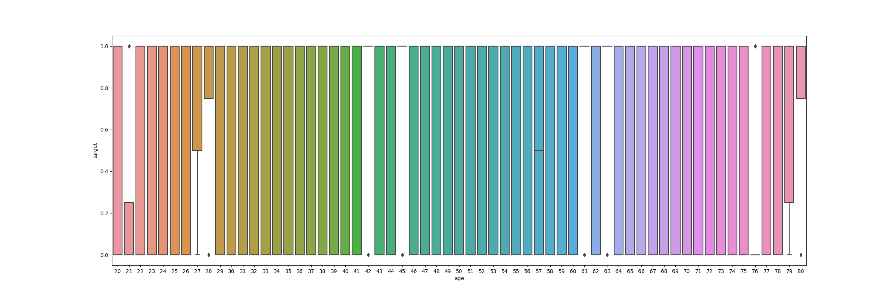
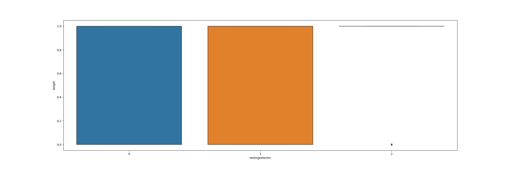

<h1>Cardiovascular Disease Analysis and Prediction</h1>

**GOAL**

The aim of this project is to analyze and predict the disease based on the given dataset.

**DATASET**

https://www.kaggle.com/datasets/jocelyndumlao/cardiovascular-disease-dataset

**DESCRIPTION**

To analyze the dataset of Cardiovascular Disease and build and train the model on the basis of different features and variables.

There are 14 features and 1000 entries in this dataset.

### Visualization and EDA of different attributes:

**MODELS USED**

| Model                       | MSE_train | R2_train | MSE_test  | R2_test   |
|-----------------------------|-----------|----------|-----------|-----------|
| Random Forest Regression    | 0.002946  | 0.987915 | 0.023432  | 0.903483  |
| XG Boost Regression         | 0.000002  | 0.999993 | 0.027463  | 0.886879  |
| Decision Tree Regression    | 0.000000  | 1.000000 | 0.035000  | 0.855834  |
| Ridge Regression            | 0.063654  | 0.738905 | 0.059288  | 0.755792  |
| Linear Regression           | 0.063654  | 0.738907 | 0.059305  | 0.755721  |
| KNN Regression              | 0.094450  | 0.612590 | 0.125600  | 0.482649  |
| Elastic Net Regression      | 0.180585  | 0.259287 | 0.155394  | 0.359926  |

**WHAT I HAD DONE**

* Load the dataset which contains 1000 entries in it and having 14 columns in it.
* Checked for missing values and cleaned the data accordingly.
* Analyzed the data, found insights and visualized them accordingly.
* Plotting heatmap using correlation and checking the relation between different features.
* Found detailed insights of different columns with target variable using plotting libraries.
* Train the datasets by different models and saves their accuracies into a dataframe.

**LIBRARIES NEEDED**

1. Pandas
2. Matplotlib
3. Sklearn
4. NumPy
5. XGBoost
6. Sci-py
7. Seaborn

**CONCLUSION**

- Random Forest and XG Boost Regression models show promising performance with lower MSE and higher R2 values.
- Decision Tree Regression achieved perfect R2 on the training set but performed poorly on the test set, indicating overfitting.

**YOUR NAME**

*Avdhesh Varshney*

  

