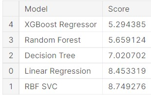
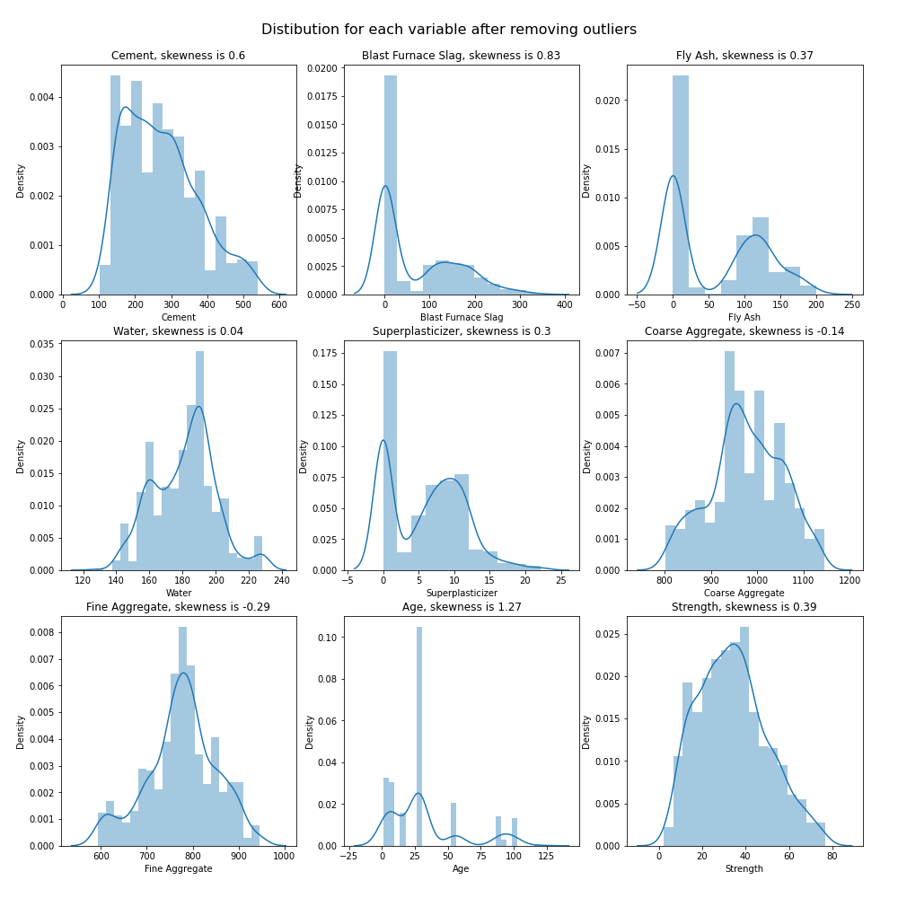

  

**Concrete Strength Calculation**

  

**GOAL**

  

Implementtion of different algorithms like random forest, logistic regression, and XGBoost to see which gives better accuracy.

  

**DATASET**

  

https://www.kaggle.com/prathamtripathi/regression-with-neural-networking

  

**DESCRIPTION**

  

The main aim of the project is to calculate the strength of the concrete using Machine Learning techniques.

  

**WORK DONE**

* Analyzed the data and found insights such as correlation, missing values etc.
* Made a filtered csv with less noise data. (Refer : `eda-concrete-strength.ipynb`)
* Next trained model with algorithms with default parameters:
	* Linear Regression
	* RBF SVM
	* Decision Tree
	* Random Forest
	* XGBoost
* In this XGBoost performed the best with 5.29 rmse. (Refer : `baseline-models-concrete-strength-regression.ipynb`)
* Also added an approach on getting optimal parameters on XGBoost with GPU.(Refer : `xgboost-tuning-concrete-strength-gpu.ipynb`)

  

**MODELS USED**

1. Linear Regression : Linear regression is easier to implement, interpret, and very efficient to train.
2. RBF SVM : SVM performs well on classification problems when size of dataset is not too large. Support Vector Machine can also be used as a regression method, maintaining all the main features that characterize the algorithm (maximal margin).
3. Decision Tree : Decision trees help you to evaluate your options. Decision Trees are excellent tools for helping you to choose between several courses of action. They provide a highly effective structure within which you can lay out options and investigate the possible outcomes of choosing those options.
4. Random Forest : It **provides higher accuracy through cross validation**. Random forest regressor will handle the missing values and maintain the accuracy of a large proportion of data. If there are more trees, it won't allow over-fitting trees in the model.
5. XGBoost : XGBoost is **a library for developing fast and high performance gradient boosting tree models**. XGBoost achieves the best performance on a range of difficult machine learning tasks.

**LIBRARIES NEEDED**

* Numpy
* Pandas
* Matplotlib
* scikit-learn
* xgboost
* seaborn
  
  

**Images**

  

**CONCLUSION**

  

We investigated the data, checking for data unbalancing, visualizing the features, and understanding the relationship between different features. We then investigated two predictive models. The data was split into three parts, a train set, a validation set, and a test set. For the first five  base models, we only used the train and test set.

We started with Linear Regression, SVM, Decision Tree, Random Forest and XGBoost for which we obtained RMSE of 8.453319,8.749276,7.020702,5.659124 and 5.294385 respectively, when predicting the target for the test set.

We followed with XGB regressor and optimizing it using Grid search CV and achieved rmse of (4.551) and r2 score of (0.9194) for the prediction of the test set target values.

  

**CONTRIBUTION BY**

*Sankalp Srivastava*

  
  
