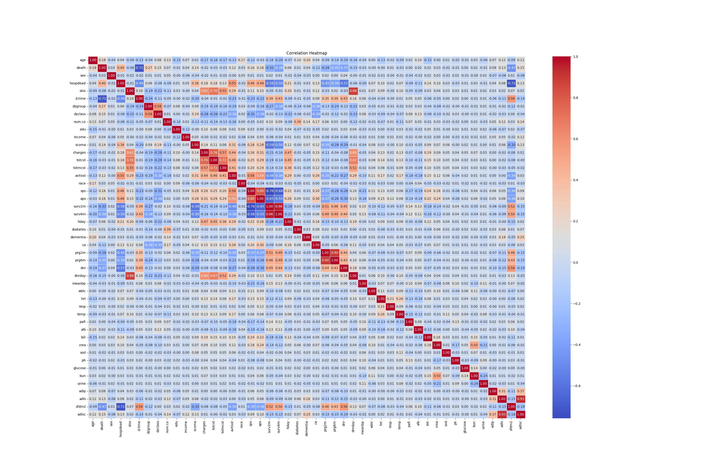
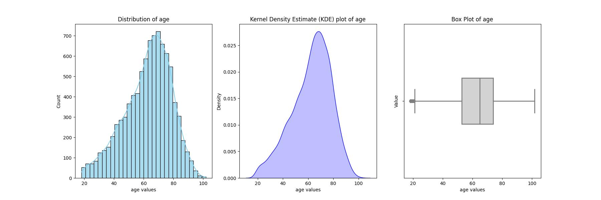
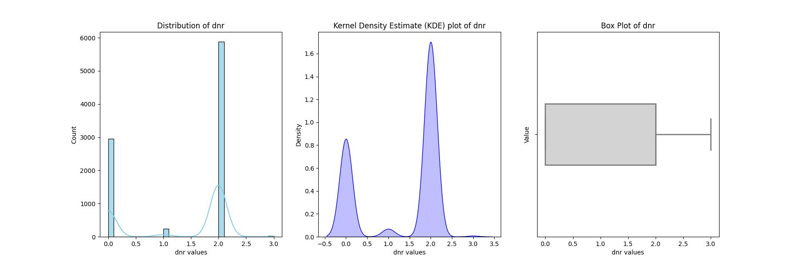
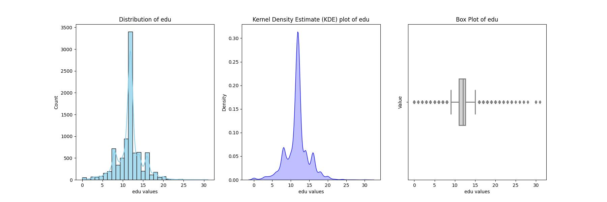
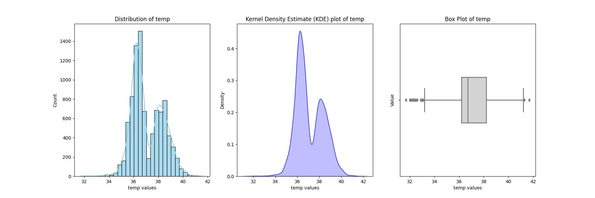
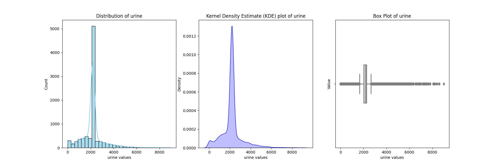

<h1>Critically Ill Patients Analysis and Prediction</h1>

**GOAL**

To build a machine learning model for predicting the patient survival rate or probability.

**DATASET**

https://www.kaggle.com/datasets/margaritakholostova/support-ii-dataset-with-critically-ill-patients

**DESCRIPTION**

To analyze the dataset of Critically Ill Patients and build and train the model on the basis of different features and variables.

There are 2 types of datasets:

- `columns_descriptions`: This dataset contains the description of all the features.
- `support2`: This dataset contains 9105 entries with 47 different features.

### Visualization and EDA of different attributes:

**MODELS USED**

| Model                     | MSE_train | R2_train | MSE_test  | R2_test   |
|---------------------------|-----------|----------|-----------|-----------|
| Random Forest Regression  | 9.52      | 0.88     | 66.02     | 0.14      |
| XG Boost Regression       | 12.08     | 0.82     | 72.75     | 0.08      |
| Linear Regression         | 76.54     | 0.07     | 74.91     | 0.06      |
| Ridge Regression          | 76.54     | 0.07     | 74.91     | 0.06      |
| Elastic Net Regression    | 77.70     | 0.03     | 75.98     | 0.03      |
| Decision Tree Regression  | 0.00      | 1.00     | 127.30    | -0.68     |
| Deep NN                   | 211.83    | -2.24    | 201.13    | -2.35     |

**WHAT I HAD DONE**

* Load the dataset which contains 9105 entries in it and having 47 columns in it.
* Checked for missing values and cleaned the data accordingly.
* Analyzed the data, found insights and visualized them accordingly.
* Plotting heatmap using correlation and checking the relation between different features.
* Found detailed insights of different columns with target variable using plotting libraries.
* Train the datasets by different models and saves their accuracies into a dataframe.

**LIBRARIES NEEDED**

1. Pandas
2. Matplotlib
3. Sklearn
4. NumPy
5. XGBoost
6. Tensorflow
7. Keras
8. Sci-py
9. Seaborn

**CONCLUSION**

- Random Forest and XG Boost Regression models show promising performance with lower MSE and higher R2 values.
- Decision Tree Regression achieved perfect R2 on the training set but performed poorly on the test set, indicating overfitting.
- Deep Neural Network (NN) has a high MSE and negative R2, suggesting poor performance on both training and test sets.

**YOUR NAME**

*Avdhesh Varshney*

  

