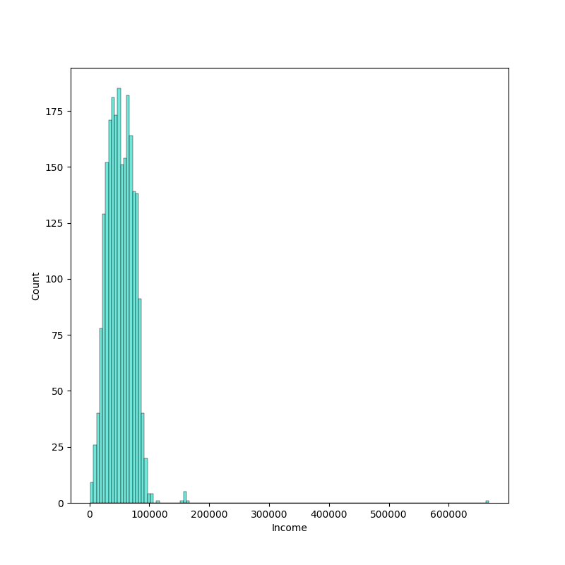
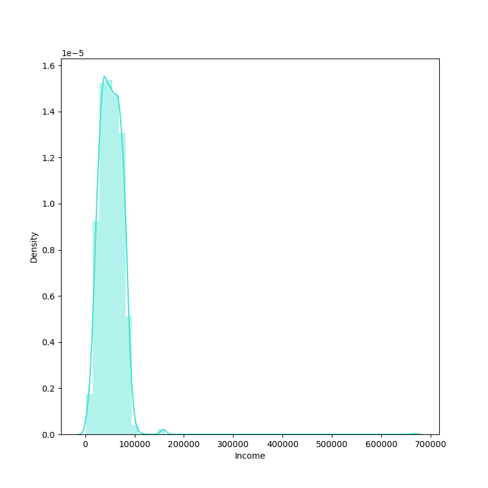
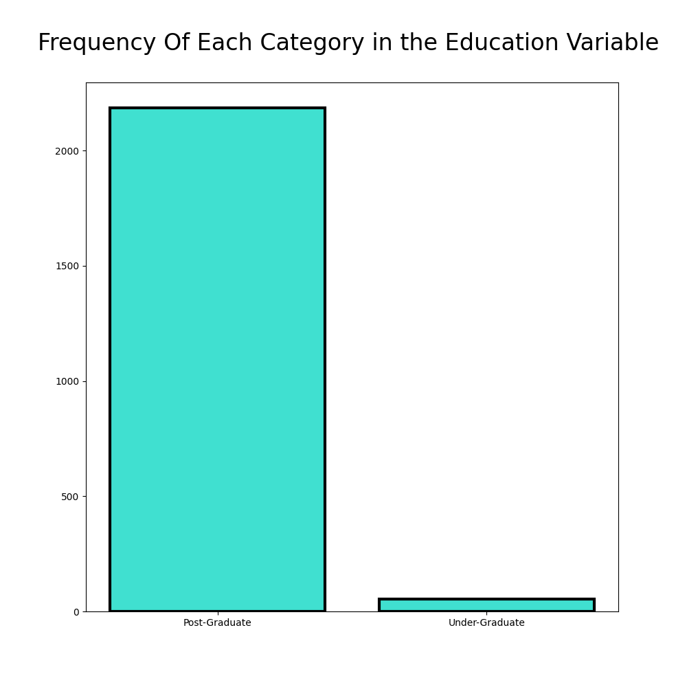

<h1>Customer Personality Analysis</h1>

**GOAL**

To build a machine learning model for predicting the customer's personality on the basis of his daily living.

**DATASET**

https://www.kaggle.com/datasets/imakash3011/customer-personality-analysis

**DESCRIPTION**

To analyze the dataset of customer's personality and build and train the model on the basis of different features and variables.

### Visualization and EDA of different attributes:

**MODEL USED**

| Model             | Shiloutte Score | V Score | Completeness |
|-------------------|-----------------|---------|--------------|
| K-Means           | 0.30            | 0.26    | 0.97         |
| Mean Shift        | 0.18            | 0.23    | 0.96         |
| Agglometric       | 0.19            | 0.21    | 0.98         |
| DBSCAN            | -0.33           | 0.26    | 0.97         |

**WHAT I HAD DONE**

* Load the dataset which contains 2240 entries in it and having 29 columns in it.
* Checked for missing values and cleaned the data accordingly.
* Analyzed the data, found insights and visualized them accordingly.
* Found detailed insights of different columns with target variable using plotting libraries.
* Train the datasets by different models and saves their accuracies into a dataframe.

**LIBRARIES NEEDED**

1. Pandas
2. Matplotlib
3. Sklearn
4. NumPy
5. Seaborn

**CONCLUSION**

About the models implemented:
1. K-Means:
   * K-Means is a popular clustering algorithm that separates data into 'k' groups or clusters. It works by minimizing the inertia or within-cluster sum-of-squares.
2. Mean Shift:
   * Mean Shift is another clustering algorithm that doesn't require the user to specify the number of clusters a priori. Instead, it starts with an initial guess for the number of clusters, and then iteratively refines these clusters by shifting the cluster centroid towards the mean of the points within the cluster.
3. DBSCAN:
   * DBSCAN (Density-Based Spatial Clustering of Applications with Noise) is a density-based clustering algorithm. Unlike k-means, DBSCAN does not require the user to specify the number of clusters a priori. Instead, it starts with an arbitrary point and forms a cluster by including all points that are close to it according to some distance measure (usually Euclidean distance).
4. Agglomerative Clustering
   * Agglomerative clustering is a type of hierarchical clustering that builds a hierarchy of clusters by recursively merging or splitting existing clusters. This is in contrast to divisive clustering, where clusters are formed by splitting data into smaller groups.

About the metrics details:
1. Silhouette Score:
   * The silhouette score is a measure of how similar an object is to its own cluster compared to other clusters. The silhouette scores range from -1 to 1, where a    high value indicates that the object is well matched to its own cluster and poorly matched to neighboring clusters.
2. V Score:
   * The V-measure is a metric used to evaluate the quality of a clustering solution. It takes into account both the homogeneity and completeness of the clustering. The V-measure is the harmonic mean between homogeneity and completeness.
3. Completeness  Score:
   * The completeness score is a measure of the ratio of correctly classified items to the total actual positives. It is the proportion of the actual positive instances that were correctly classified. A higher completeness score implies that the clustering algorithm is performing better.

After using the 4 models. We found that the best model in these is `K-Means` because its all metrics score are high as compared to other models score with Silhouette score - 0.30, V Score - 0.26 and Completeness - 0.97. On the second the `Agglomerative Clustering` is good model to use as its score is better as compared to other models with Silhouette score - 0.19, V Score - 0.21 and Completeness - 0.98.

**Pawas Pandey**

