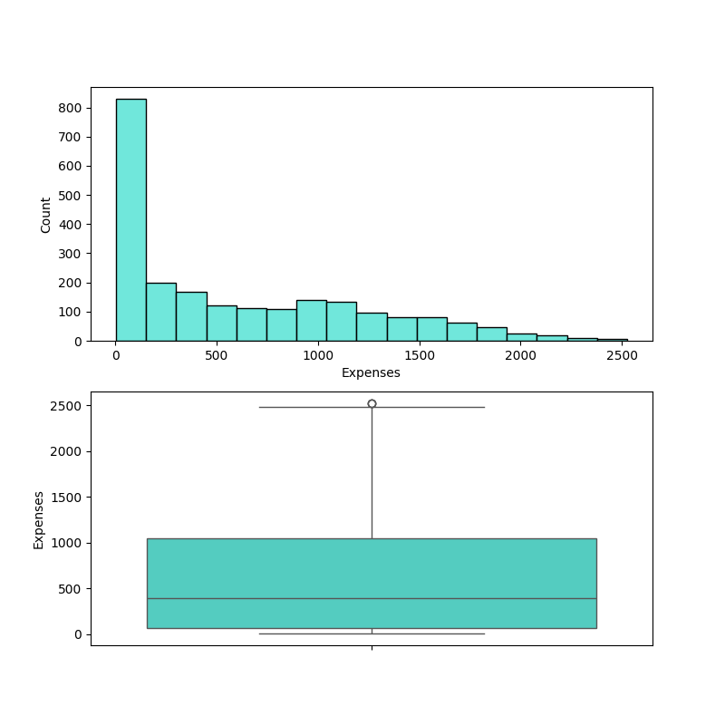
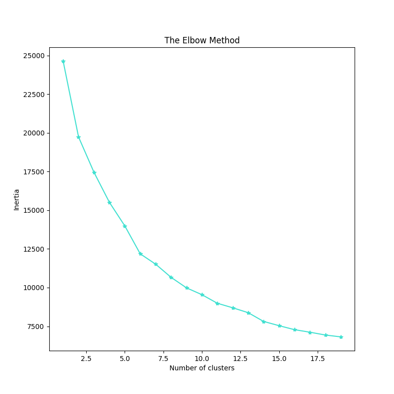
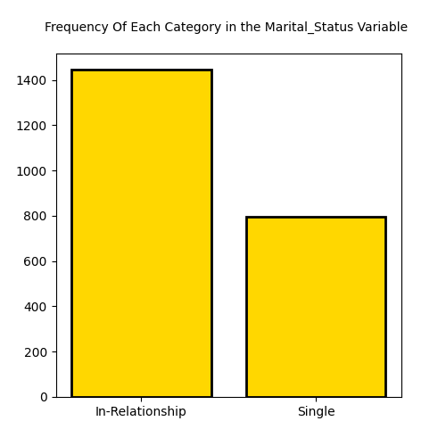

<h1>Customer Personality Analysis</h1>

**GOAL**

To build a machine learning model for predicting the customer's personality on the basis of his daily living.

**DATASET**

https://www.kaggle.com/datasets/margaritakholostova/support-ii-dataset-with-critically-ill-patients

**DESCRIPTION**

To analyze the dataset of customer's personality and build and train the model on the basis of different features and variables.

### Visualization and EDA of different attributes:

**MODEL USED**

K-Means:-  

| Clusters| Inertia   | 
|---------|-----------|
| n = 2   | 19734.56  |
| n = 4   | 15512.71  |
| n = 6   | 12181.35  |
| n = 8   | 10662.54  |
| n = 10  | 9542.45   |
| n = 12  | 8694.499  |
| n = 14  | 7813.57   |

**WHAT I HAD DONE**

* Load the dataset which contains 9105 entries in it and having 47 columns in it.
* Checked for missing values and cleaned the data accordingly.
* Analyzed the data, found insights and visualized them accordingly.
* Found detailed insights of different columns with target variable using plotting libraries.
* Train the datasets by different models and saves their accuracies into a dataframe.

**LIBRARIES NEEDED**

1. Pandas
2. Matplotlib
3. Sklearn
4. NumPy
5. Sci-py
6. Seaborn

**CONCLUSION**

Using different clusters greater than 2 decreases the inertia of the K-Means model.

**Pawas Pandey**

