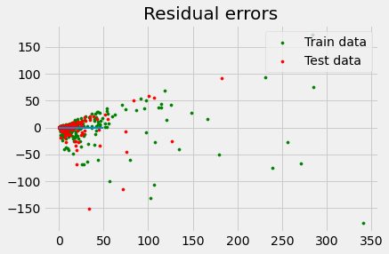
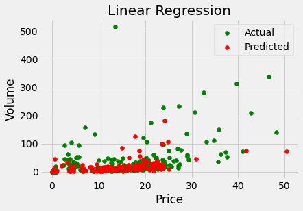
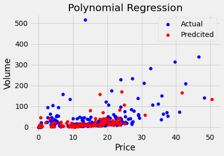

## **DOGE coin INR Analysis** ##

## **AIM:** ##

To Analyse and predict the price of Dogecoin in the Indian Market and also in INR.

## **Dataset:** ##

[dataset link](https://www.kaggle.com/meetnagadia/dogecoin-inr-dataset-20172020)

## **Tasks Done:** ##
* Reading the data in python
* Basic Exploration of data
* Cleaning the data and transforming it to be useful for basic analysis 
* Visual Data exploration

## **Libraries required:** ##
* matplotlib: 

* seaborn:

* sklearn:

* numpy:

* pandas:

## **Price vs Date Visualisations:** 

| |  ||
|---|---|---|
||||
||||

