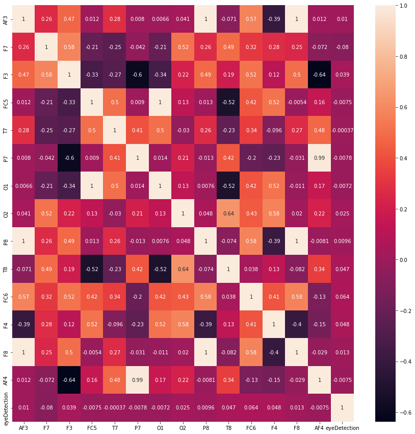
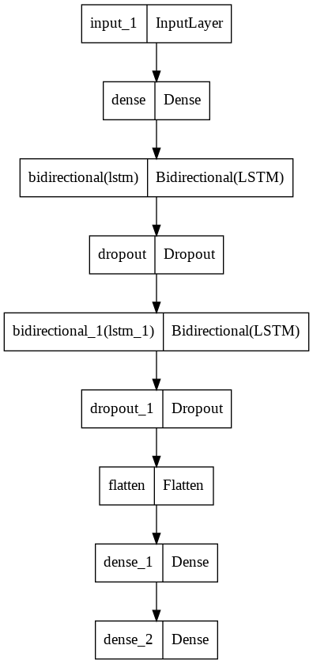
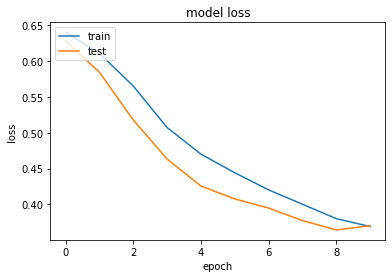
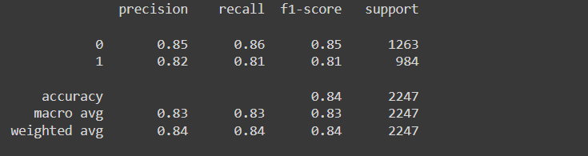

# Eye State Classification

The aim is to find whether eye state can be predicted using EEG signals collected from the brain through various sensors.

Eye state identification is a kind of common time-series classification problem which is also a hot spot in recent research. Electroencephalography (EEG) is widely used in eye state classification to detect human's cognition state.

**Dataset**

The Kaggle Dataset link 
[Dataset link](https://www.kaggle.com/datasets/robikscube/eye-state-classification-eeg-dataset)

**Libraries Used**

- Tensorflow
- Seaborn
- Matplotlib
- Numpy
- Pandas
- os
- warnings

**Visualization**
* Heatmap

 * Hierarchy 

 

 

**Accuracies**

The model gave a training accuracy of 94% after 10 epochs

**Conclusion**

The conclusion that can be drawn after performing the experiment is that when the model trained with a transfer learning model it provided an accuracy of 94% on training set when epoched for 10 times. But When we are training the dataset with custom CNN architecture we get a less accuracy of around 80%. 
***********************************************************
