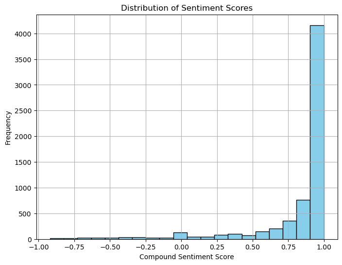

**F1 Visa Experiences**

**GOAL**

Finding out if the review is positive, negative or neutral.

**DATASET**

https://www.kaggle.com/datasets/adiamaan/f1-visa-experiences

**DESCRIPTION**

This dataset contains Visa interview experiences from about 6391 users, who are students applying to live temporarily in the US while studying at a school. The data comes from a telegram channel and all the visa experiences mainly are from India. 

**WHAT I HAD DONE**

* Analyzed data, extracted insights, and generated relevant visualizations.
* Preprocessed data to prepare it for machine learning model training.
* Trained default-parameter models:
		* Logistic Regression
		* Linear SVM
		* Random Forest

* In this, Support Vector Machine(SVM) performed the best with 97.27% accuracy. (Refer : `visa_experience.ipynb`)
  
**MODELS USED**

* Logistic Regression
* Linear SVM
* Random Forest

**LIBRARIES NEEDED**

* Pandas        V2.0.3
* Numpy         V1.24.3
* Matplotlib    V3.7.2
* Scikit-learn  V1.3.2
* nltk          V3.8.1

**VISUALIZATION**

**ACCURACIES**

	* Logistic Regression - 94.46
	* Linear SVM		  - 94.92
	* Random Forest		  - 97.27

**CONCLUSION**

We analyse the data, preprocess and visualize the features. We then investigated two predictive models. The data was split into two parts, a train set and a test set.

We started with Logistic Regression, Random Forest Classifier and SVM and SVM had the highest accuracy followed by Random Forest Classifier.

**YOUR NAME**

*Churnika S Mundas*

  
  
