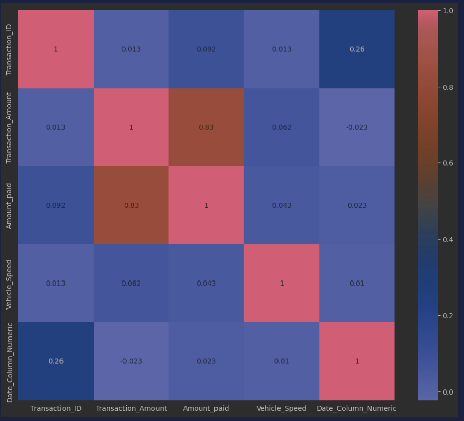

## **FASTag Fraud Detection**

### 🎯 **Goal**

The primary goal of this project is to detect fraudulent transactions in the FASTag system. By analyzing transaction patterns, we aim to build a robust model that identifies anomalies and potential fraud, ensuring the integrity of electronic toll collection.

### 🧵 **Dataset**

The dataset is sourced from [Dataset Link](https://www.kaggle.com/datasets/krishujeniya/fastag-frauds-records) and contains detailed transaction data, including timestamps, amounts, and vehicle information.

### 🧾 **Description**

This project involves analyzing transaction data to detect patterns of fraud. We implemented machine learning models and deployed the best-performing model as a web application.

### 🧮 **What I Had Done!**

- **Data Exploration and Analysis**:
  - Explored the data distribution and identified potential fraud indicators.
- **Feature Engineering**:
  - Created new features to enhance fraud detection capabilities.
- **Model Development**:
  - Trained and evaluated multiple machine learning models.
- **Model Deployment**:
  - Developed a user-friendly Streamlit web app for real-time fraud predictions.

### 🚀 **Models Implemented**

- **Decision Tree Classifier**: Chosen for its interpretability and ability to handle categorical data.
- **Random Forest Classifier**: Used for its robustness and ensemble learning capability.
- **AdaBoost Classifier**: Implemented to improve the model's performance through boosting.
- **XGBClassifier**: Selected for its high performance and ability to handle imbalanced data.
- **KNeighborsClassifier**: Chosen for its simplicity and effectiveness in capturing complex relationships.
- **Support Vector Machine (SVM)**: Selected for its high accuracy and F1-Score, making it ideal for fraud detection.

### 📚 **Libraries Needed**

```plaintext
pandas
scikit-learn
seaborn
matplotlib
xgboost
streamlit
```
### 📊 **Exploratory Data Analysis Results**

### Correlation Heatmap
- **Correlation Heatmap**: Identified correlations between features.

 

### Distribution of Transactions
- **Distribution of Transactions**: Visualized the distribution to spot anomalies.


### Fraud Indicators
- **Fraud Indicators**: Analysis of potential fraud indicators.


### 📈 **Performance of the Models Based on Accuracy Scores**

| Model                  | F1 Score | Accuracy | ROC AUC Score |
|------------------------|----------|----------|---------------|
| DecisionTreeClassifier | 0.9895   | 0.9895   | 0.9939        |
| RandomForestClassifier | 0.9498   | 0.9521   | 0.9955        |
| AdaBoostClassifier     | 0.9564   | 0.9581   | 0.9761        |
| XGBClassifier          | 0.9947   | 0.9948   | 0.9973        |
| KNeighborsClassifier   | 0.9978   | 0.9978   | 0.9948        |
| SVM                    | **0.9932** | **0.9933** | 0.9686        |

### 📢 **Conclusion**

The **SVM** model was chosen as the best model due to its high `F1-Score (0.9932)` and `Accuracy (0.9933)`, indicating a good balance between precision and recall. Despite a slightly lower ROC AUC Score, its robust performance and generalization capability make it suitable for real-world applications.

FastTag fraud detection is crucial for maintaining the integrity of electronic toll collection systems. Our approach leverages machine learning to effectively identify and prevent fraudulent transactions. Ongoing monitoring and model updates will ensure sustained performance and adaptability to new fraud patterns. Together, we can create a safer and more efficient toll collection experience for all stakeholders.

### ✒️ **Your Name**

[ **Harshit Ghosh** ]  
- GitHub: [Harshit-code-tech](https://github.com/Harshit-code-tech)
- LinkedIn: [Harshit Ghosh](www.linkedin.com/in/harshit-ghosh-026622272)
