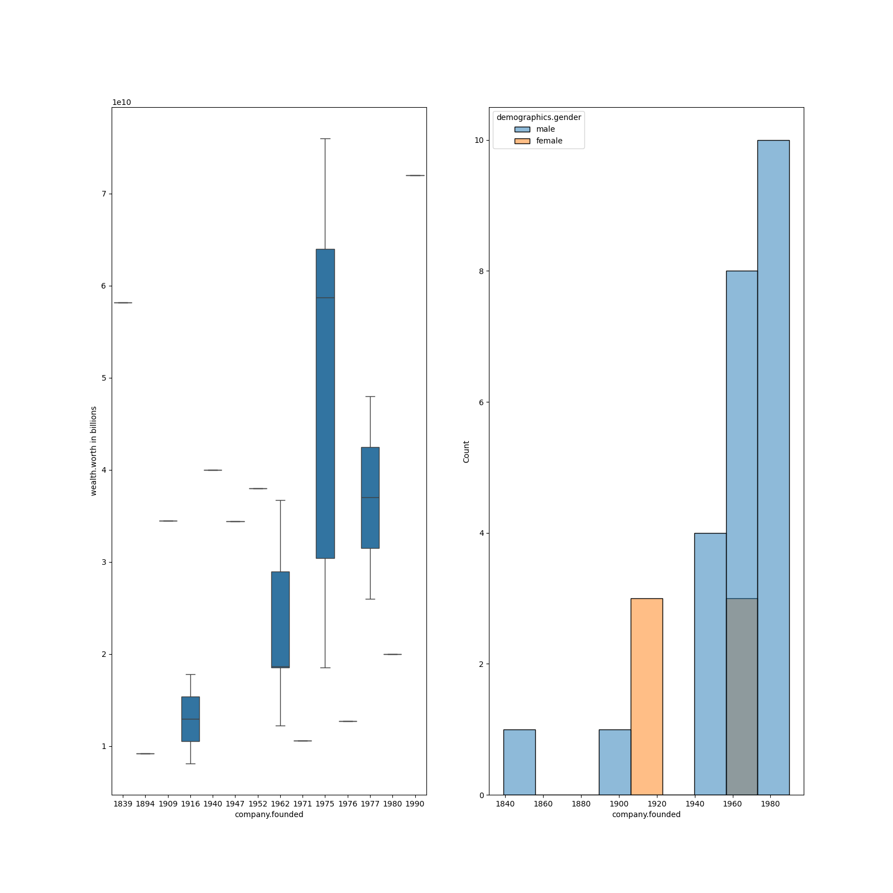
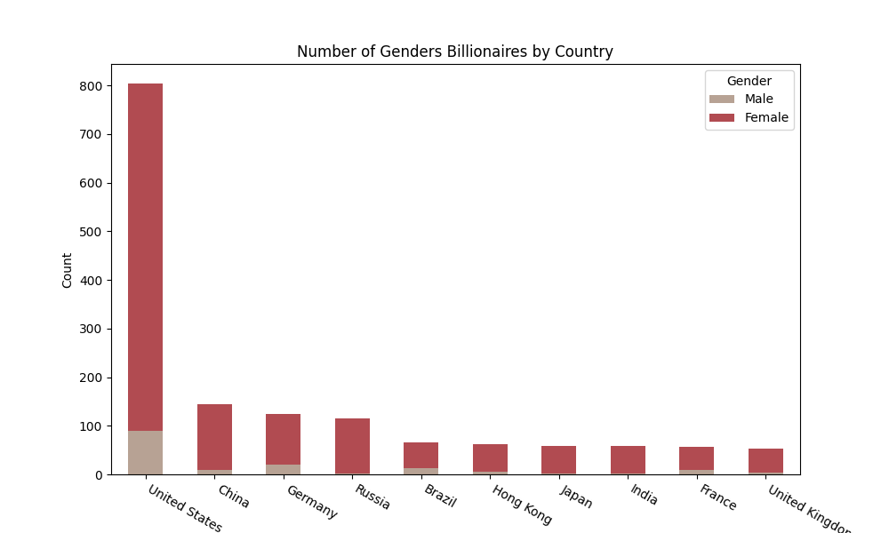
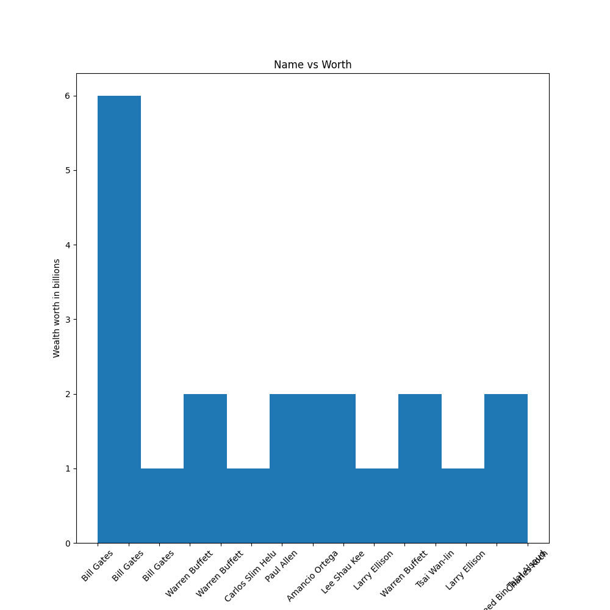
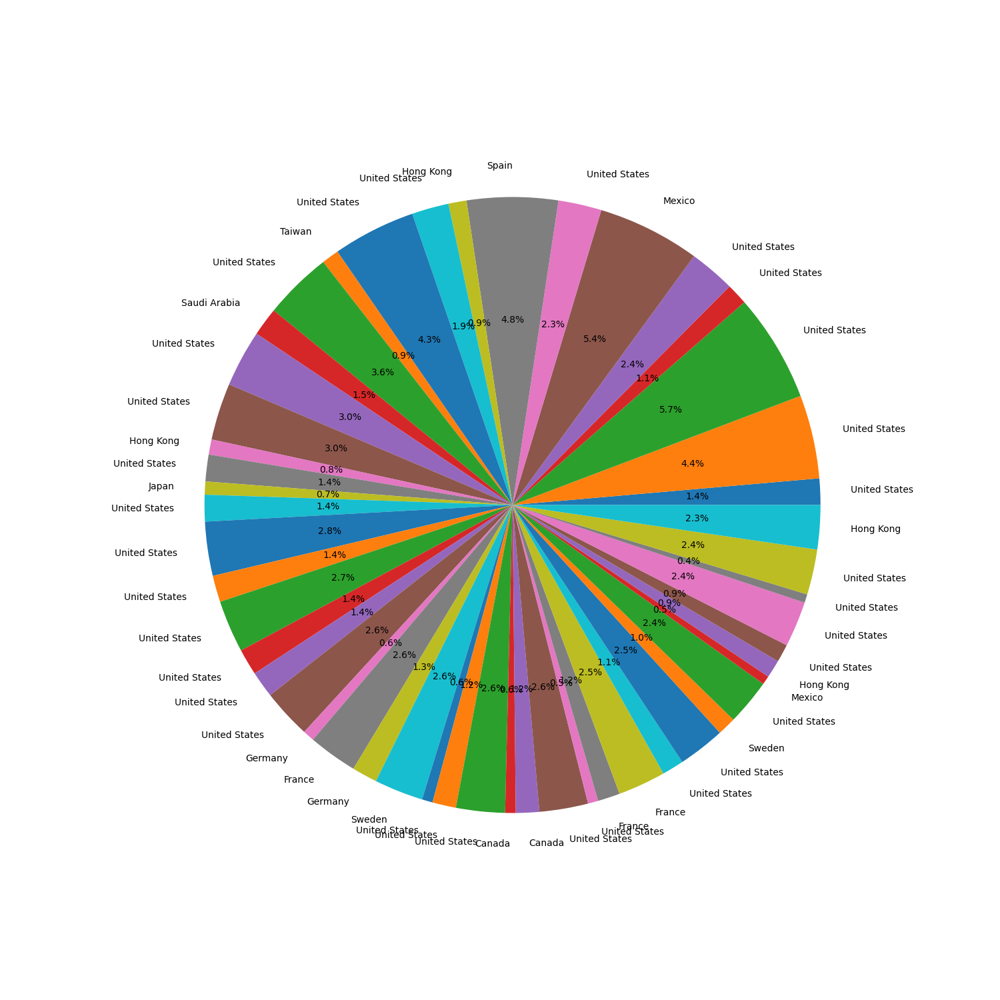

# PROJECT TITLE
Billionaires Statistics Analysis Model 

# GOAL

Performing exploratory data analysis on a dataset containing billionare statistics. Such EDA has various potential analysis areas like:

Wealth Distribution Exploration: Examine how billionaires' wealth is distributed across various industries, countries, and regions.

Demographic Profiling: Investigate the demographics of billionaires, including age, gender, and birthplace data.

Origins of Wealth: Analyze the ratio between self-made billionaires and those who inherited their wealth.

Economic Indicator Correlations: Study relationships between billionaire wealth and economic metrics such as GDP.

Geospatial Representation: Visualize the global distribution of billionaires and their amassed wealth through mapping techniques.

Temporal Trends: Track the evolving patterns in billionaire demographics and wealth across different time frames.

# DATASET

https://www.kaggle.com/datasets/nelgiriyewithana/billionaires-statistics-dataset/data

# DESCRIPTION

This project was about analysing different parameters of relation to billionares and prediction of the wealth of the person on the basis of year and gdp and age of the person. I was able to make conclusions related to the gender, demographics, age etc of the billionaires.

### Visualization and EDA of different attributes:

##MODELS USED

| Model                     | MSE       | R2       | MAE       |
|---------------------------|-----------|----------|-----------|
| Random Forest Regression  | 2.56e16   | 0.99     | 2.56e8    |
| Decision Tree Regression  | 1.26e16   | 0.99     | 3.40e8    |
| Gradient Boost Regressor  | 6.65e16   | 0.99     | 1.14e8    |
| SVR                       | 1.29e19   | -0.11    | 1.82e8    |
| Lasso                     | 7.58e18   | 0.34     | 2.02e8    |

**WHAT I HAD DONE**

* Load the dataset which contains 362000 entries in it and having 13 columns in it.
* Checked for missing values and cleaned the data accordingly.
* Analyzed the data, found insights and visualized them accordingly.
* Plotting heatmap using correlation and checking the relation between different features.
* Found detailed insights of different columns with target variable using plotting libraries.
* Train the datasets by different models and saves their accuracies into a dataframe.

**LIBRARIES NEEDED**

1. Pandas
2. Matplotlib
3. Sklearn
4. NumPy
5. Sci-py
6. Seaborn

# WHAT I HAD DONE

1. First I uploaded the dataset as a pandas dataframe and listed the top few rows to get an overview of the data. This overview was extended to getting to know about all the different paramters as well shape of the dataset.

2. The second thing was data preprocessing, I made suitable fixes for missing values and unwanted parameters like for example the birth day, date, month and year. There were no duplicate values in the dataset.

3. Then I started with some descriptive statistics like maximum, minimum, mean etc for numerical data and most frequent category, maximum count etc for categorical data.

4. Next, I visualized the data using specific graphs that I felt could be analysed easily. For example using box plots to spot outliers. I listed down my conclusions for each of these graphs.

# CONCLUSION

1. I made the following conclusions with the help of this analysis:

2. There are more male billionaires than female.

3. The ratio of self made to non self made billionaires is >1 in males and <1 in females.

4. The United States has most billionaires.

5. The most preferred country for relocation for billionaires is the UK.

6. Most billionaires lie in the advanced age bracket.

7. Bernard Arnault & family, Elon Musk, and Jeff Bezos stand out due to their exceptional wealth compared to the rest of the billionaire cohort.

8. Nigeria's average life expectancy of 54.3 emerges as an outlier due to its relatively lower value.

9. The Decision Tree and Random Forest are the best models to be used to predict the wealth of the person.

10. The r2 score of the Random Forest and Decision Tree and Gradient Boosting is high which is almost 1 which tells that the model overfitted due to low data.

11. The other models SVR and Lasso didn't learned well and and scored negative which couldn't be used for predictions.

# YOUR NAME

**Pawas Pandey**
