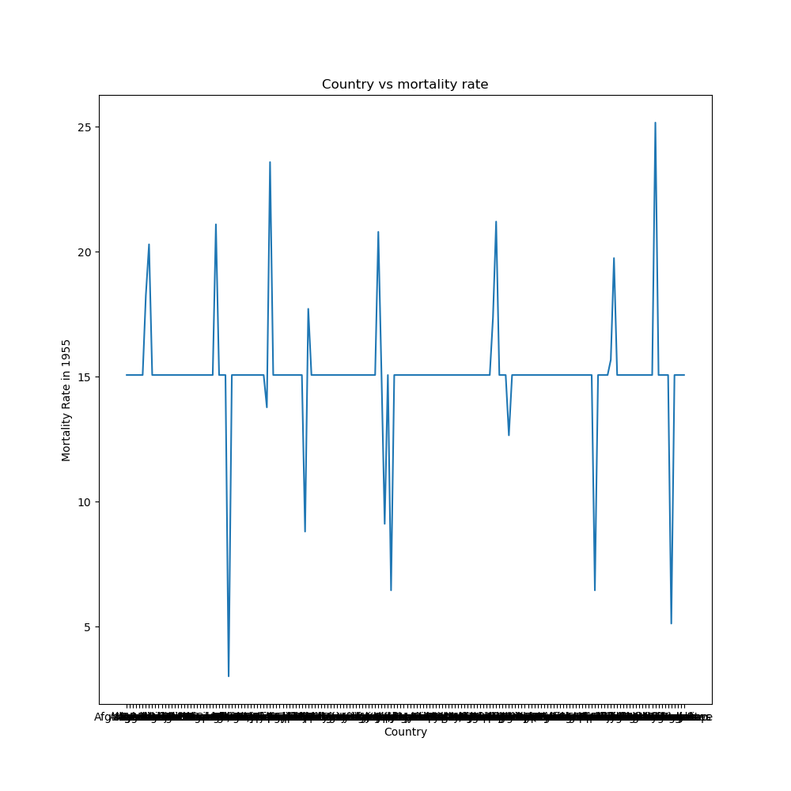
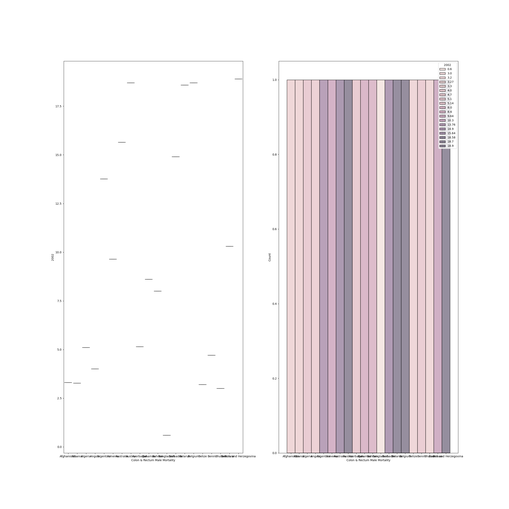
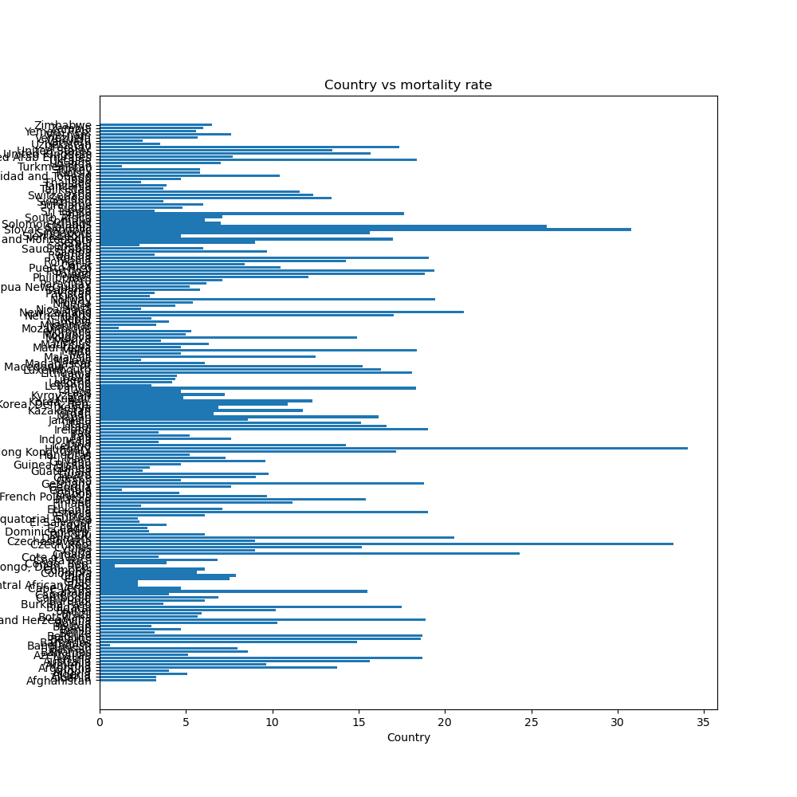
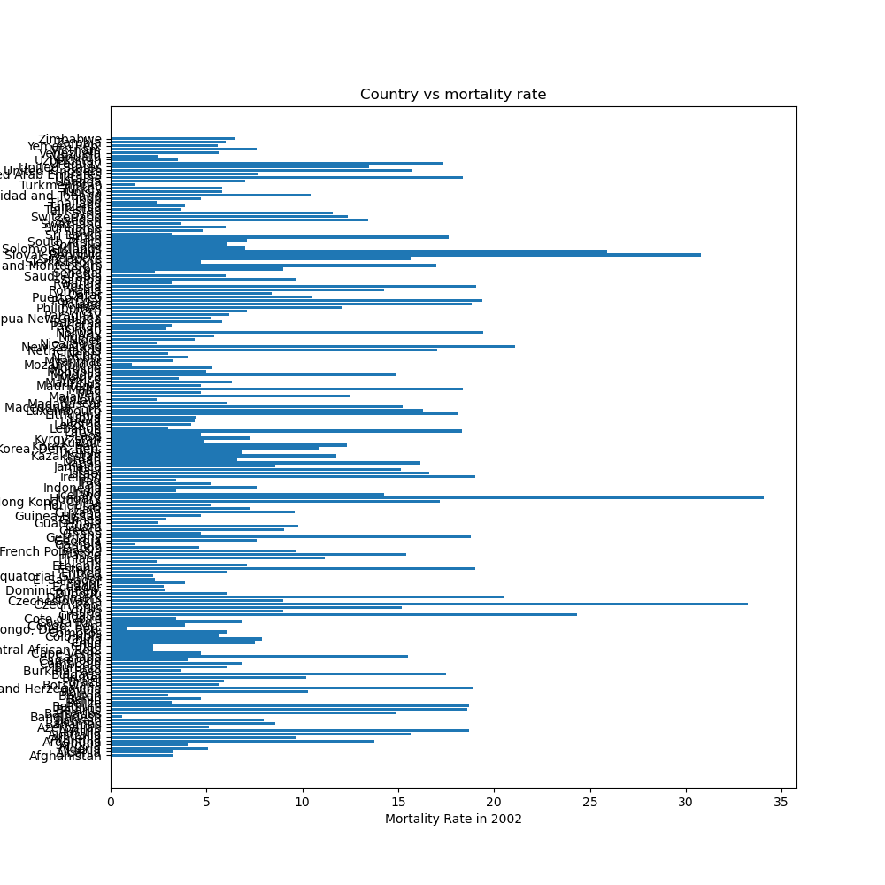
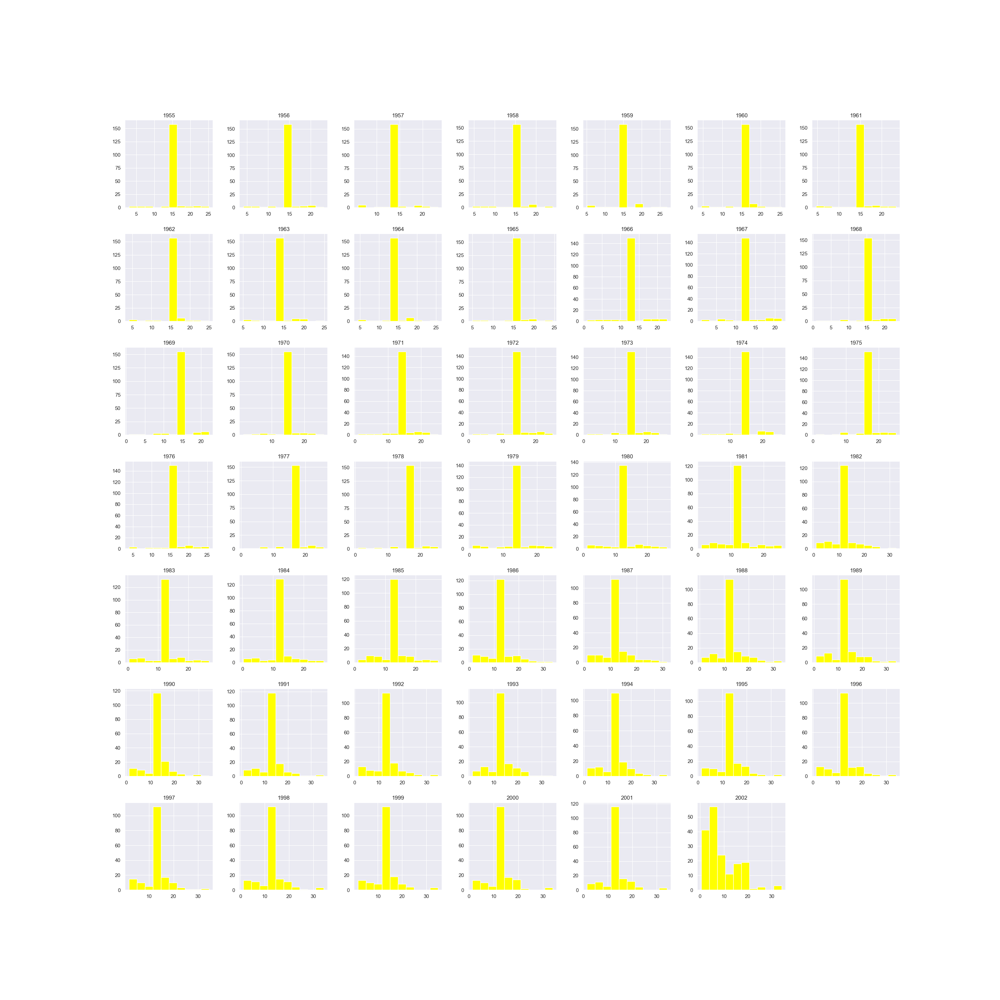
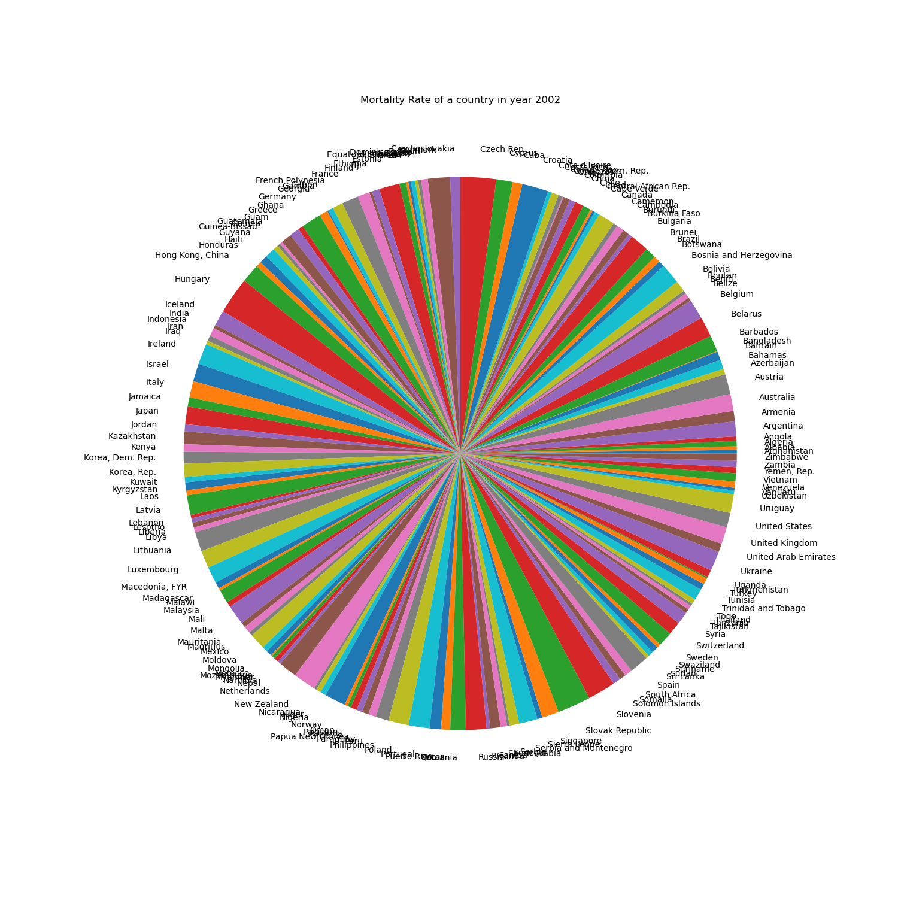
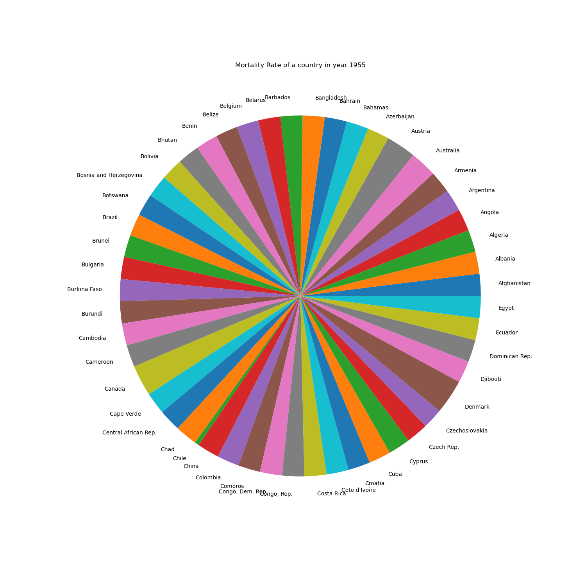

<h1>Gapminder Colon Cancer</h1>

**GOAL**

To build a machine learning model for predicting the patient survival rate or probability.

**DATASET**

https://www.kaggle.com/datasets/nancyalaswad90/gapminder-colon-cancer

**DESCRIPTION**

To analyze the dataset of Gapminder Colon Cancer and build and train the model on the basis of different features and variables.

There are 2 types of datasets:

- `columns_descriptions`: This dataset contains the description of all the features.
- `support2`: This dataset contains 176 entries with 49 different features.

### Visualization and EDA of different attributes:

**MODELS USED**

| Model                     | MSE       | R2       | RMSE      | MAE       |
|---------------------------|-----------|----------|-----------|-----------|
| Random Forest Regression  | 16.55     | 0.65     | 4.06      | 2.97      |
| Gradient Boost Regressor  | 14.51     | 0.70     | 3.80      | 2.81      |
| Lasso                     | 25.04     | 0.48     | 5.00      | 4.51      |
| Linear Regression         | 9086.095  | -185.76  | 95.32     | 45.30     |
| SVR                       | 42.33     | 0.12     | 6.50      | 4.93      |
| Decision Tree Regressor   | 19.06     | 0.60     | 4.33      | 3.03      |
| XGB Regressor             | 20.45     | 0.57     | 4.52      | 3.17      |
| Light GBM Regressor       | 22.51     | 0.53     | 4.74      | 3.41      |
| Cat Boost Regressor       | 14.54     | 0.70     | 3.81      | 2.83      |

**WHAT I HAD DONE**

* Load the dataset which contains 176 entries in it and having 49 columns in it.
* Checked for missing values and cleaned the data accordingly.
* Analyzed the data, found insights and visualized them accordingly.
* Plotting heatmap using correlation and checking the relation between different features.
* Found detailed insights of different columns with target variable using plotting libraries.
* Train the datasets by different models and saves their accuracies into a dataframe.

**LIBRARIES NEEDED**

1. Pandas
2. Matplotlib
3. Sklearn
4. NumPy
5. XGBoost
6. Tensorflow
7. Keras
8. Sci-py
9. Seaborn

**CONCLUSION**

- Cat Boost and Gradient Boost Regression models show promising performance with lower MSE and higher R2 values.
- Decision Tree Regression and Random Forest also scored good score on the testing set.
- Other models such as SVR, Lasso, LGBM, Linear didn't score well in the testing which says that they can't be used in prediction.
- The dataset has only 176 entries and also maximum entries were NaN value which tells that this dataset shouldn't be used in making the model. For better model we should have more entries in dataset.

**YOUR NAME**

*Pawas Pandey*
