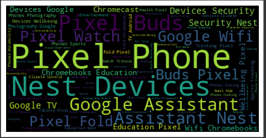
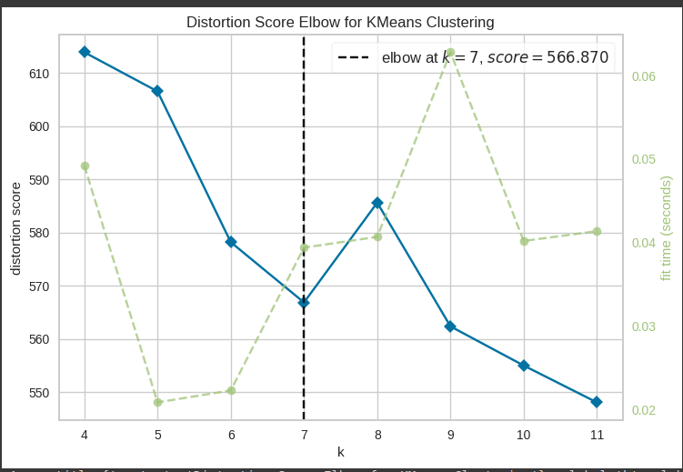
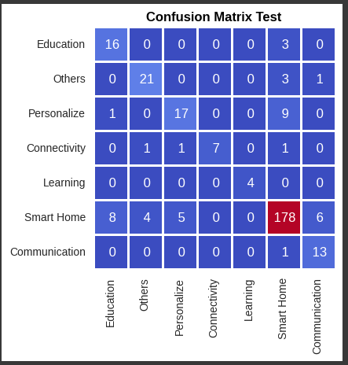

**GOOGLE Q AND A ANALYSIS**

**GOAL**

To build nlp based ml models for google question and answer dataset to specify category of device it predicts.

**DATASET**

https://www.kaggle.com/datasets/aashidutt3/google-devices-q-and-a-dataset

**DESCRIPTION**

To analyze question asked by customer along with device to predict which category problem falls onto wrt google dataset.

**Visualization and EDA of different attributes:**

**MODELS USED**
1) Decision Tree 
2) Random Forest
3) Catboost
4) Multivariate Logisitic Regression
5) Gradient Boost
6) Ridge
7) MLP
8) XGBoost

**LIBRARIES**
1) PANDAS
2) NUMPY
3) CATBOOST
4) MATPLOTLIB
5) OS
6) SCIKIT-LEARN
7) XGBOOST
8) SPACY

**IMPLEMENTATION**
1) Loaded the dataset with 3 columns having 997 entries.
2) Implementated EDA with visualisation using wordcloud to get estimate of important labels to be used later on for classification.
3) Duplicate values were taken care of and text cleaning was implemented.
4) Distortion score elbow for K-means was implemented.
5) Tokenization and vectorization of textual data was implemented
6) Model was trained efficiently with different machine learning algorithms

**RESULT**
1) Multivariate Logisitic Regression calculated exceptional accuracy of 0.86
2) Rest of the models performed fairly well wrt to smaller database.

...

### Models and Accuracies

| Model                         | Accuracy   | 
| ----------------------------- |:----------:|
| Decision Tree                 | 0.76       |                    
| Random Forest                 | 0.7592     |                    
| Logistic Regression(Multi)    | 0.86       |                    
| Gradient Boost                | 0.796      |                    
| Ridge                         | 0.82       | 
| MLP                           | 0.83       |                    
| XGBoost                       | 0.798      |
| Catboost                      | 0.85       |

...

**NAME**

Keshav Arora
