# Hotel Booking Demand Prediction

## 🎯 **Goal**

Predicting cancellations based on booking data to estimate demand for hotel rooms.

## 🧵 **Dataset**

[Hotel Booking Demand Dataset](https://www.kaggle.com/datasets/jessemostipak/hotel-booking-demand)

## 🧾 **Description**

This data set contains booking information for a city hotel and a resort hotel, and includes information such as when the booking was made, length of stay, the number of adults, children, and/or babies, and the number of available parking spaces, among other things. The problem is binary classification of cancellation status to estimate hotel booking demand.

## 🧮 **What I have done**

1. Exploratory analysis of features: cleaning, preprocessing and data visualization.
2. Feature engineering:
    * re-categorizing categorical features based on target splits
    * target-encoding high-cardinality categorical features
    * discretizing numerical features with low number of unique values
3. Feature selection:
    * Statistical tests - Pearson correlation, Mutual information scores, ANOVA F-test, Chi-squared test of independence
    * Model-based feature importances using Extremely-Randomized Trees.
4. Created a holdout set for testing using Stratified sampling to maintain imbalance ratio.
5. Training and validation of: Logistic Regression, Naive Bayes, K-nearest neighbours, Decision Tree, Random Forest, AdaBoost, Multi-Layer Perceptron, and gradient-boosting trees (XGBoost, CatBoost, LightGBM).
6. Model ensembling using averaging of predictions with different configurations.
7. Models were tuned and evaluated based on ROC-AUC score instead of Accuracy, since the target classes are imbalanced.

## 🚀 **Models Implemented**

* Logistic Regression
* Naive Bayes: Gaussian
* K-Nearest Neighbours
* Decision Tree
* Random Forest
* AdaBoost
* Neural network: Multi-layer Perceptron
* Gradient-boosting models: XGBoost, CatBoost, LightGBM
* Model Ensembling: Simple/Power/Weighted averaging

## 📚 **Libraries Needed**

* Pandas
* Numpy
* Scikit-learn
* XGBoost
* CatBoost
* LightGBM
* Matplotlib
* Seaborn

## 📊 **Exploratory Data Analysis Results**

**Feature distributions**  
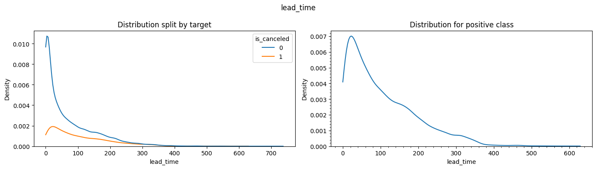  
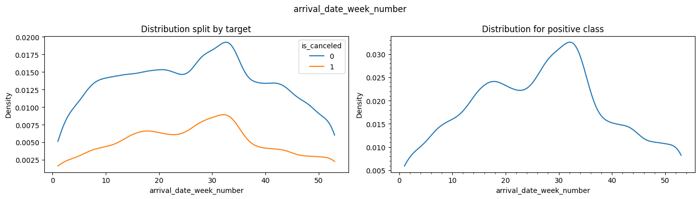  
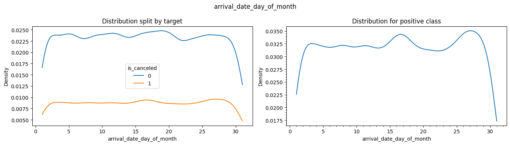  
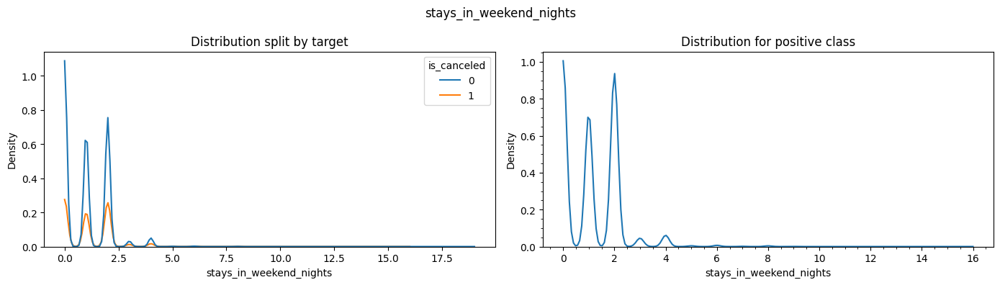  
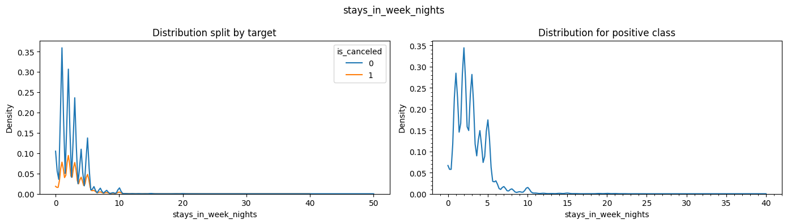  
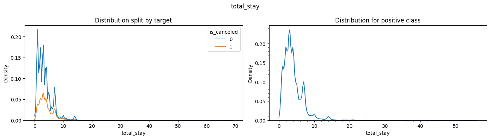  
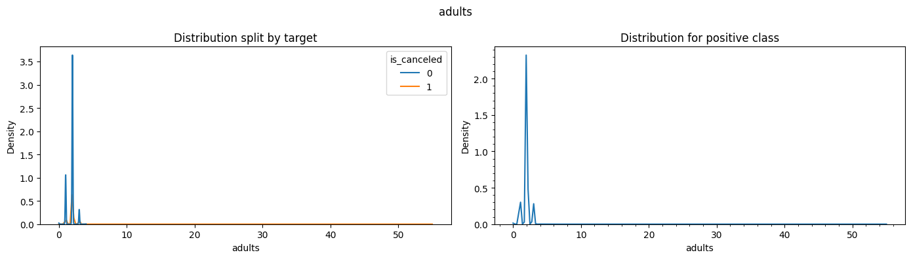  
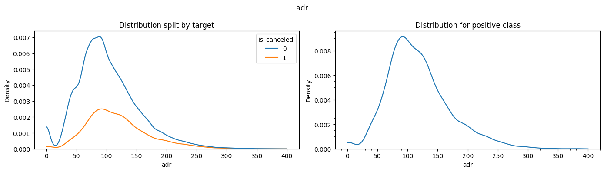  

**Feature selection**:  
Correlation between features:  
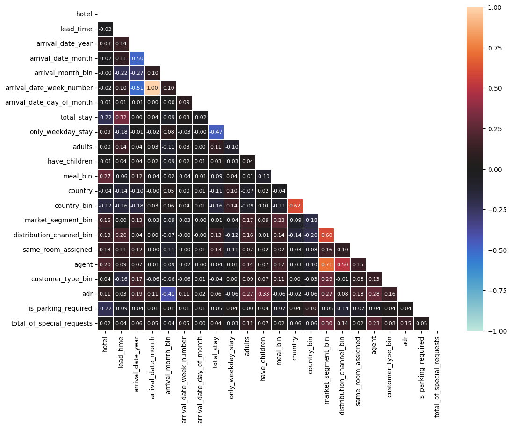  
Correlation with target:  
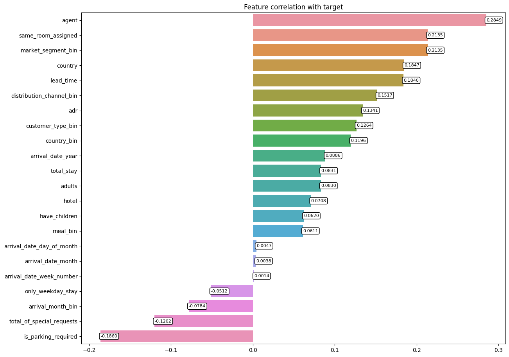
Mutual Information:  
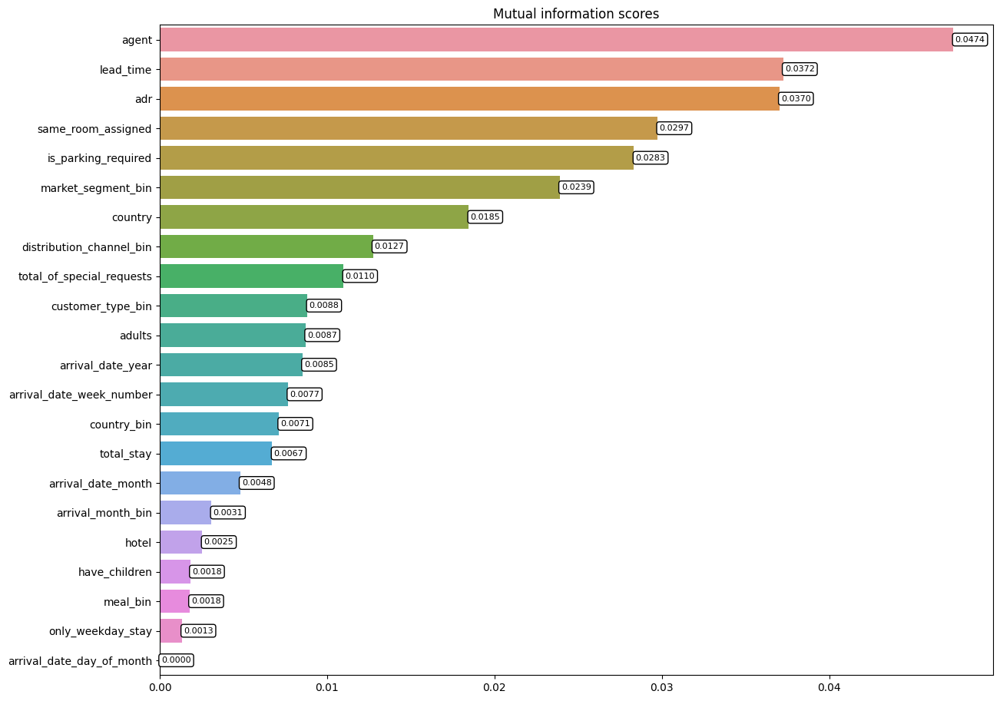  
Model-based feature importances:  
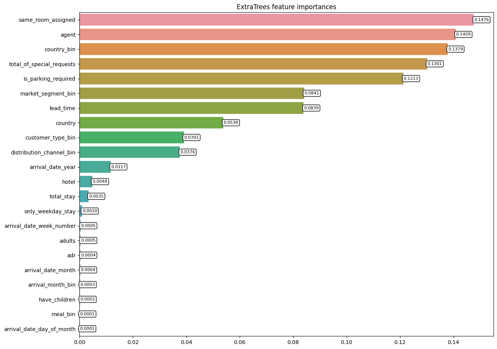  

## 📈 **Performance of the Models**

Models were evaluated based on ROC-AUC score due imbalanced class ratio.

| Model configuration | ROC-AUC Score  
|:-----|:-----:
| Logistic Regression | 0.8470  
| Gaussian Naive Bayes | 0.7944  
| K-Nearest Neighbours | 0.8810  
| Decision Tree | 0.8820  
| Random Forest | 0.8958  
| AdaBoost | 0.8959  
| Multi-layer Perceptron | 0.9039  
| XGBoost | 0.9138  
| LightGBM | 0.9146
| CatBoost | 0.9154  
| Simple averaging | 0.9108  
| Power averaging | 0.9062  
| **Weighted averaging** | **0.9159**  

## 📢 **Conclusion**

Trained a variety of models and created ensembles using averaging methods. Used ROC-AUC score to evaluate for imbalanced classification, and the best performance was shown by the Weighted-averaging ensemble.

## ✒️ **Your Signature**

Siddhant Tiwari  
([Github](https://www.github.com/siddhant4ds) - [Kaggle](https://www.kaggle.com/sid4ds) - [LinkedIn](https://www.linkedin.com/in/siddhant-tiwari-ds/))
