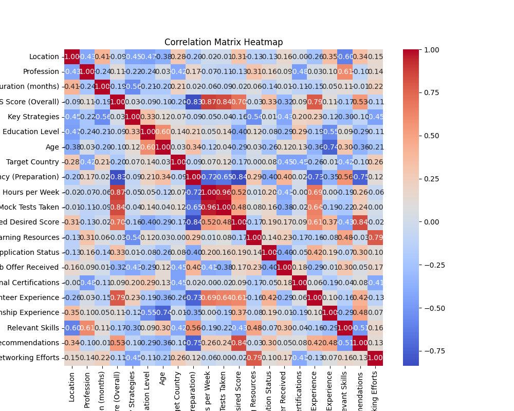
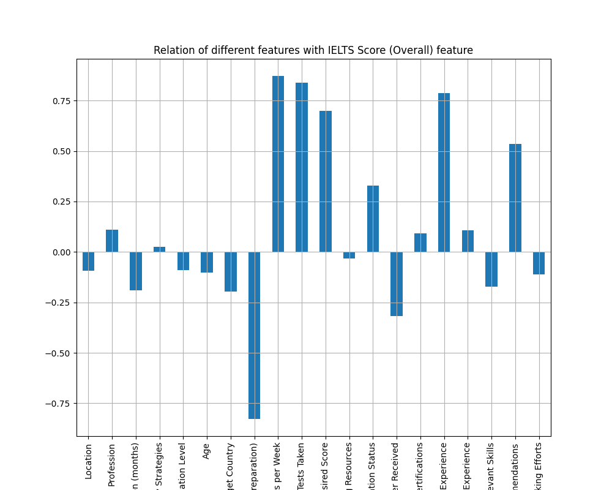
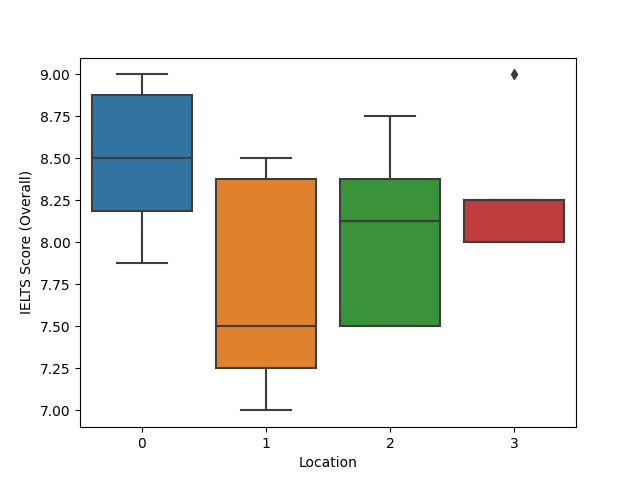

<h1>IELTS Success Stories Analysis and Prediction Model</h1>

**GOAL**

The aim of this project is to analyze and predict the success rates of IELTS.

**DATASET**

https://www.kaggle.com/datasets/zakirkhanaleemi/ielts-success-stories-dataset

**DESCRIPTION**

To analyze the IELTS Success Stories Dataset and build and train the model on the basis of different features and variables.

### Visualization and EDA of different attributes:

**MODELS USED**

| Model                                    | MSE_train           | R2_train | MSE_test  | R2_test   |
|------------------------------------------|---------------------|----------|-----------|-----------|
| GradientBoosting Regression with tuning  | 1.459225e-06        | 0.999996 | 0.000067  | 0.999671  |
| XGboost Regression with tuning           | 1.842974e-07        | 0.999999 | 0.006423  | 0.968378  |
| Random Forest Regression with tuning     | 6.955859e-03        | 0.979460 | 0.012847  | 0.936753  |
| XG Boost Regression                      | 1.422946e-07        | 1.000000 | 0.016455  | 0.918990  |
| XG Boost Regression without tuning       | 1.422946e-07        | 1.000000 | 0.016455  | 0.918990  |
| Decision Tree Regression                 | 0.000000e+00        | 1.000000 | 0.020833  | 0.897436  |
| Random Forest Regression                 | 1.066101e-02        | 0.968519 | 0.023450  | 0.884554  |
| Ridge Regression                         | 6.444433e-04        | 0.998097 | 0.072341  | 0.643857  |
| Elastic Net Regression                   | 9.246131e-02        | 0.726969 | 0.133491  | 0.342813  |
| Linear Regression                        | 2.554407e-30        | 1.000000 | 0.154003  | 0.241830  |
| KNN Regression                           | 1.005357e-01        | 0.703126 | 0.168333  | 0.171282  |

**WHAT I HAD DONE**

* Loaded the dataset which contains 27 entries and 23 features.
* Checked for missing values and cleaned the data accordingly.
* Analyzed the data, found insights, and visualized them accordingly.
* Plotted a heatmap using correlation and checked the relation between different features.
* Found detailed insights of different columns with target variable using plotting libraries and plotted box plots to see the distribution of dataset with respect to target features.
* Split the dataset into training and testing datasets.
* Applied PCA to reduce the number of features.
* Applied hyperparameter tuning using Grid Search for various models.
* Trained the datasets using different models and recorded their accuracies, MSE, and R2 scores.

**LIBRARIES NEEDED**

1. Pandas
2. Matplotlib
3. Sklearn
4. NumPy
5. XGBoost
6. Tensorflow
7. Keras
8. Sci-py
9. Seaborn

**CONCLUSION**

- GradientBoosting Regression with tuning and XGboost Regression with tuning show promising performance with lower MSE and higher R2 values.
- Decision Tree Regression achieved perfect R2 on the training set but performed poorly on the test set, indicating overfitting.

**YOUR NAME**

*Manpreet Singh*

  
