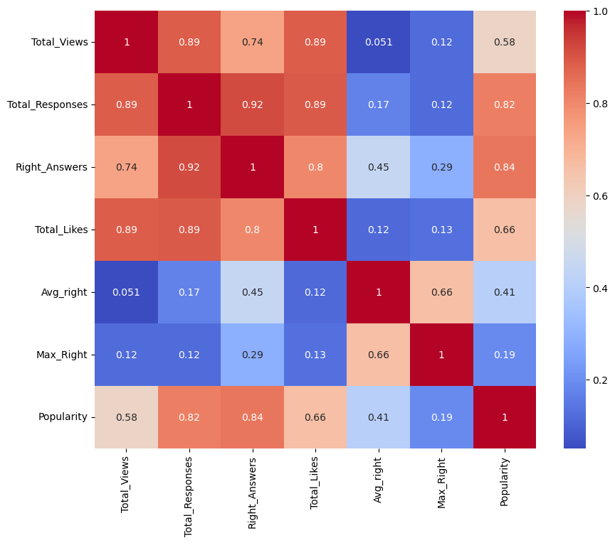
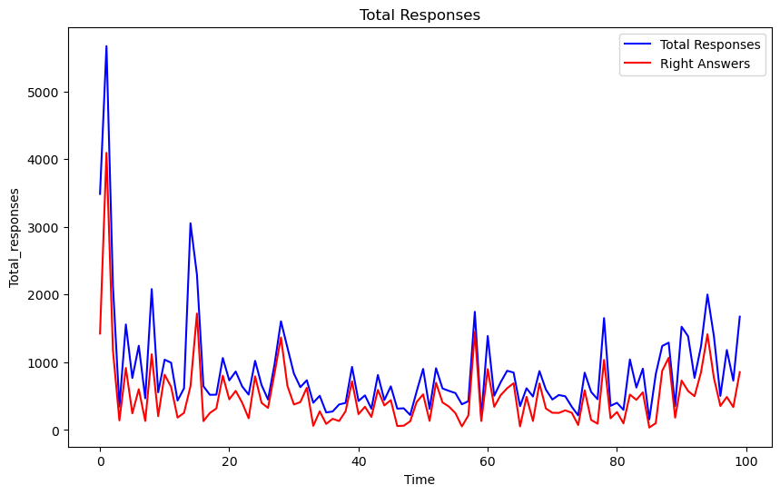

**Linkedln Poll Data Analysis**

**GOAL**

To analyse the dataset and see the popularity of the Linkedln Poll.
<!-- Write the main goal of project and what's the purpose of it -->

**DATASET**

<!-- Add a link to dataset and from where it's taken. -->
https://www.kaggle.com/datasets/kalilurrahman/linkedin-poll-data

**DESCRIPTION**

<!-- Brief description about the project -->
The dataset compiles quiz data gathered from LinkedIn Polls, providing insights into various topics.

**WHAT I HAD DONE**

<!-- Write down the step by step procedure of how project works using points. -->
* Analyzed data, extracted insights, and generated relevant visualizations.
* Process data to prepare it for machine learning model training.
* Trained default-parameter models:
		* Linear Regression
        * Decision Tree
        * Random Forest
		* SVM

* In this, Linear Regression performed best with R2_score: 0.8196 and MSE: 0.0000. (Refer : `LinkedIn_poll_analysis.ipynb`)

**MODELS USED**

<!-- List out all the algorithms or models used in this project -->
<!-- Why have you choosed that algorithms should also be stated -->
* Linear Regression - Chosen for its simplicity, interpretability, and ease of implementation. 
* Decision Tree - Chosen for its ability to handle non-linear relationships and its interpretability.
* Random Forest - Aggregates the predictions of multiple decision trees trained on random subsets of the data and features.
* SVM - Chosen for its effectiveness in high-dimensional spaces and its ability to handle non-linear relationships.

**LIBRARIES NEEDED**

<!-- Add all the libraries needed in this project in points -->
* Pandas        V2.0.3
* Numpy         V1.24.3
* Matplotlib    V3.7.2
* Scikit-learn  V1.3.2
* Seaborn version: 0.12.2

**VISUALIZATION**

<!-- INCLUSION OF IMAGES OF THE VISUALIZATION IS MUST (RESULT OF EDA). -->

**ACCURACIES**

<!-- Add all the algorithms used with their accuracies and results -->

* Linear Regression - Mean Squared Error (MSE): 0.0000, R-squared (R2) Score: 0.8196
* Decision Tree     - Mean Squared Error (MSE): 0.0000, R-squared (R2) Score: 0.4230
* Random Forest     - Mean Squared Error (MSE): 0.0000, R-squared (R2) Score: 0.6487
* SVM               - Mean Squared Error (MSE): 0.0001, R-squared (R2) Score: -2.3062

**CONCLUSION**

<!-- What's the conclusion derived from this project and also showcase the accuracy results if it's applicable. Be briefer -->
We analyze, preprocess, and visualize the features. Then, we calculate the quiz popularity based on views and answers received. Finally, we explore quiz popularity using various ML models along with other parameters.

Linear Regression model is the best fit - Mean Squared Error (MSE): 0.0000, R-squared (R2) Score: 0.8196.

**YOUR NAME**

<!-- Add your name at the end of the file, along with social media handles if applicable. -->
*Churnika S Mundas*

  
  
