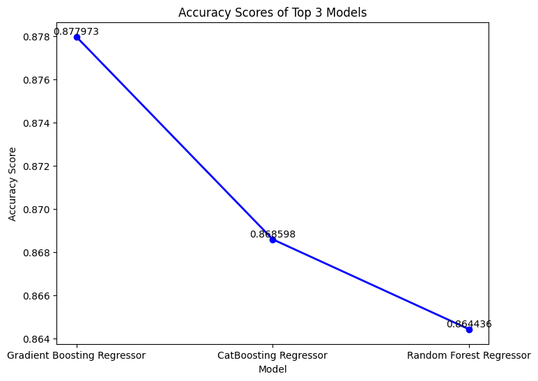
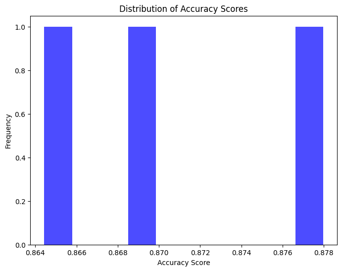
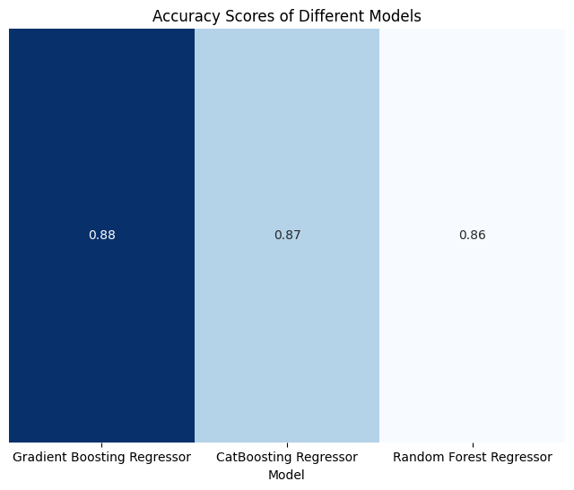

# Medical Cost Prediction

## Goal

The main goal of this project is to develop a machine learning model that can predict the medical charges of a person based on the given features. The model is trained on the training set and evaluated on the evaluation set. The model with the highest accuracy is selected as the best performing model for this task. The model was developed using the scikit-learn library also xgboost, and catboost libraries are used for this task. The model was evaluated using appropriate metrics such as mean absolute error, mean squared error, root mean squared error, and R2 score.

## Dataset

The dataset for this project can be found at [Kaggle](https://www.kaggle.com/datasets/mirichoi0218/insurance) and [GitHub](https://github.com/stedy/Machine-Learning-with-R-datasets).

For more information about the dataset, please refer to this readme file in the Dataset folder [Dataset Description](../Dataset/README.md)

## Approach

1. **Data loading and exploration:** Loaded the dataset, explored the dataset using pandas profiling, and performed exploratory data analysis. In EDA, I have used different plots to visualize the relationship between the features and the target variable and the relationship between the features. such as box plot, scatter plot, histogram etc.

2. **Data preprocessing:** Performed data preprocessing steps such as feature scaling, encoding, and feature selection. For feature scaling, I have used the StandardScaler from the scikit-learn library. For encoding, I have used the OrdinalEncoder from the scikit-learn library. Also, dataset is split into training and evaluation sets.

3. **Model development(Top 3):** Developed multiple models using the scikit-learn library. Top three models are:

```bash
a. Gradient Boosting Regressor:

- Description: Gradient Boosting Regressor is a boosting ensemble algorithm that builds the model in a stage-wise fashion, optimizing an arbitrary differentiable loss function.
- Accuracy: 87.7973%
```

```bash

b. CatBoosting Regressor:

- Description: CatBoosting Regressor is a boosting ensemble algorithm similar to Gradient Boosting Regressor.
- Accuracy: 86.8598%
```

```bash
c. Random Forest Regressor:

- Description: Random Forest Regressor is an ensemble learning method for regression that constructs multiple decision trees and outputs the mean prediction of the individual trees.
- Accuracy: 86.4436%
```

4. **Model evaluation:** Evaluated the performance of each model using appropriate metrics such as mean absolute error, mean squared error, root mean squared error, and R2 score. The model with the highest accuracy on evaluation is selected as the best performing model for this task.

## Libraries Needed

- Numpy
- Pandas
- Seaborn
- Matplotlib
- Scikit-learn
- Catboost
- Xgboost

## Accuracies (Top 10)

| Model                       | Accuracy |
| --------------------------- | -------- |
| Gradient Boosting Regressor | 87.7973% |
| CatBoosting Regressor       | 86.8598% |
| Random Forest Regressor     | 86.4436% |
| XGBRegressor                | 85.0103% |
| K-Neighbors Regressor       | 83.3971% |
| AdaBoost Regressor          | 82.1003% |
| Linear Regression           | 78.3346% |
| Lasso                       | 78.3329% |
| Ridge                       | 78.3304% |
| Bayesian Ridge              | 78.3257% |

## Accuracy Graphs

- Actual vs Predicted Scatter Plot for Gradient Boosting Regressor
  

- Actual vs Predicted Regression Plot for Gradient Boosting Regressor
  

## Model Comparison

- Line plot of the accuracy of the three models on the evaluation set
  

- Distribution of the accuracy of the three models on the evaluation set
  

- Heatmap of the accuracy of the three models on the evaluation set
  

## Conclusion

In conclusion, this project aimed to predict the medical charges of a person based on the given features. The dataset was loaded and explored. The dataset was split into training and test sets. The dataset was preprocessed by performing feature scaling, encoding, and feature selection. Multiple models were developed using the scikit-learn library. The models were evaluated using appropriate metrics such as mean absolute error, mean squared error, root mean squared error, and R2 score. The model with the highest accuracy on evaluation is selected as the best performing model for this task. Top three models are Gradient Boosting Regressor, CatBoosting Regressor, and Random Forest Regressor. The Gradient Boosting Regressor model achieved best accuracy of 87.7973% on evaluation set.

## Author [Sitam Meur](https://github.com/sitamgithub-MSIT)

## References

- Scikit-learn Documentation: https://scikit-learn.org/stable/supervised_learning.html
- Xgboost Documentation: https://xgboost.readthedocs.io/en/stable/
- Catboost Documentation: https://catboost.ai/en/docs/concepts/tutorials
