<u><h1>📊 EDA on Medical Recommendation Dataset using Machine Learning</h1></u>

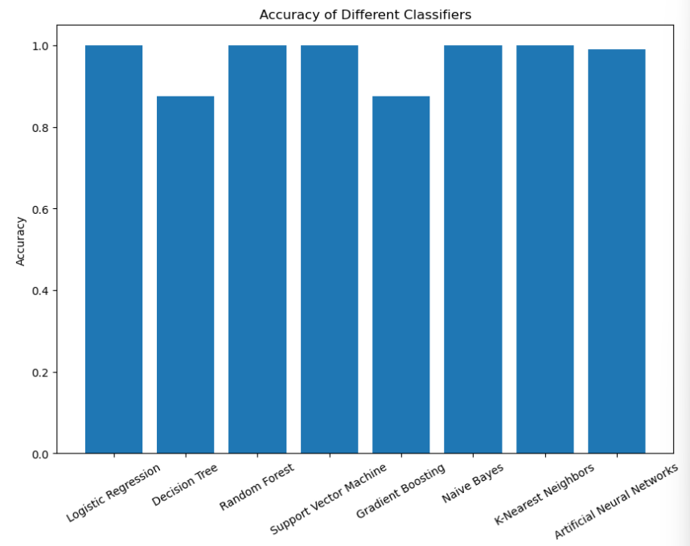
<u><h2>Count of Each Disease :</h2></u>

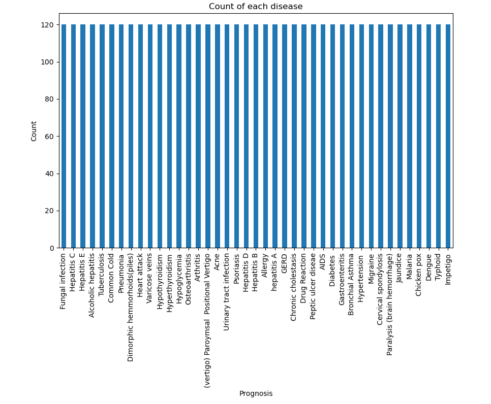

<u><h2>Correlation Heatmap</h2></u>

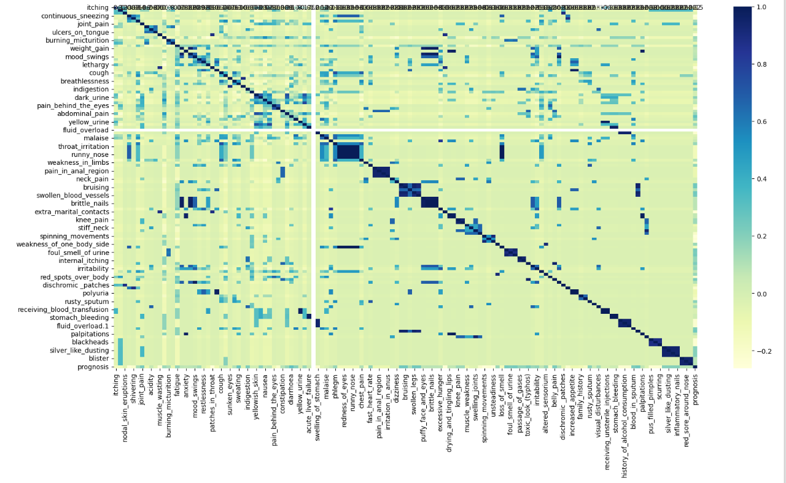

<u><h1>ROC Scores of Different Models</h1></u>

<u><h2> ROC curve: Logistic Regression</h2></u>

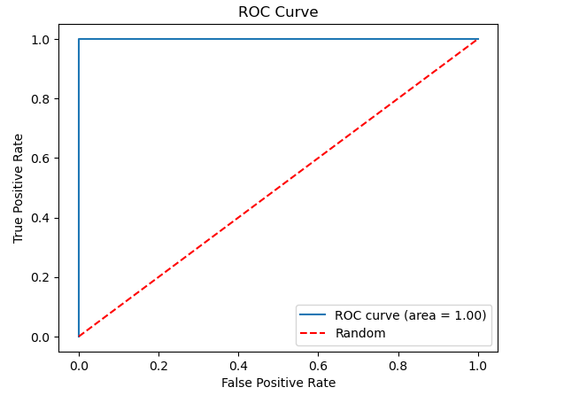

<u><h2> ROC curve: Decision Tree</h2></u>

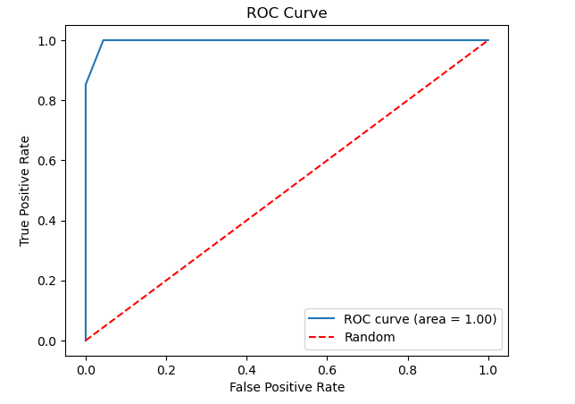

<u><h2> ROC curve: Random Forest Classifier</h2></u>

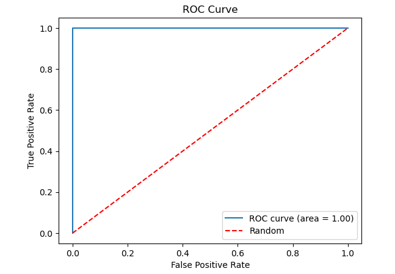

<u><h2> ROC curve: Support Vector Classifier</h2></u>

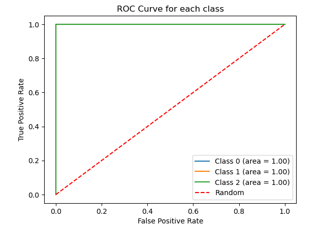

<u><h2> ROC curve: Gradient Boosting</h2></u>

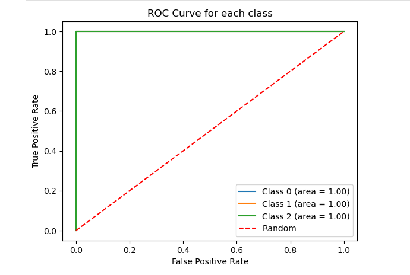

<u><h2> ROC curve: Naive Bayes</h2></u>

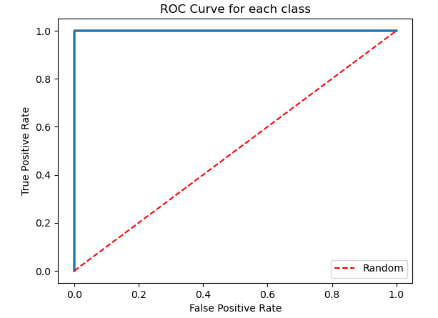

<u><h2> ROC curve: K-nearest neighbors</h2></u>

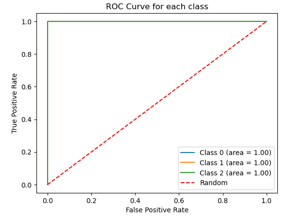

<u><h2> ROC curve: Artificial Neural Networks</h2></u>

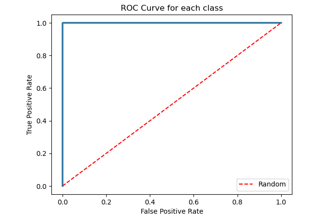

<u><h2> ANN Model Summary </h2></u>

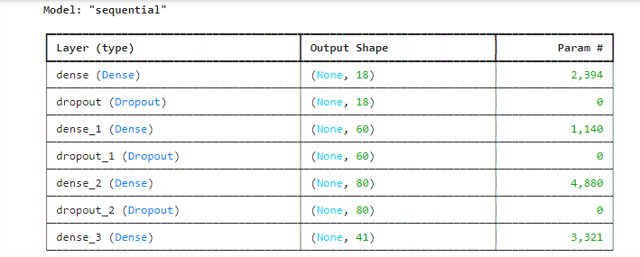

<u><h2>📈 Confusion Matrix of Best Model : SVC</h2></u>

A confusion matrix is a tabular representation that summarizes the performance of a classification model. It provides insights into the model's predictive accuracy by displaying the counts of true positive (TP), true negative (TN), false positive (FP), and false negative (FN) predictions.

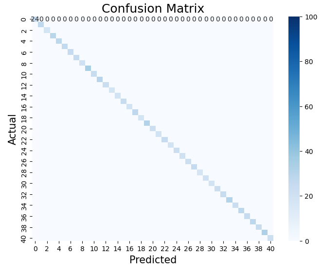

<u><h2>📈 Accuracy v/s precision for SVC Model:</h2></u>

Accuracy refers to the degree of closeness between a predicted value and the actual value. It is a measure of how correct the model's predictions are whereas precision, on the other hand, quantifies the consistency and reproducibility of the model's predictions. It assesses how well the model produces similar results for repeated experiments or runs. Achieving high accuracy means minimizing the gap between predicted and actual values, while high precision indicates low variability in the model's outputs. Both accuracy and precision are important metrics for evaluating the performance and reliability of data science models.

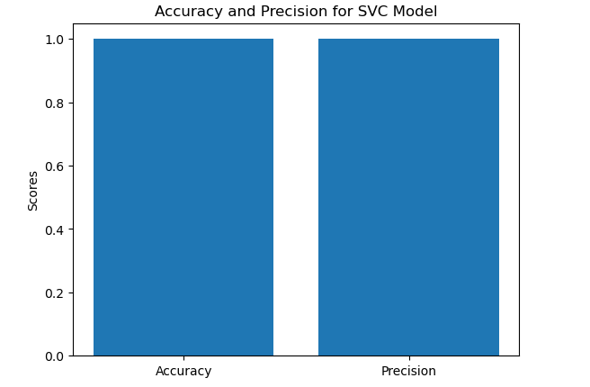

The bar plot represents the comparison between the accuracy and precision of our model. The plot displays two bars, one for accuracy and one for precision. As we can see that both bars indicate values greater than 95%, indicating that our ML model is consistently producing correct predictions (high accuracy) and demonstrating low variability in its results (high precision). 

<u><h2>📈 Accuracy comparison:</h2></u>

This plots shows that all models except Decision Tree and Gradient Boosting have high accuracy of almost 100.

<u><h2>📈 ROC Score comparison:</h2></u>

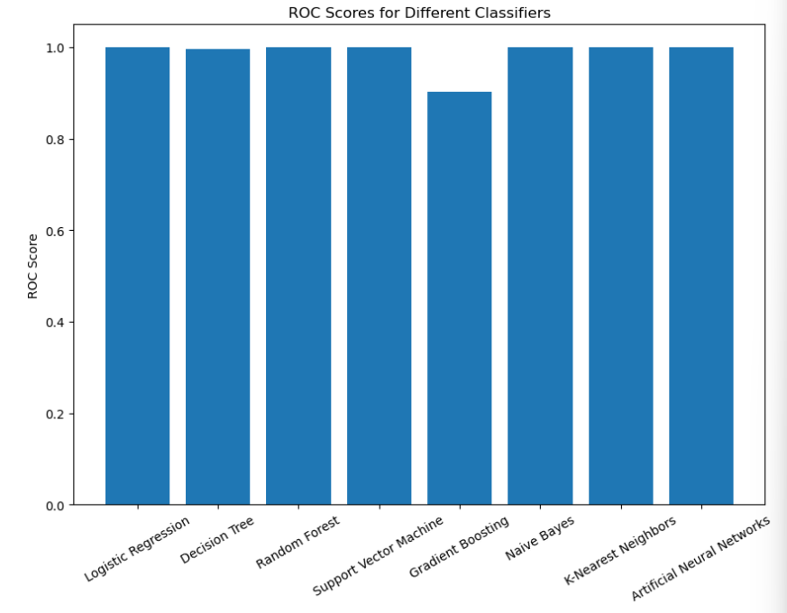
