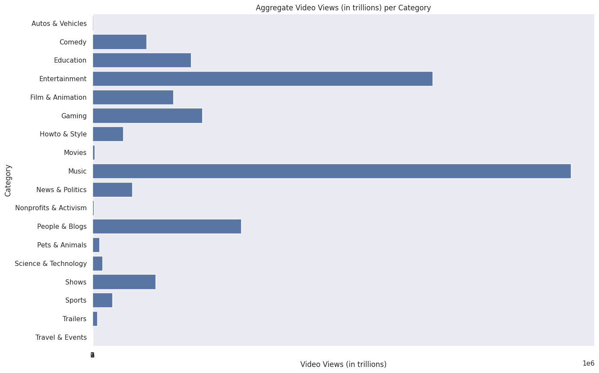
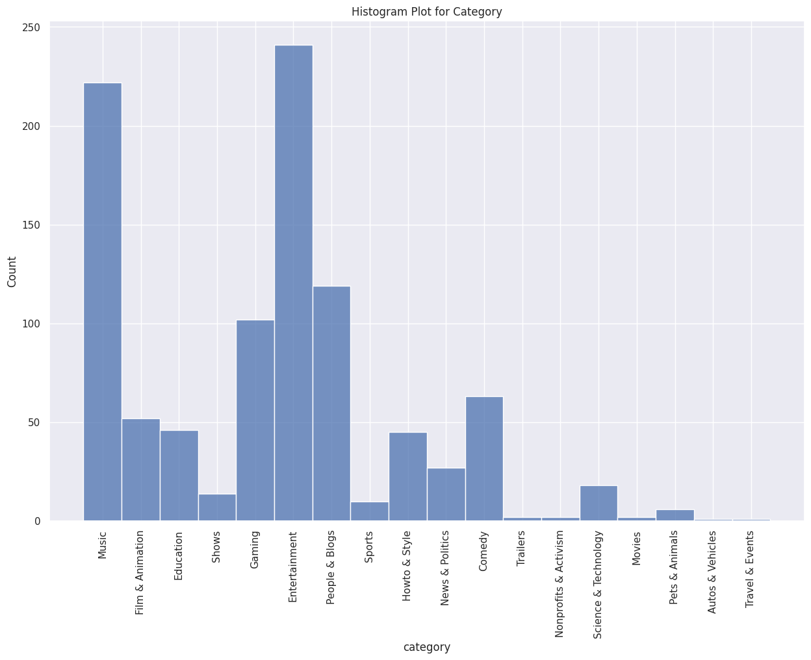
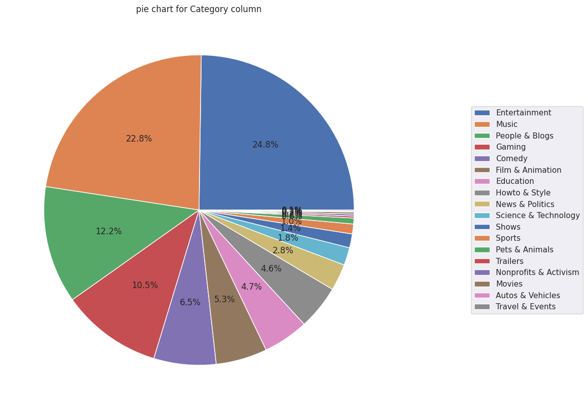
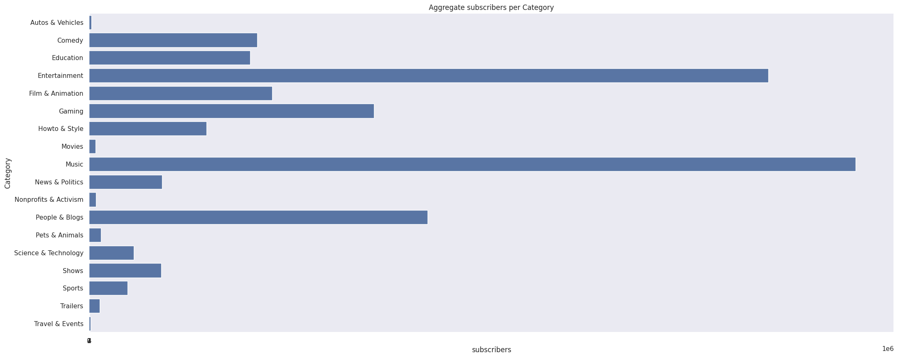
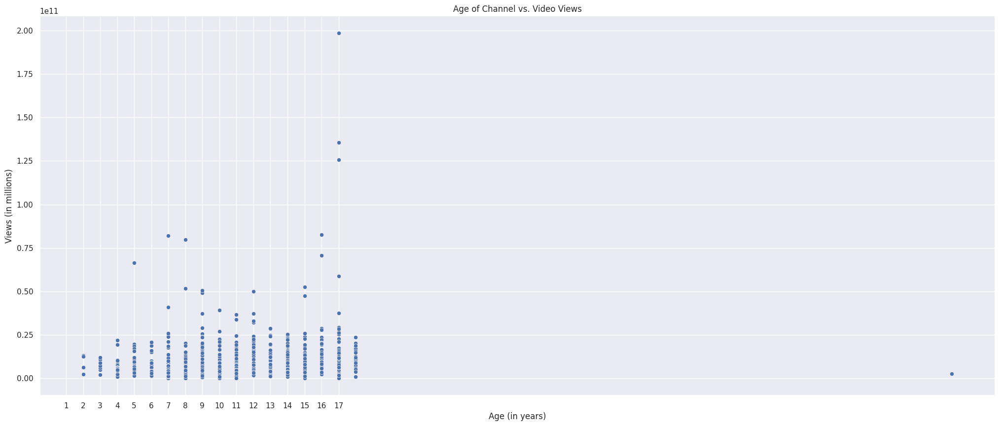
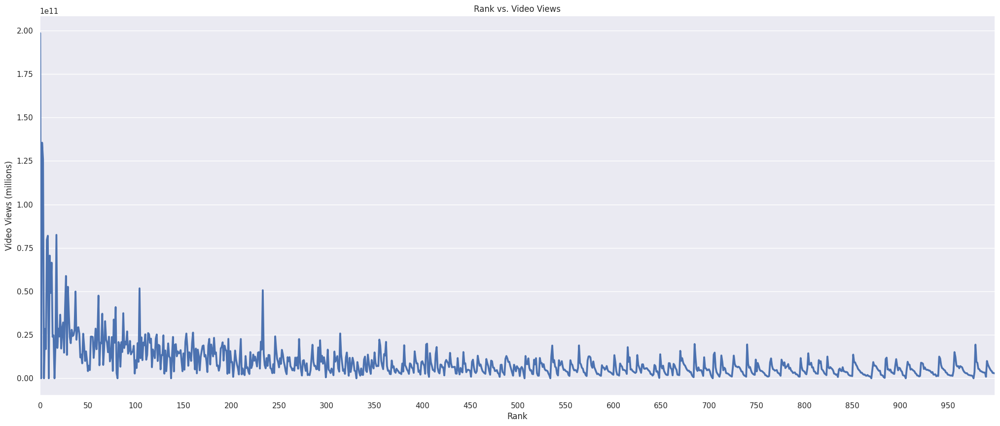
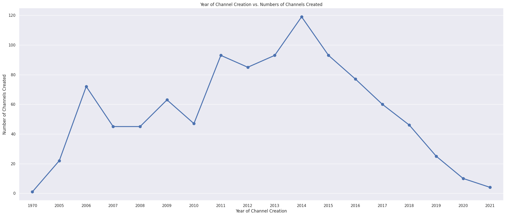
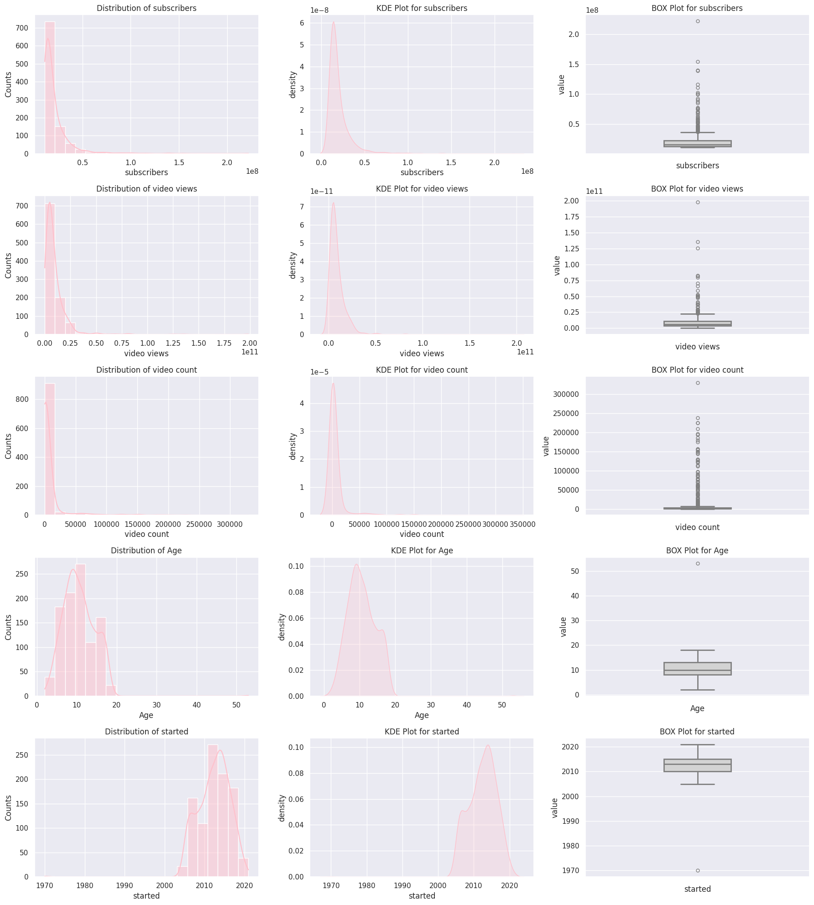
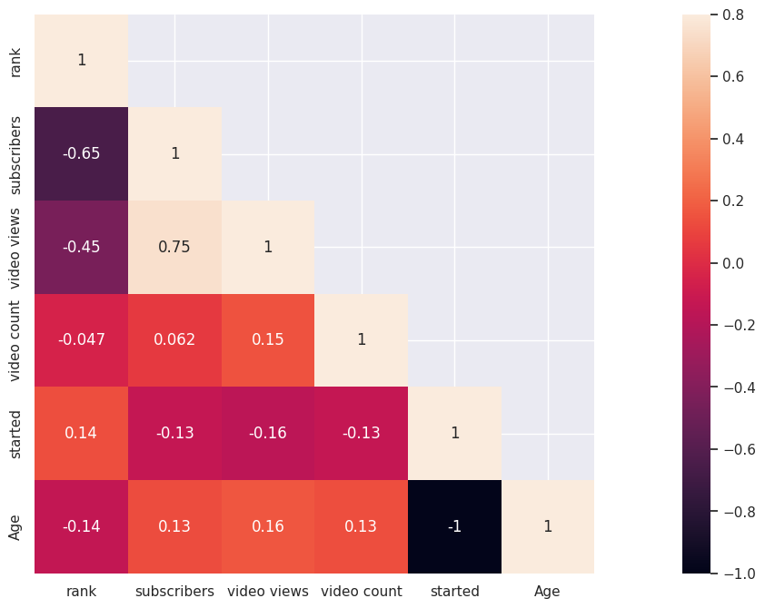

<h1>Most Subscribed YouTube Channels Analysis</h1>

**GOAL**

To visualize and perform EDA and study relationship between different atttributes.

**DATASET**

[https://www.kaggle.com/datasets/surajjha101/top-youtube-channels-data]

**DESCRIPTION**

This data contains the 7 attributes about the top 1000 YouTube channels as per number of subscribers they have. These attributes with their proper description are as follows:

rank: Rank of the channel as per number of subscribers they have

youtuber: Channel Official Name

subscribers: Number of subscribers channel have

video views: Number for which all videos have been watched collectively

video count: Number of videos channel has uploaded so far

category: Category (genre) of the channel

started: Year when the channel was started

Hence the dataset has 1000 rows and 7 columns.

### Visualization and EDA of different attributes:

**Distribution Plot, KDE Plot, BOX Plot**

**Correlation heatmap**

**WHAT I HAD DONE**

* Load the dataset which is CSV format.
* It has 1000 entries(Rows), 7 columns(attributes).
* Checked for missing values and cleaned the data accordingly.
* Analyzed the data, found insights and visualized them accordingly.

**LIBRARIES NEEDED**

1. Pandas
2. Matplotlib
3. NumPy
4. Seaborn

**CONCLUSION**

- From various visualizations we can see that Music Category channels are most subscribed
- We can notice that there's high correlation 0.82 with subscribers and video views.
- Music, education, Film & Animation are top3 categories that have most subscribers.
- Includes: T-Series, YouTube Movies and Cocomelon - Nuresery Rhymes

**YOUR NAME**

*Ghousiya Begum*

  
