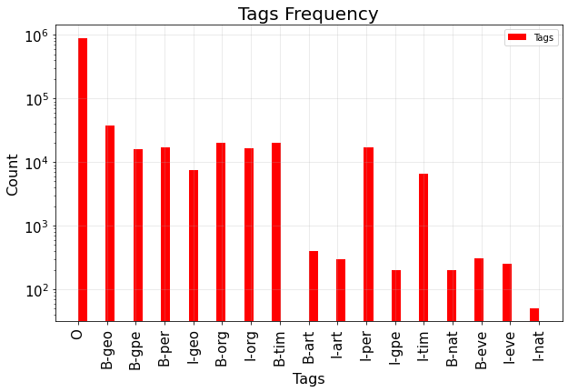

**Named Entity Recognition (NER) Corpus**

  

**GOAL**

  

Task of categorizing the entities in a text into categories like names of persons, locations, organizations, etc..

  

**DATASET**

https://www.kaggle.com/naseralqaydeh/named-entity-recognition-ner-corpus

  

**DESCRIPTION**

  
The main aim of the project is to implement an algorithm which categorize the entities in a text into categories like names of persons, locations, organizations, etc..

  

**WORK DONE**

* Analyzed the dataset and performed EDA.
* Performed data pre processing.
* Did train,validation and test split.
* Trained the model using LSTM.

  

**LIBRARIES NEEDED**

* tensorflow
* keras
  
  

## **VISUALIZATION.**
_________________________________________
## **Tags frequency**

**CONCLUSION**

  

The dataset was analysed , data preprocessing was done and LSTM model was used for training, the accuracy turns out to be around 98% on test data.
  

**CONTRIBUTION BY**

*Vishnu Bhaarath*

  
  
