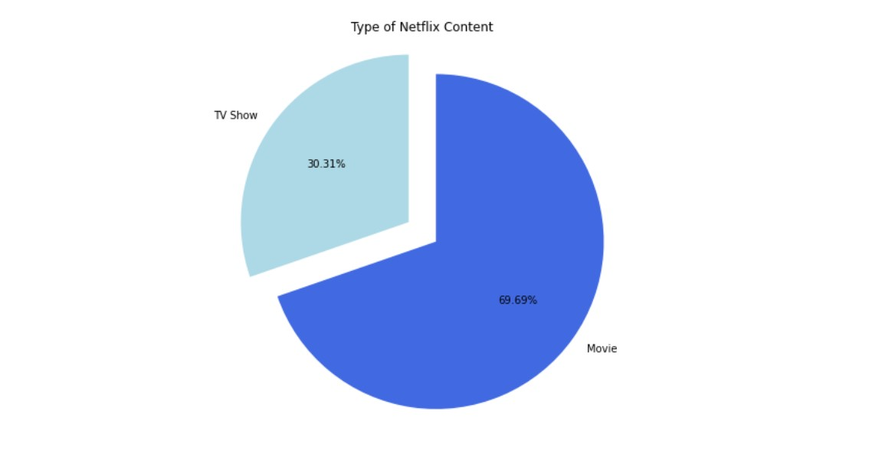
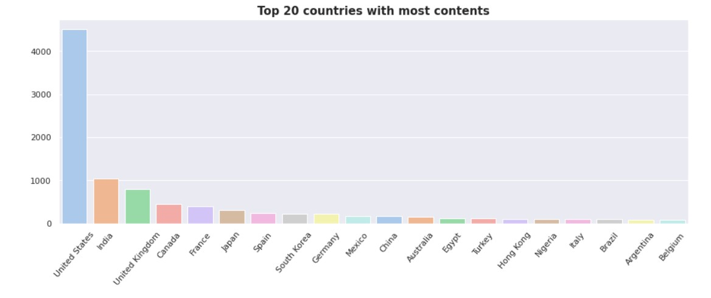
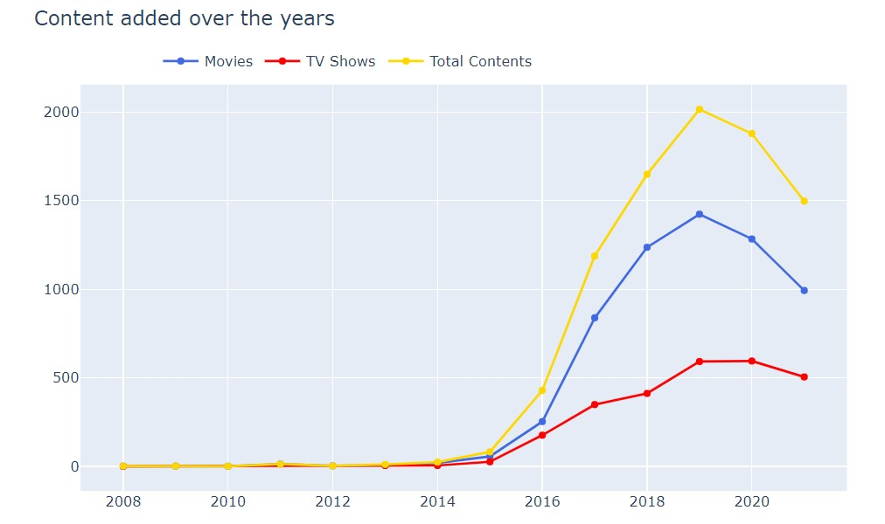
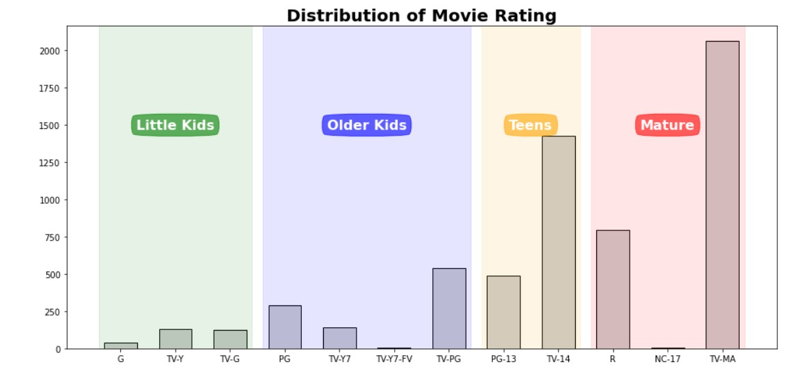

  

**Netflix Movies and TV Shows**

  

**GOAL**

  
To perform EDA on the Netflix Movies and TV show data and find insights.

  

**DATASET**

  

https://www.kaggle.com/shivamb/netflix-shows

  

**DESCRIPTION**

  

The main aim of the project is to understand what content is available in different countries ,Identify similar content by matching text-based features ,Network analysis of Actors / Directors and find interesting insights ,Does Netflix has more focus on TV Shows than movies in recent years and perform EDA.

  

**WORK DONE**

* Analyzed the data and found insights such as correlation, missing values etc.
* Applied different techniques to do data cleaning and then visulaized the data.

  

**LIBRARIES NEEDED**

* Numpy
* Pandas
* Matplotlib
* missingno
* seaborn
  
  

**IMAGES**

    
    

    
    

**CONCLUSION**

  * Nearly 2/3rd of the content on netflix are movies while the rest are TV Show
  * The growth in number of movies on netflix is much higher than that of TV shows
  * About 1200 new movies were added in both 2018 and 2019
  * The growth in content started from 2013
  * Most of the movies were released in the year 2017 followed by 2018 and 2016
  * Most of the TV Shows were released in 2020 followed by 2019 and 2018

  

**CONTRIBUTION BY**

*Sankalp Srivastava*

  
  
