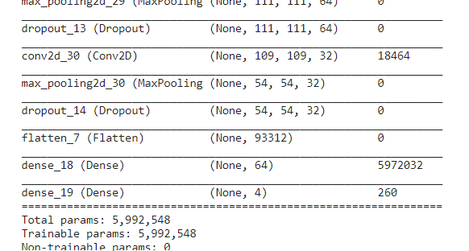
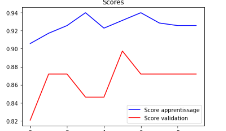
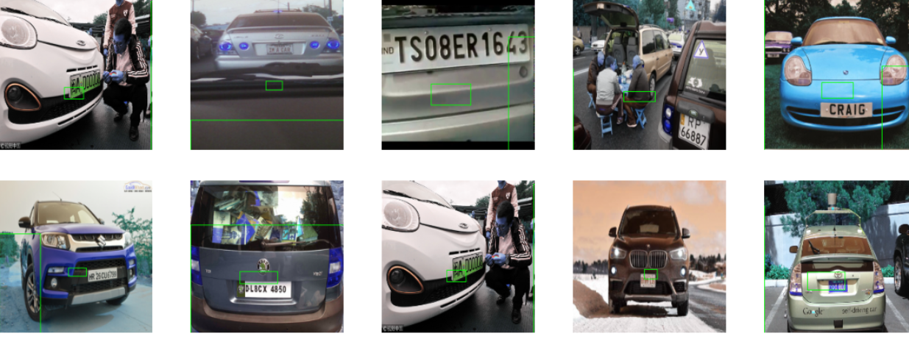
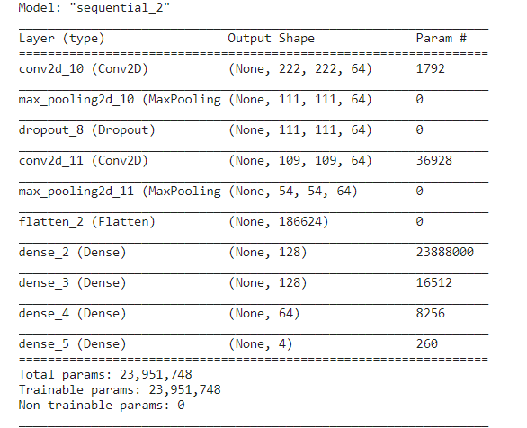
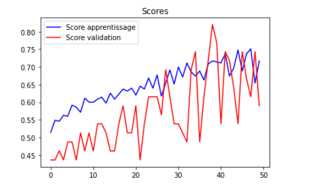
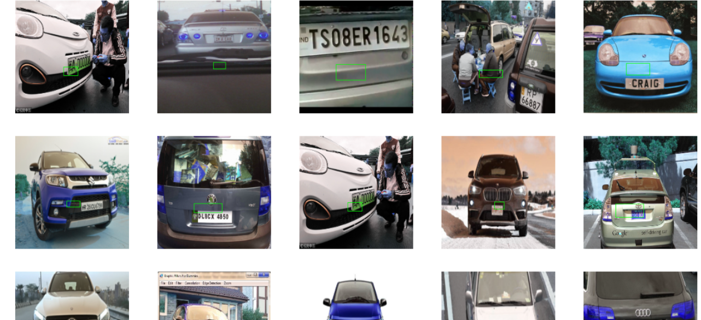
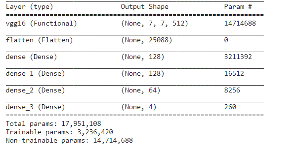
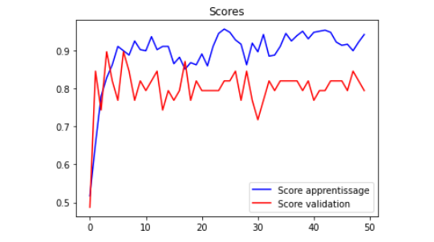
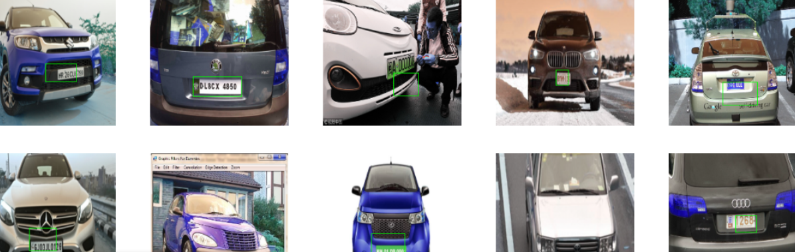

# Number Plate Prediction
### **Task**: Detecting a number plate in a given image (If any)
Dataset-> https://www.kaggle.com/andrewmvd/car-plate-detection

# Approach: 
1. Data Exploration
2. Preprocessing the image
3. Model Selection and Training
4. Compare Losses/Accuracies/Predictions
5. Repeat 3-4 for various models

# Models Used: 
1. Convolutional Networks: 
2. VGG-16

| Model | Score_graph | Output On TestSet | 
|--|--|--|
|  |  |  | 
|  |  |  | 
| | |
| | |
|  |  |  | 

# Accuracies/Losses

 
**CONTRIBUTION BY**  

*Yagyesh Bobde*  

  
 
