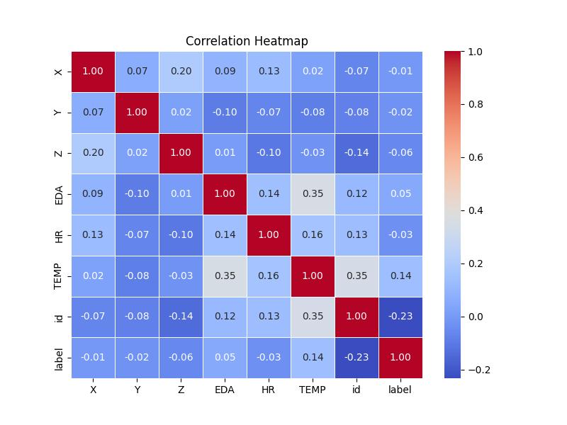
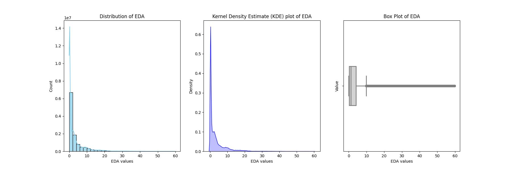
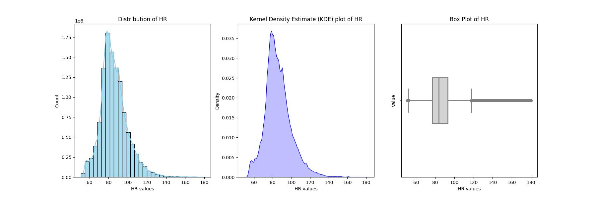
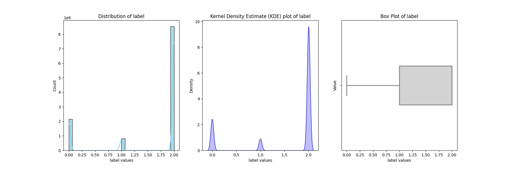
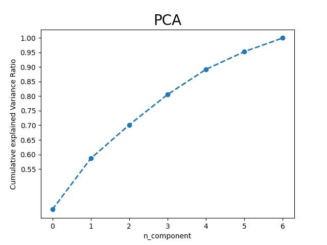
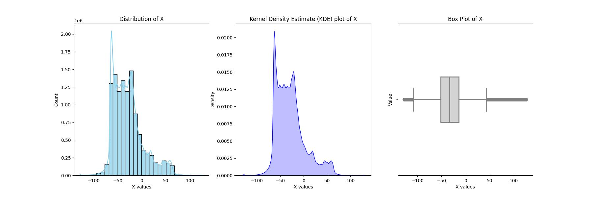
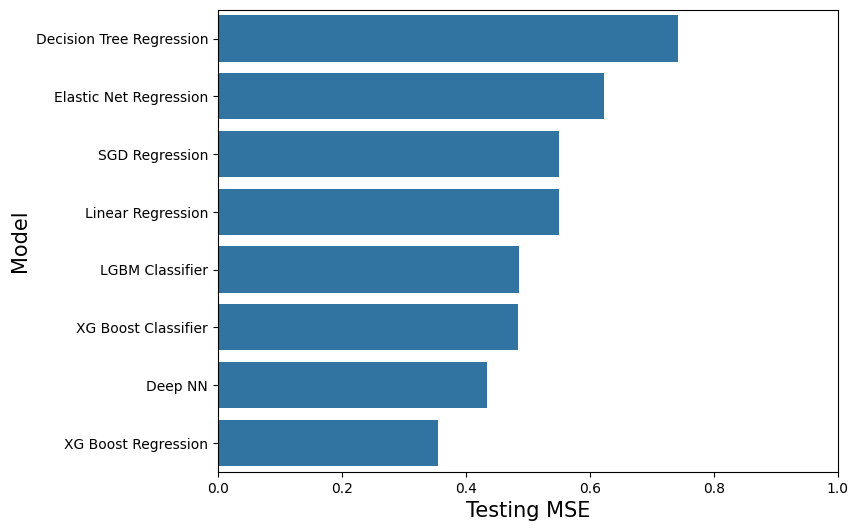
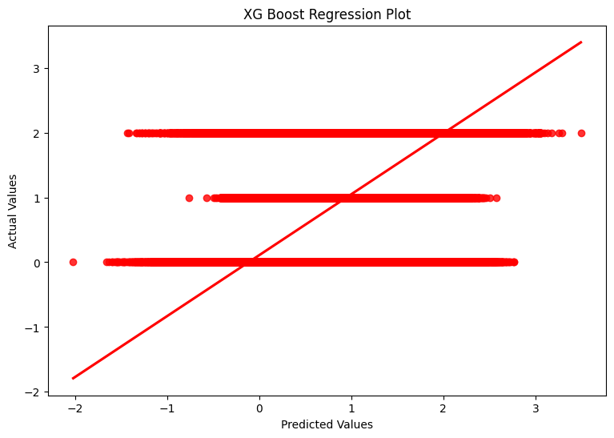
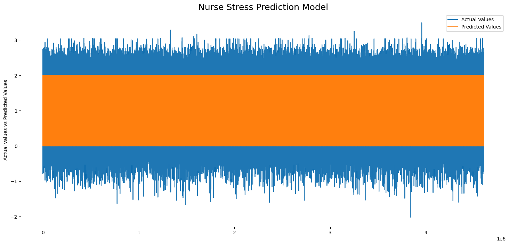

<h1>Nurse Stress Prediction</h1>

**GOAL**

The aim of this project is to predict the stress on nurse based on the given dataset.

**DATASET**

https://www.kaggle.com/datasets/priyankraval/nurse-stress-prediction-wearable-sensors

**DESCRIPTION**

- To analyze the dataset of Nurse stress prediction wearable sensors and build and train the model by understanding the different features and connections between the features.

- There are 9 different types of features in the datasets which are explained in the kaggle or you can read about them in [README](./Dataset/README.md) of the Dataset folder.

**Visualization and EDA of different attributes**

**MODELS USED**

| Model                     | MSE_train | R2_train | MSE_val  | R2_val               | MSE_test | R2_test              |
|---------------------------|-----------|----------|----------|----------------------|----------|----------------------|
| XG Boost Regression       | 0.204959  | 0.670992 | 0.359257 | 4.233017e-01         | 0.355257 | 4.293855e-01         |
| Deep NN                   | 0.305992  | 0.508809 | 0.438734 | 2.957209e-01         | 0.434882 | 3.014910e-01         |
| XG Boost Classifier       | 0.244597  | 0.607362 | 0.491024 | 2.117828e-01         | 0.484412 | 2.219365e-01         |
| LGBM Classifier           | 0.323493  | 0.480715 | 0.490993 | 2.118316e-01         | 0.485734 | 2.198123e-01         |
| Linear Regression         | 0.549359  | 0.118145 | 0.551217 | 1.151569e-01         | 0.550664 | 1.155217e-01         |
| SGD Regression            | 0.549366  | 0.118134 | 0.551315 | 1.150005e-01         | 0.550770 | 1.153516e-01         |
| Elastic Net Regression    | 0.622959  | 0.000000 | 0.622955 | -2.460906e-07        | 0.622586 | -9.965216e-09        |
| Decision Tree Regression  | 0.000000  | 1.000000 | 0.747171 | -1.993990e-01        | 0.741888 | -1.916233e-01        |

**WHAT I HAD DONE**

* Load the dataset which contains 11509051 entries in it and having 9 columns in it.
* Checked for missing values and cleaned the data accordingly.
* Analyzed the data, found insights and visualized them accordingly.
* Plotting heatmap using correlation and checking the relation between different features.
* Performing PCA to reduce the number of features and normalize the data to remove the effect of outliers.
* Found detailed insights of different columns with target variable using plotting libraries.
* Train the datasets by different models and saves their accuracies into a dataframe.
* Visualize the accuracy and finalize the best fitted model.

**LIBRARIES NEEDED**

1. Pandas
2. Matplotlib
3. Sklearn
4. NumPy
5. XGBoost
6. Tensorflow
7. Keras
8. Sci-py
9. Seaborn
10. LightGBM

**CONCLUSION**

- XG Boost Regressor and DNN models show promising performance with lower MSE and higher R2 values.
- Decision Tree Regression achieved perfect R2 on the training set but performed poorly on the test set, indicating overfitting.
- Among the classifier models, XG Boost Classifier and LGBM Classifier showcased similar performances in terms of MSE and R-squared on both validation and test datasets. These models present viable options for classification tasks, with comparable accuracy.

**YOUR NAME**

*Avdhesh Varshney*

  

