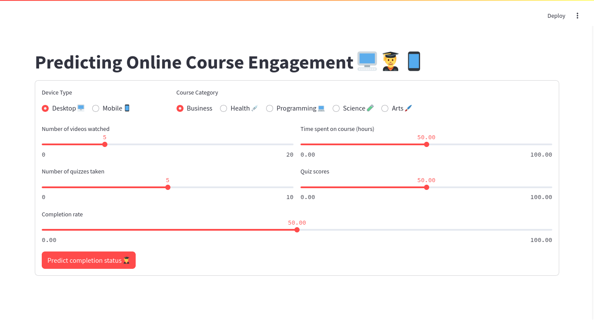
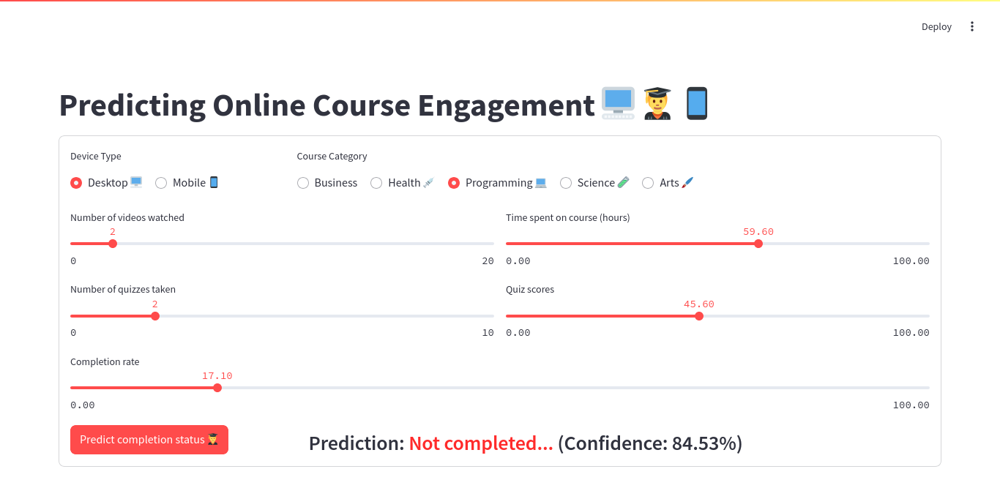
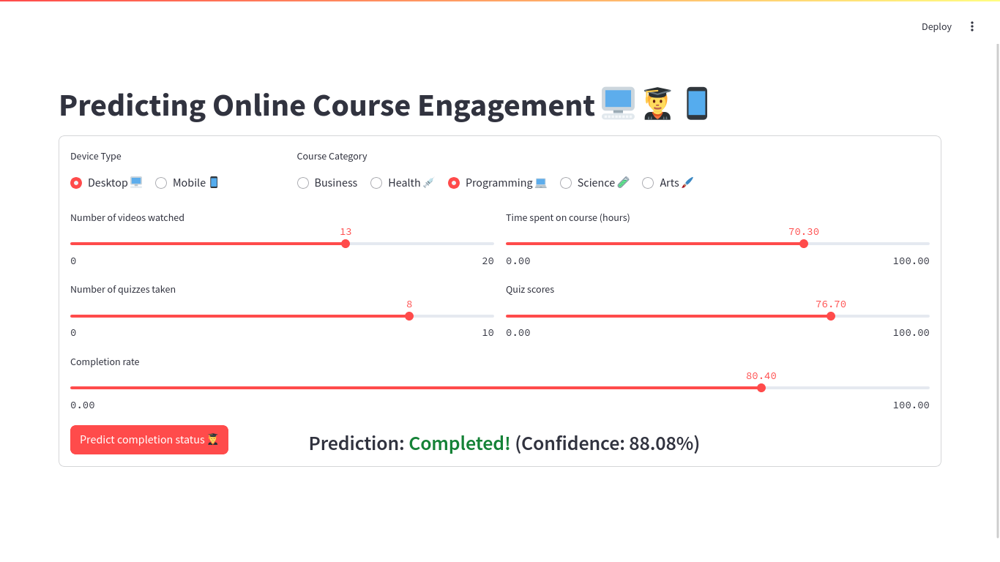

# App demo

A Streamlit web application to provide an interface allowing the user to input course engagement metrics and predict if the course was completed or not, along with a confidence score in the form of probability.  
This can be used by course administrators to track which students may need help or additional monitoring.

User can input the following parameters:

1. Device type - Desktop/Mobile
2. Course Category - Business/Arts/Programming/Health/Science
3. Time spent on course
4. Number of videos watched
5. Number of quizzes taken
6. Quiz Scores
7. Completion rate

## Video demonstration

[streamlit-app-demo.webm](https://github.com/user-attachments/assets/544e3cc4-c4fa-4e1d-9d85-fe0b07eaa7ae)

## Screenshots

### Homepage

### Prediction: No

### Prediction: Yes

