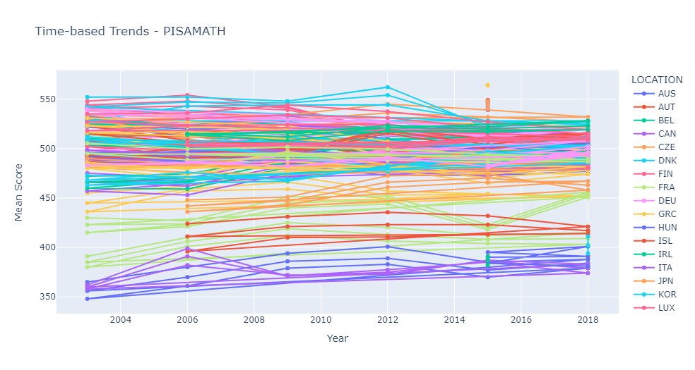
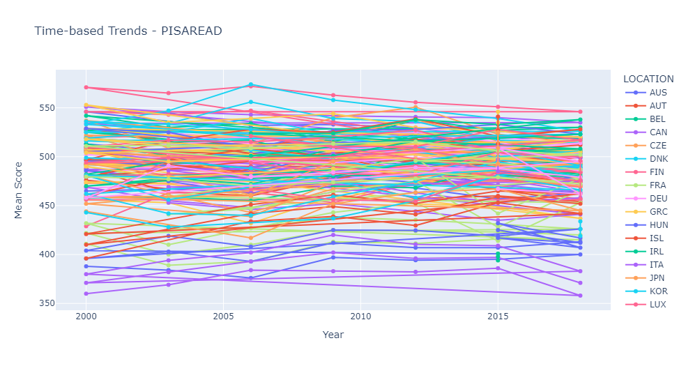
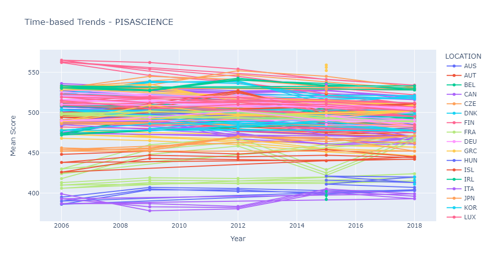
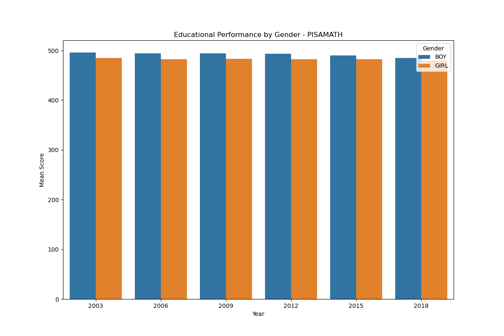
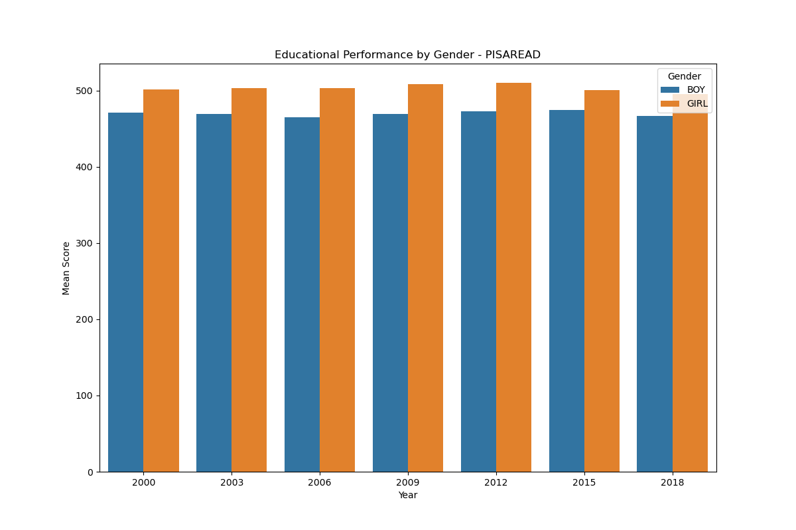
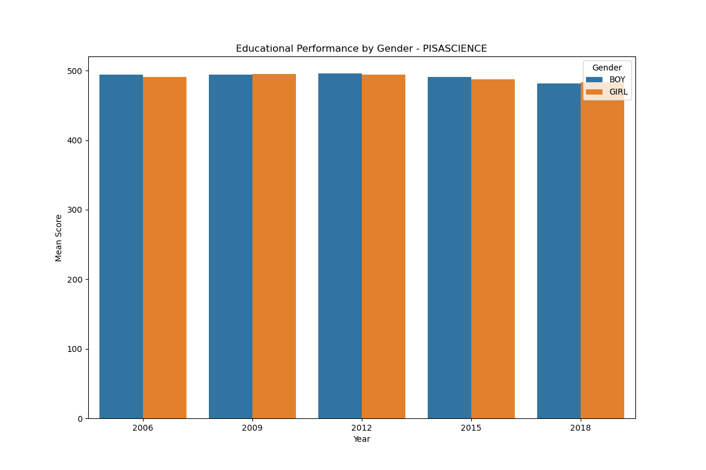

<h1>PISA Performance Scores Analysis</h1>

**GOAL**

To analyze the 'PISA Performance Scores by country' Dataset using Exploratory Data analysis.

**DATASET**

https://www.kaggle.com/datasets/thedevastator/pisa-performance-scores-by-country

**DESCRIPTION**

TThe OECD PISA dataset provides performance scores for 15-year-old students in reading, mathematics, and science across OECD countries. The dataset covers the years 2000 to 2018.

These performance scores are measured using the Programme for International Student Assessment (PISA), which evaluates students' abilities to apply their knowledge and skills in reading, mathematics, and science to real-life challenges.

The dataset includes information on the performance scores categorized by location (country alpha‑3 codes), indicator (reading, mathematical, or scientific performance), subject (boys/girls/total), and time of measurement (year). The mean score for each combination of these variables is provided in the Value column.

The dataset contains the following columns:
- Locations (country alpha-3 codes)
- Indicator (PISAREAD, PISAMATH, PISASCIENCE)
- Subject (Boys, Girls, Total)
- Time (the year which performance scores were measured[values between 2000 to 2018])
- Value (The mean score of performance indicator)

**WHAT I HAD DONE**

* Checked for missing values and cleaned the data accordingly
* Analyzed the data, found insights and visualized them accordingly.
* Found detailed insights of different columns with one another using plotting libraries.

**LIBRARIES NEEDED**

1. Pandas
2. Matplotlib
3. Seaborn
4. Plotly

**VISUALIZATION**

For more plots checkout the .ipynb file :)
 

 

**CONCLUSION**
- OECD countries have better mean scores in all three indicators as compared to Non-OECD countries.
- Girls have outperformed boys in PISAREAD by a greater margin than boys have outperformed girls in PISAMATHS.
- Both boys and girls have approximately equal scores in PISASCIENCE over the years.
- The same trend in gender was observed both in OECD and Non-OECD countries.
- Comparison against benchmark (OAVG) shows that most countries have performed nicely in PISAREAD and badly in PISAMATH and PISASCIENCE.
- Average scores for countries have reamined save over years in all the three indicators.
- KOR and FIN have performed most well in PISAREAD 
- KOR and JPN have performed greatly in PISAMATH over the years.
- FIN and SGP have taken lead in PISASCIENC scores.

**AUTHOR**

- Code contributed by *Mariam* @ #JWoC_2024

  
