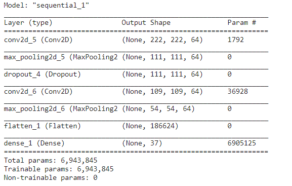
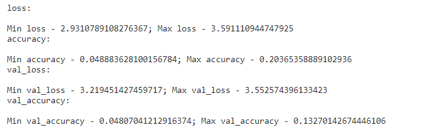
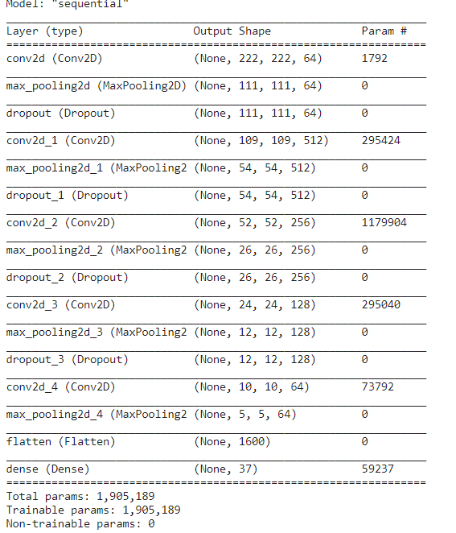
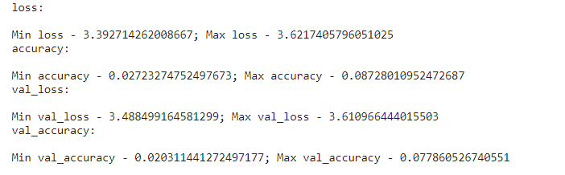
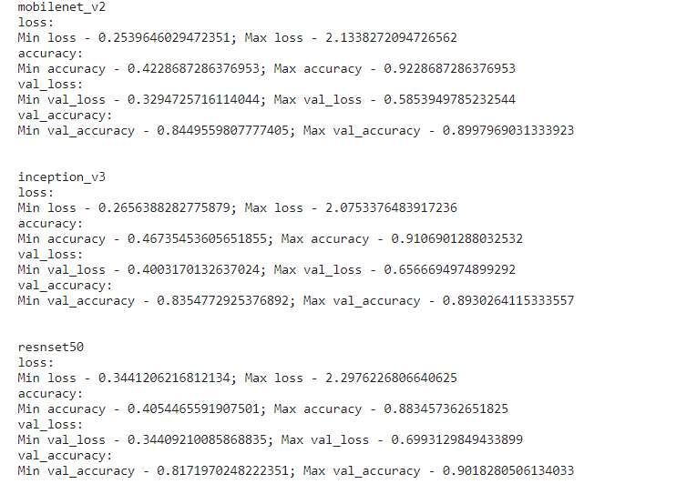

# Oxford Pets Classification
### **Task**: Image Classificaiton using the oxford IIT pets dataset -37 classes
Dataset-> 

# Approach: 
1. Loading the datset
2. Preprocessing the image dataset
3. Data augmentation
4. Model Selection and Training
5. Comparing/Analyzing the accuracies and losses 
6. Repeat the steps 4 and 5 to find the best model

# Models Used:
Since this is an image classification I mainly focused on convolutional neural networks, and tried different variations of CNN possible to find the best fit.

## Convolutions: 

| Conv Layers | Model Summary| Metrics |
|------|-------|-------|
| 2 layers |  |  | 
| 4 layers |  | 

Here we observed that the accuracy was pretty low, it could only reach about **10%**. 
So the next thing we can try is using transfer learning.

# Transfer Learning 
I also used 3 pretrained models 
1. Mobilenet 
2. Inception_v3
3. Resnet50

Here as you can see we reached an accuracy of **90% accuracy**. 
This the power of using pre-trained models for your machine learning tasks.

**CONTRIBUTION BY**  

*Yagyesh Bobde*  

  
 
