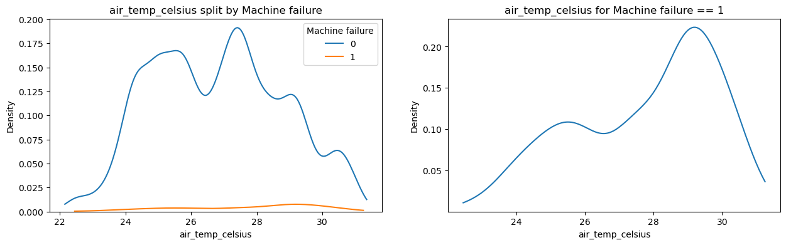
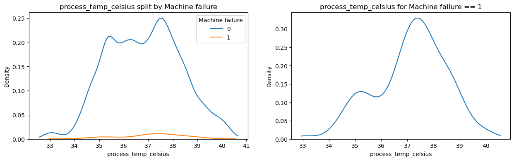
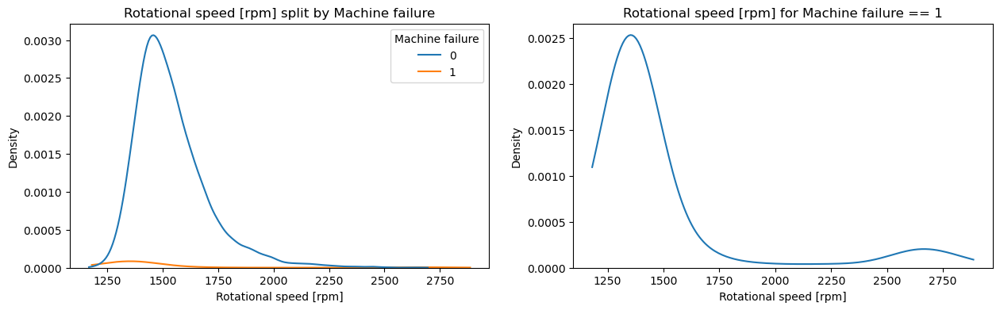
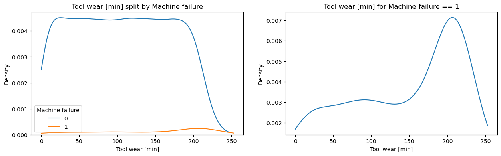
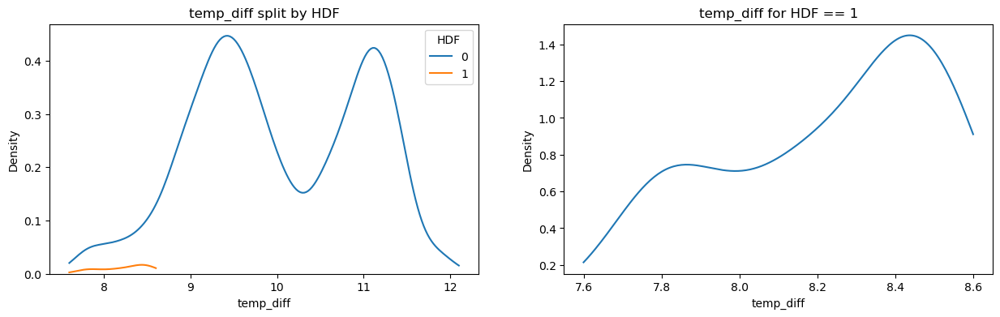
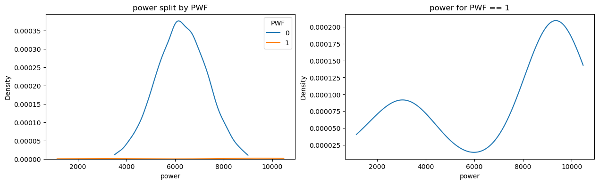
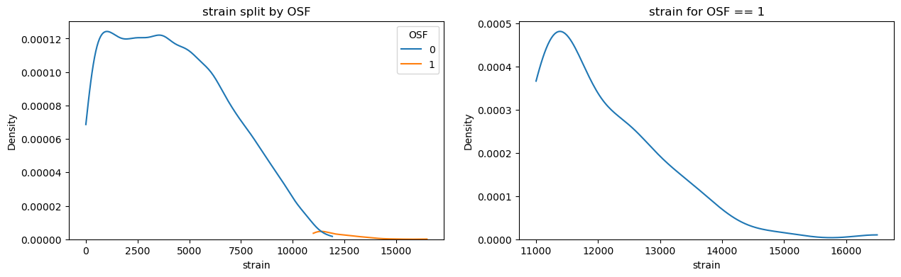
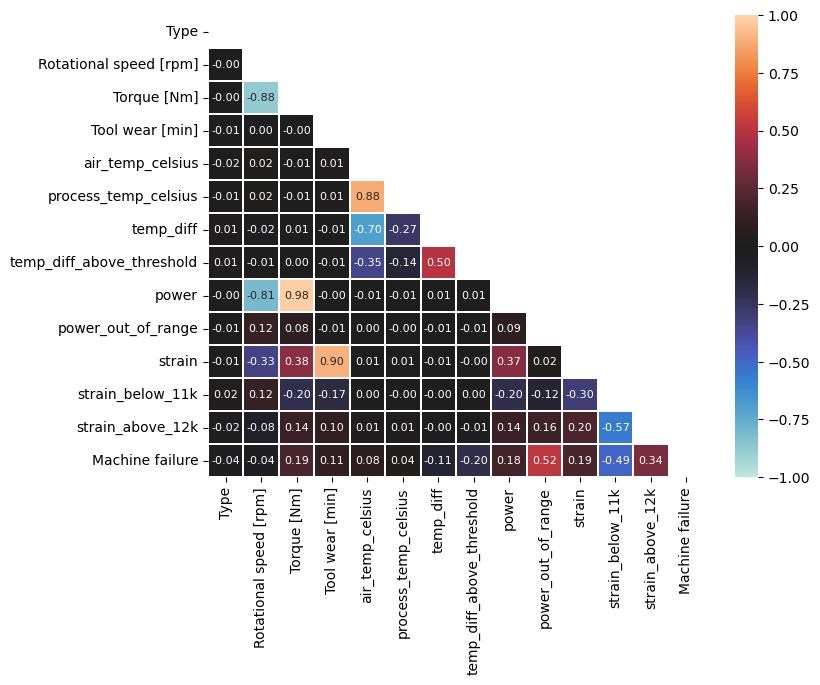

## **PROJECT TITLE**

### 🎯 **Goal**

Detecting machine failure based on different operational parameters for predictive maintenance of equipment.

### 🧵 **Dataset**

[Predictive Maintenance Dataset (AI4I 2020)](https://www.kaggle.com/datasets/stephanmatzka/predictive-maintenance-dataset-ai4i-2020)

### 🧾 **Description**

This synthetic dataset is modeled after an existing milling machine and consists of 10,000 data points stored as rows with 14 features in columns. Only 339 out of 10000 data points represent machine failure, making it an extremely imbalanced classification problem.

### 🧮 **What I had done!**

1. Exploratory analysis of features along with preprocessing.
2. Feature engineering based on domain knowledge of different types of machine failures.
3. Feature selection based on statistical tests.
4. Created a holdout set for testing all the models using Stratified sampling to maintain imbalance ratio.
5. Training and validation of multiple types and configurations of: linear models, support vector machines, tree models, tree ensembles, gradient-boosting trees and neural networks.
6. Models were tuned and evaluated based on F2-score, which is a harmonic, weighted mean of precision and recall, with recall having twice the importance of precision. This is because identifying all instances of machine failure correctly is critical to us.
7. Created a Streamlit web app to provide an interface for testing new data points with appropriate input methods. For inference, the best model is chosen i.e., AdaBoostClassifier trained on full feature set.

### 🚀 **Models Implemented**

* Linear models: Logistic Regression, Ridge Classifier, Passive-Aggressive Classifier, Perceptron
* Support Vector Machine: LinearSVC, SVC with polynomial kernel, SVC with RBF kernel
* Tree models: Decision-tree, Extra-Tree (Extremely Randomized Tree) classifier
* Tree ensembles: Random Forest, Extra-Trees Classifier, Bagging Classifier
* Gradient-boosting models: AdaBoost (best model), Hist-Gradient Boosting
* Neural network: Multi-layer Perceptron (three configurations)

### 📚 **Libraries Needed**

* Pandas
* Numpy
* Scikit-learn
* Matplotlib
* Seaborn
* Joblib

### 📊 **Exploratory Data Analysis Results**

**Feature distributions**:  

**Feature engineering**:

**Feature selection**:

### 📈 **Performance of the Models based on the Accuracy Scores**

The most important metric for our imbalanced classification is recall. To balance accuracy/precision and recall, we tuned the models based on F2-score (where recall is weighted twice that of precision).  

Each model as two variations, one for each feature set: all (A) and reduced (R). Only the best of the two variations is included in the table.

| Model configuration | Accuracy (%) | F2-Score (%) | Recall (%)
|:-----:|:-----:|:-----:|:-----:
| Logistic Regression (A) | 97.74 | 75.42 | 79.41
| Ridge Classifier (A) | 98.70 | 79.88 | 79.41
| Passive Aggressive Classifier (A) | 98.30 | 73.96 | 73.53
| Perceptron (R) | 95.50 | 63.45 | 73.53
| Linear SVM (A) | 97.80 | 75.84 | 79.41
| SVM - RBF kernel (A) | 99.00 | 81.33 | 79.41
| SVM - Poly kernel (A) | 99.10 | 81.82 | 79.41
| Decision Tree Classifier (A) | 99.00 | 83.33 | 82.35
| Extra Tree Classifier (R) | 94.70 | 68.08 | **85.29**
| Random Forest Classifier (A) | 98.50 | 80.92 | 82.35
| Extra Trees Classifier (R)| 98.30 | 78.03 | 79.41
| Bagging Classifier (A) | 99.00 | 83.33 | 82.35
| AdaBoost Classifier (A) | 99.10 | **85.80** | **85.29**
| Hist-Gradient Boosting Classifier (A) | **99.40** | 85.37 | 82.35
| Multi-layer Perceptron Config-1 (A) | 99.00 | 81.33 | 79.41
| Multi-layer Perceptron Config-2 (A) | 99.10 | 81.82 | 79.41
| Multi-layer Perceptron Config-3 (A) | 98.70 | 79.88 | 79.41

### 📢 **Conclusion**

After comparing a variety of models on our extremely imbalanced dataset, the best performance was shown by AdaBoost Classifier with an accuracy of 99.1%, recall of 85.29% and F2-score of 85.80%. The best model was used for inference in a Streamlit web app to test new data points.

### ✒️ **Your Signature**

Siddhant Tiwari  
([Github](https://www.github.com/siddhant4ds) - [Kaggle](https://www.kaggle.com/sid4ds) - [LinkedIn](https://www.linkedin.com/in/siddhant-tiwari-ds/))
