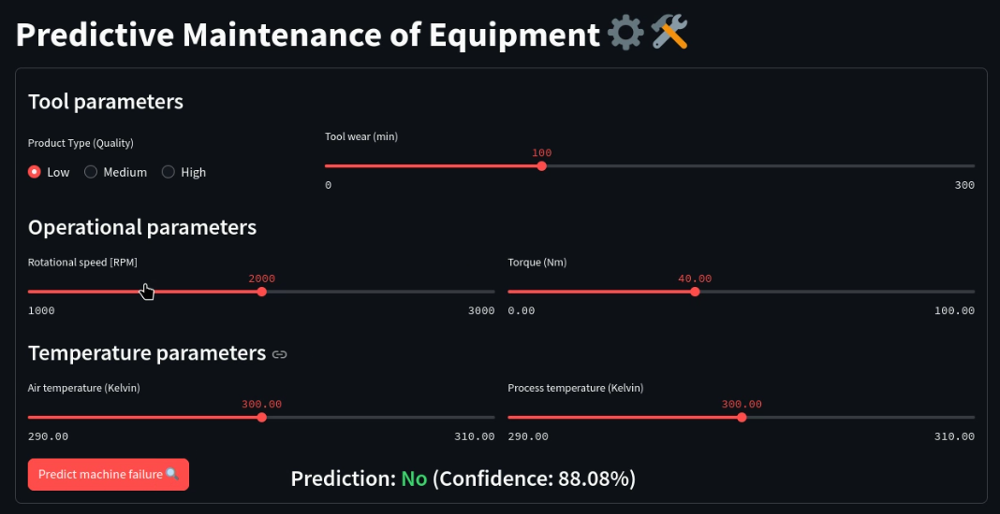
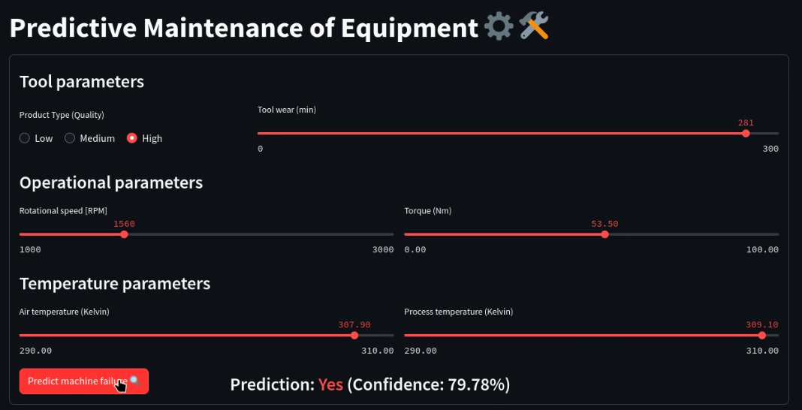

# App demo

A Streamlit web application to provide an interface to the user to input operational parameters and predict if they could cause machine failure, along with a confidence score in the form of probability.  
This can act as a simulation tool, since these parameters are available once the machine starts operating. User can know in advance if certain combinations of parameters are high risk for machine failure, and avoid operating at those conditions.

User can input the following parameters:

1. Product type (Machine quality)
2. Tool wear
3. Air temperature
4. Process temperature
5. Rotational speed
6. Torque

## Video demonstration

[streamlit-app-demo.webm](https://github.com/siddhant4ds/ssoc3-ML-Crate/assets/150765441/a18d158f-9417-4af0-9215-472a6504b94e)

## Screenshots

### Prediction: No

### Prediction: Yes

