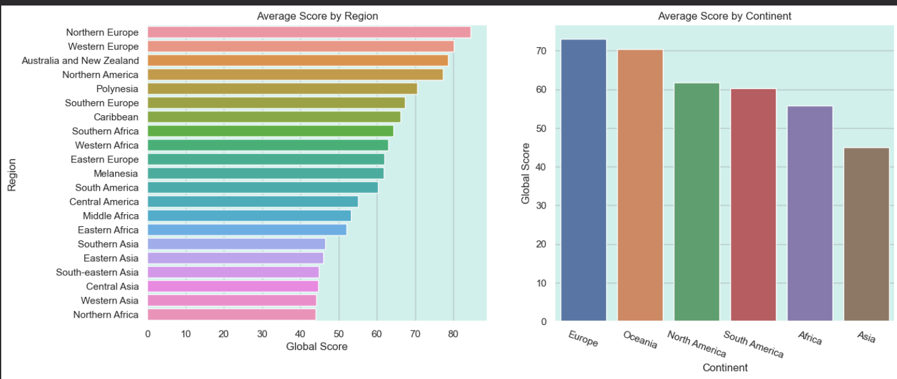
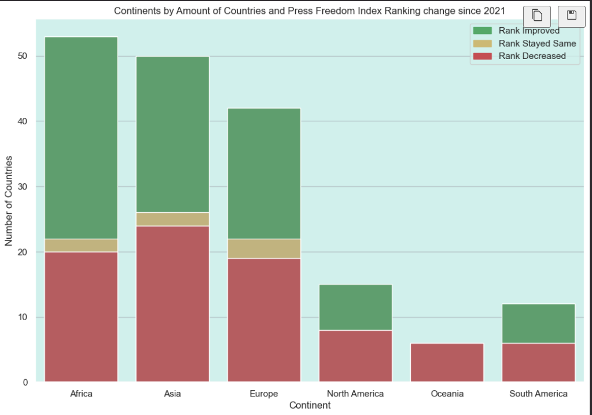
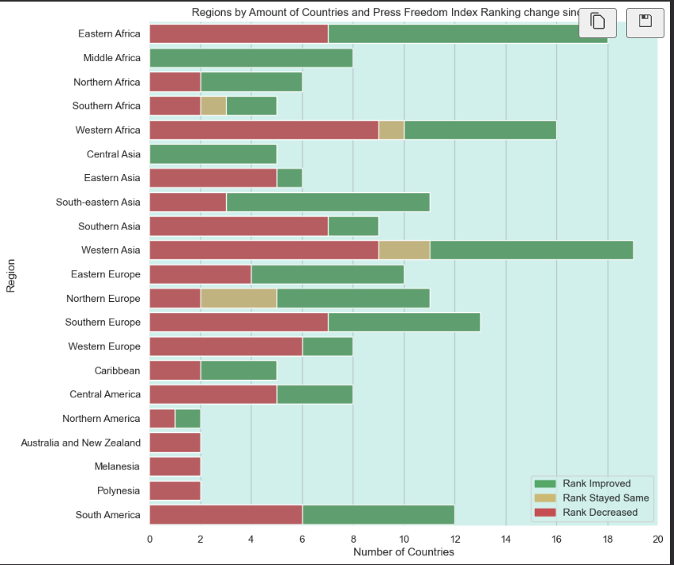
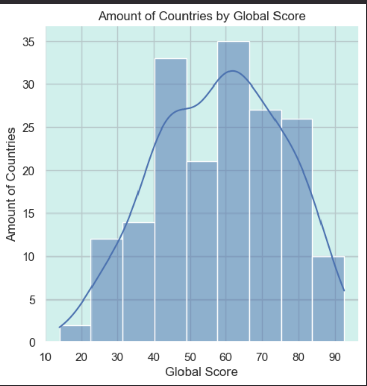
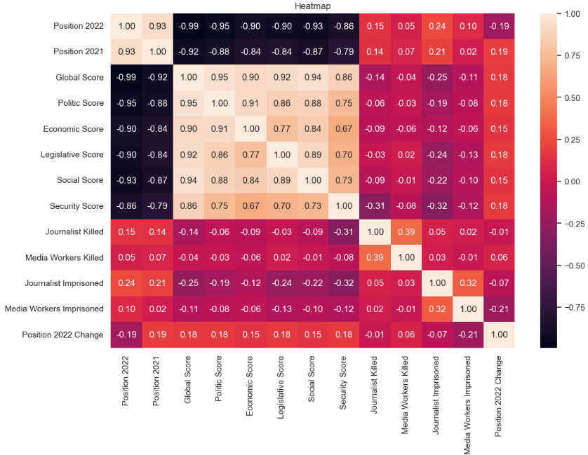

# Press Freedom Analysis

## AIM
The aim of the above task is to give a analysis of Press Freedom in year 2022 , 2021 and 2020 .

## DATASETS:-
https://www.kaggle.com/datasets/mfaaris/press-freedom-index-and-abuse

## WORKDONE:-
1.OBSERVE AND ANALYSIS THE DATASET.

2.THE DATASET IS DIVIDED INTO 3 SUB DATASETS IN YEAR (2019-2020) , (2020-2021)  and (2021-2022).

3.PREPARED A JUPITER NOTEBOOK CONTAINING THE ANALYSIS OF THE DATASETS.

## OBSERVATION:-

1. Northern Europe have highest average score by a region.

2. Europe have highest average score by a continent.

3.Africa have the highest number of country that improve their ranks.

4.Whereas Oceania is the lowest one.

5.The rank of all countires in Middle Africa and East Asia increased since 2021.

6.The majority of countries have a Press Freedom Index of Problematic or worse.Very few countries have a Press Freedom Index of 'Good'.

7. Hong Kong saw the greatest fall in ranking, going from 80th in 2021 to 148th in 2022.

8.Timor-Leste had the greatest improvement in ranking, going from 71st in 2021 to 17th in 2022.

9.Malaysia saw the greatest fall in ranking, going from 101th in 2020 to 119th in 2021.

10.Burundi had the greatest improvement in ranking, going from 160th in 2020 to 147th in 2021.

11.Haiti saw the greatest fall in ranking, going from 62nd in 2019 to 83rd in 2020.

12.Malaysia had the greatest improvement in ranking, going from 123rd in 2019 to 101st in 2020.

## HEATMAP OF THE DATASETS:-

