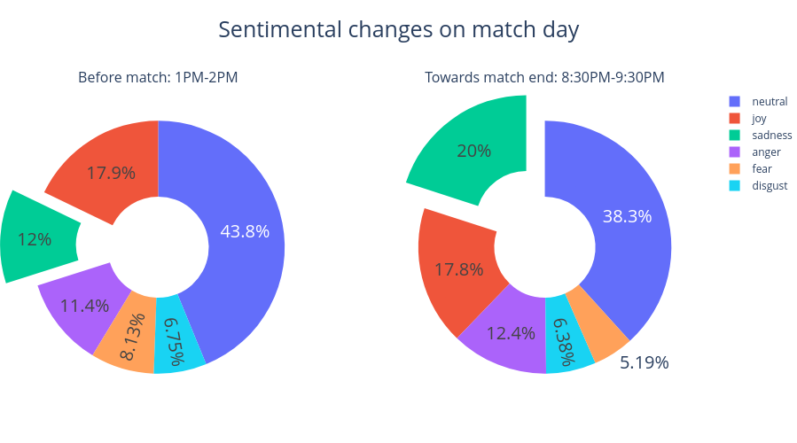
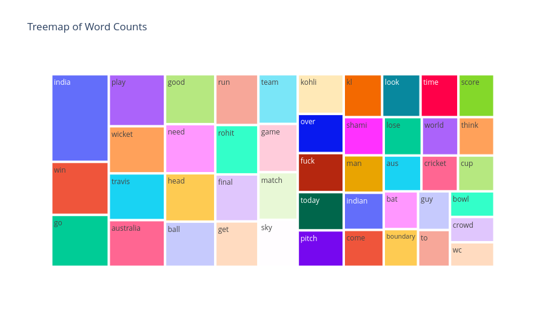

**PROJECT TITLE**: 
 Reddit Comments Analysis during CWC Final 2023

**GOAL**

The goal of this project is to analyze the comments of the reddit users during the CWC Final 2023 and gain insights about the emotions of the audience during the match.

**DATASET**

https://www.kaggle.com/datasets/hitman69/reddit-comments-60k-ind-vs-aus-wc-final

**DESCRIPTION**

The dataset contains the comments of the reddit users during the CWC Final 2023. The dataset contains 60k comments. The dataset contains the following columns:
UserID: The unique ID of the reddit user
body: The comment of the user
author: The username of the user
upvotes: The number of upvotes the comment has received
timestamp: The time at which the comment was posted

The body column contains the comments which was the target feature to be analyzed. The comments were analyzed using the NLP techniques. The comments were cleaned and then the sentiment analysis was performed on the comments. The comments were classified into 3 categories: Positive, Negative and Neutral. The comments were then visualized using the wordcloud. The wordcloud is a visualization technique which shows the most frequent words in the comments. The wordcloud was generated for the positive, negative and neutral comments separately. The wordclouds were then compared to gain insights about the emotions of the audience during the match.

**WHAT I HAD DONE**

I had performed the following steps in this project:

1. Importing the libraries
2. Importing the dataset and changing data types of the columns.
3. Cleaning and transforming the dataset removing meaningless words and null values
4. Preprocessing the comments using the NLP techniques provided by the Spacy library
5. Performing the sentiment analysis on the comments using various libraries.
6. Populating the comments into 3 categories: Positive, Negative and Neutral and its sentiment scores.
7. Visualizing the classification of the comments using the various statistical plots.
8. Comparing the sentiment scores of the comments predicted by various models.
7. Visualizing the comments using the wordcloud

**MODELS USED**

1. Spacy with asent: It is a community project which uses rule-based learning to perform the sentiment analysis
2. Textblob: It is a library which uses the Naive Bayes algorithm to perform the sentiment analysis
3. Vader: It is a library which uses the lexicon and rule-based learning to perform the sentiment analysis. Most widely used method
4. Roberta: It is a pretrained and finetuned BERT algorithm to perform the sentiment analysis task used with transformer pipeline.

**LIBRARIES NEEDED**

- asent
- spacy
- textblob
- vaderSentiment
- transformers
- matplotlib
- seaborn
- wordcloud
- numpy
- pandas
- plotly

**VISUALIZATION**

The following key insights were gained from the visualization of the certain plots:

1. The number of positive comments were more than the negative comments.
2. The number of neutral comments were more than the positive and negative comments.

The top 10 most frequent words in the positive comments were:
India, win, great, match, team, world, cup, final, played, well

**CONCLUSION**

I made the following conclusions with the help of this analysis:

1. There was drastic change in the emotions of the audience during the match. The audience was happy at the start of the match but as the match progressed the audience became sad and angry.
2. Clearly, the audience was not happy with the performance of the Indian team during the match. The audience was angry with the performance of the Indian team during the match.
3. Text blob and roberta gave the best results for the sentiment analysis task depicting that most of the comments were neutral.
4. Travis Head was the most talked about player during the match.
5. The audience had most number of mixed reaction comments on Indian players specially on Virat Kohli, Mohammed Shami and Rohit Sharma.
6. The negative comments on word India was 10% more than the negative comments on word Australia.

**YOUR NAME**

Adithya Awati 
[linkedin](https://www.linkedin.com/in/adithya-awati-87b7541a3/)