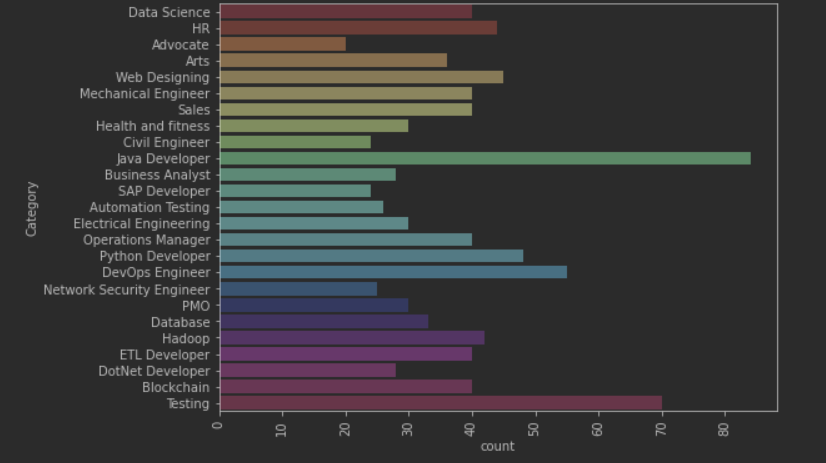
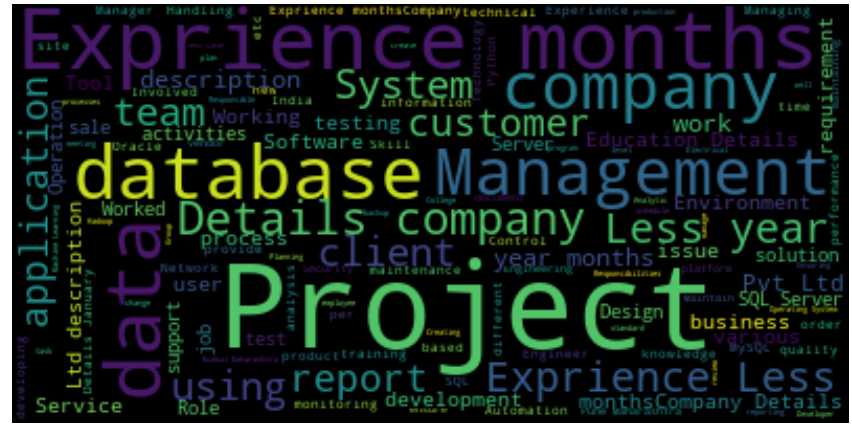
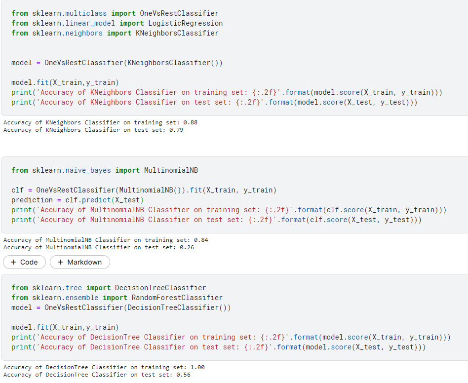

# Resume Classification 

In this project we are using the _ datset from kaggle, our main goal here is to classify the resume into one of the job categories present in our dataset.

## Workflow 
1. Load The Data
2. Data Analysis And Cleaning
     
 
 
    
 

1. Applying Tfidf Vectorization
2. Creating The Train/Test Split
3. Model Selection and Training 
4. Predictions
## Models Used 
- K-nearest neighbours
- logistic regression
- decisiontree classifier
- random forest classifier

## Prediction/Accuracy/Classification Report

## Libraries Used 

**Project By**  
Yagyesh Bobde  
  
 
