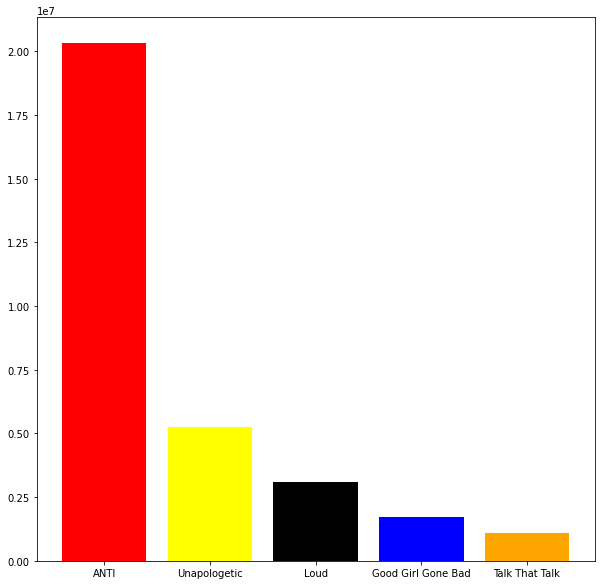
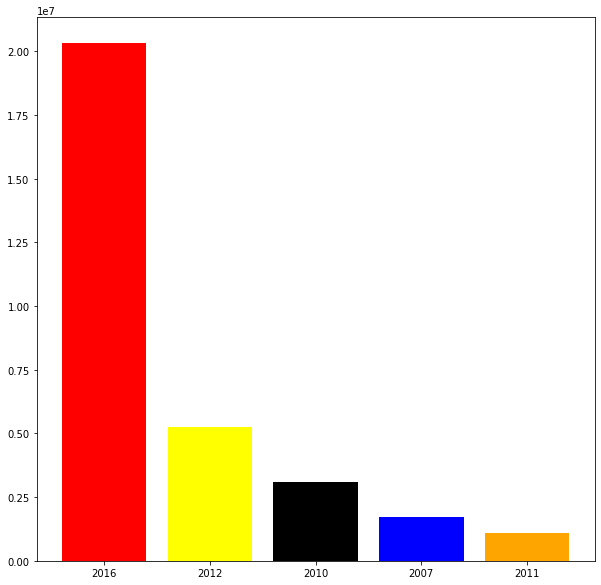
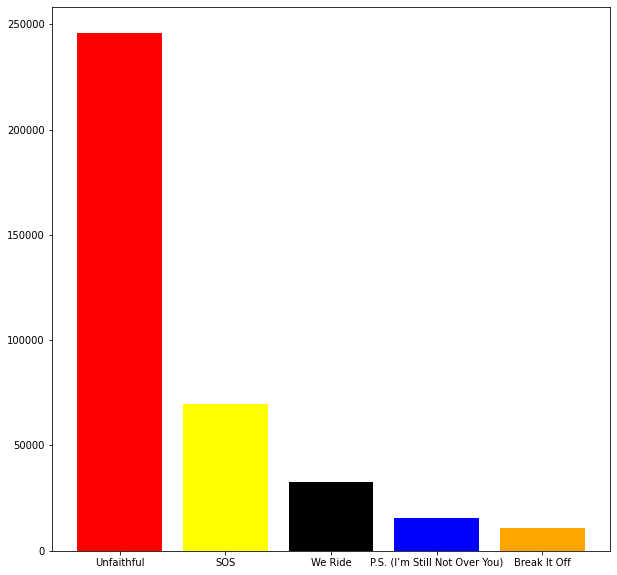
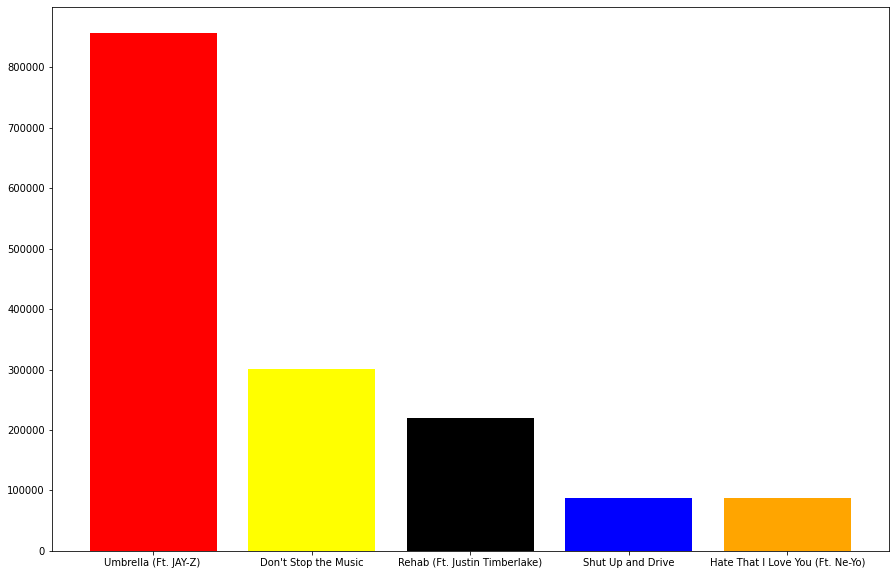
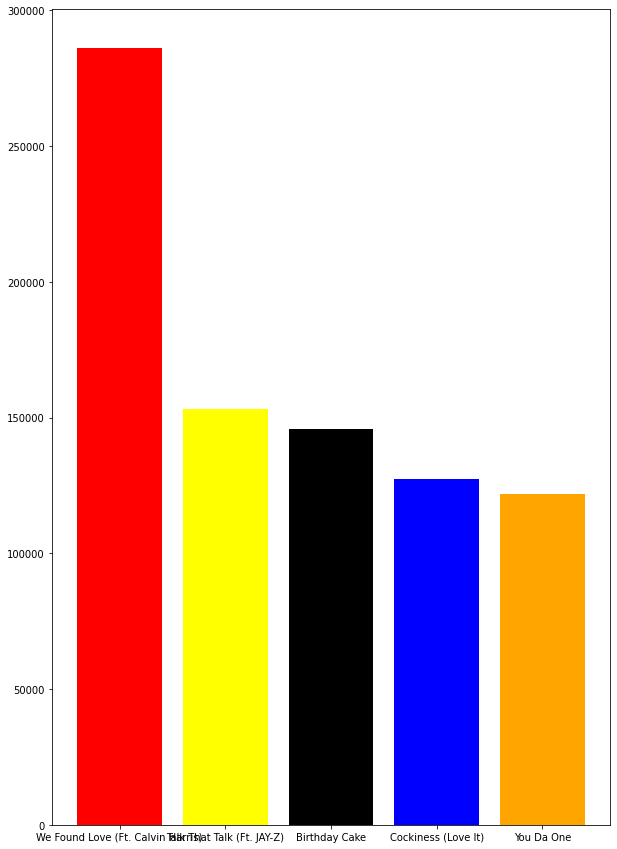
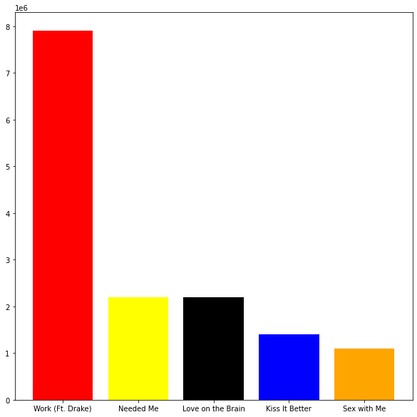

**Rihanna Lyrics Analysis**

  

**GOAL**

  
 Analysing Rihanna Lyrics with the help of python.

  

**DATASET**

https://www.kaggle.com/vivovinco/rihanna-lyrics

  

**DESCRIPTION**

  
The main aim of the project is to analysis the dataset by taking different criterias in to account.

  

**WORK DONE**

* Analyzed the dataset, analysis are as follows
* Analyzed for the most viewed albums and plotted the top 5 ones.
* Analyzed for the most viewed songs and plotted the top 5 ones
* Analyzed the year wise views and plotted the top 5 years.
* Analyzed the most viewed song year wise and plotted the top 5 viewed songs each year.

**LIBRARIES NEEDED**

* pandas
* matplotlib

  
  

## **VISUALIZATION.**
_________________________________________
## **Top 5 albums**

## **Top 5 songs**

## **Top 5 years**

## **Top 5 songs in 2005**

## **Top 5 songs in 2006**

## **Top 5 songs in 2007**

## **Top 5 songs in 2011**

## **Top 5 songs in 2016**

**CONCLUSION**

  

The dataset was analysed and the above analysis were made , which can help us to predict which songs are popular.
  

**CONTRIBUTION BY**

*Vishnu Bhaarath*

  
  
