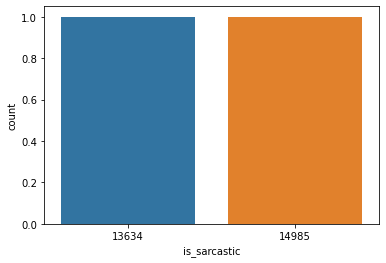
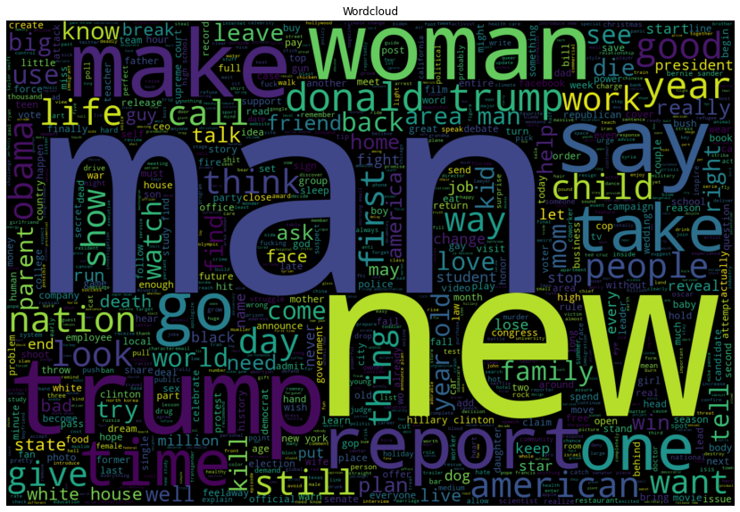
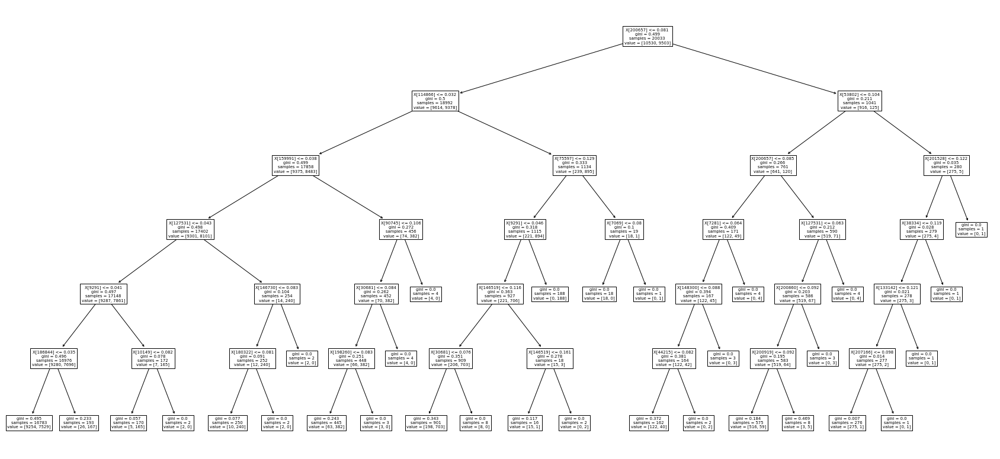
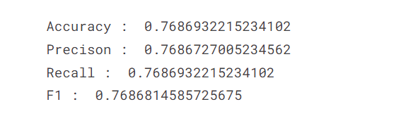

# News Sarcasm Detection 

 Create a detection model which will classify the news headlines depending on the factor of sarcasm.

**Dataset**

The Kaggle Dataset link 
[Dataset Link](https://www.kaggle.com/datasets/rmisra/news-headlines-dataset-for-sarcasm-detection)

**Libraries Used**

- Seaborn
- Matplotlib
- Numpy
- Pandas
- os
- nltk
- -wordcloud

**Dataset Visualization**

**Accuracies**

|Logistic Regression|LinearSVC|DecisionTree|Naive Bayes|
|---|---|---|---|
|||||

**Accuracies plot**

 

**Conclusion**

The conclusion is can be drawn after performing the experiment is that when the models trained they provide the following accuracies:

* Liner Regression: 0.7686932215234102
* Decision Tree: 0.5950384346610762
* Naive Bayes: 0.7866293966922898
* Linear SVC: 0.7904728627999068

Hence,we can conlcude that
Naive Bayes and Linear SVC has almost same accuracy for Sracasm Detection.
