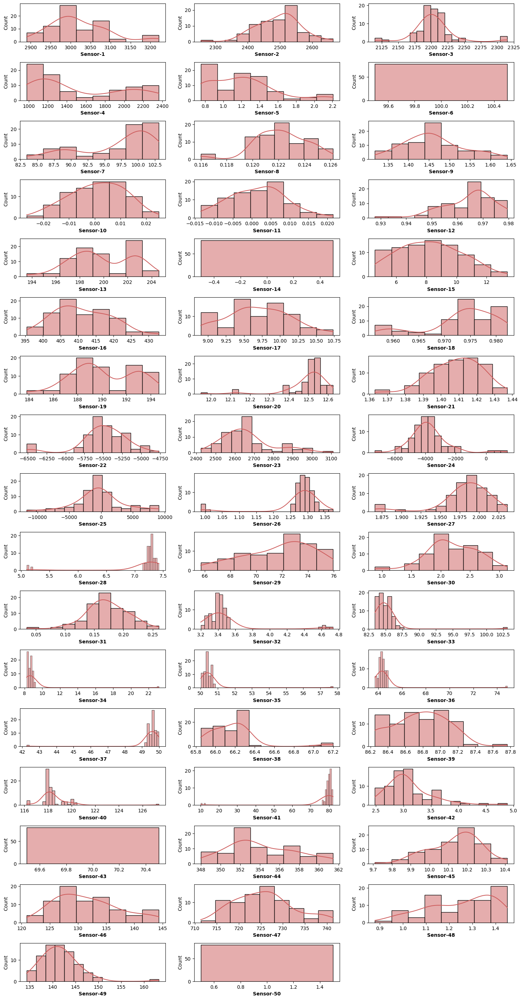

# Sensor Fault Detection

This repository contains the source code for the Sensor Fault Detection system.

## Table of Contents

- [Introduction](#introduction)
- [Features](#features)
- [App View](#app)
- [Dataset](#Dataset)
- [Visualization](#visulazation)
- [Data Preprocessing](#dataPreprocessing)
- [Installation](#installation)
- [Usage](#usage)
- [API Endpoints](#api-endpoints)
- [Contributing](#contributing)
- [License](#license)

## Introduction

The Sensor Fault Detection system is designed to monitor sensors and detect any faults. It uses advanced algorithms to ensure the accuracy and reliability of sensor data.

## Features

- Real-time sensor fault detection
- RESTful API for integrating with other systems
- Easy to deploy with Docker

## View the project


## Dataset 
 - artifacts/data.csv 
   [link](https://github.com/daemonX10/Sensor-Fault-Detection/blob/main/artifacts/data.csv)

## Visualization


 - more in NoteBooks

## Data Preprocessing
Before training the machine learning models, the dataset undergoes preprocessing to prepare it for analysis. Here's an overview of the preprocessing steps applied:

### Label Encoding and One-Hot Encoding
Categorical variables like 'Gender' are encoded using Label Encoding, converting them into numerical values. Additionally, to handle categorical variables with more than two categories, One-Hot Encoding is employed. This technique creates binary columns for each category, improving the model's ability to interpret categorical data.

### Feature Scaling
Feature scaling is crucial for machine learning algorithms, especially those based on distance calculations or gradient descent optimization. Two common scaling techniques are applied:

#### Min-Max Scaling
Min-Max scaling rescales features to a range between 0 and 1, preserving the distribution's shape while bringing all features to the same scale. This scaling is applied to features like 'Tenure' and 'NumOfProducts'.

#### Standard Scaling (Z-score Normalization)
Standard scaling transforms features to have a mean of 0 and a standard deviation of 1. It's particularly useful when features have different units or scales. Features such as 'CreditScore', 'Age', and 'Balance' are standardized using this technique.

### Final Preprocessed Dataset
After preprocessing, the dataset is ready for model training. Categorical variables are encoded, and numerical features are scaled to ensure all features contribute equally to model training. The preprocessed dataset is now suitable for feeding into machine learning algorithms for churn prediction.

## Model
The model employs several algorithms commonly used in binary classification tasks. Here's a brief overview of the algorithms utilized and their rationale:

### Logistic Regression
Logistic Regression is a simple yet powerful algorithm for binary classification. It's chosen for its interpretability, ease of implementation, and ability to provide probabilities for predictions. Despite its simplicity, Logistic Regression can capture linear relationships between features and the target variable.

### Random Forest
Random Forest is an ensemble learning technique that constructs multiple decision trees during training and outputs the mode of the classes (classification) or the mean prediction (regression) of the individual trees. It's known for its robustness to overfitting, handling of high-dimensional datasets, and feature importance estimation.

### Decision Tree
Decision Tree is a non-parametric supervised learning method used for classification and regression. It works by recursively partitioning the input space into regions based on feature values, with the goal of maximizing the homogeneity of the target variable within each region. Decision Trees are easy to interpret and visualize, making them valuable for understanding feature importance.

### Gradient Boosting
Gradient Boosting is an ensemble learning technique that builds models sequentially, with each new model correcting errors made by the previous ones. It combines weak learners (usually decision trees) to create a strong learner. Gradient Boosting is effective in capturing complex relationships in the data and has been successful in various machine learning competitions.

### AdaBoost
AdaBoost (Adaptive Boosting) is another ensemble learning method that combines multiple weak learners to form a strong classifier. It assigns higher weights to misclassified data points in each iteration, allowing subsequent weak learners to focus on the difficult examples. AdaBoost is particularly useful when dealing with imbalanced datasets and noisy data.

These algorithms are chosen for their complementary strengths in handling different aspects of the dataset and their proven effectiveness in classification tasks. By employing a diverse set of algorithms, we aim to build a robust model capable of accurately predicting customer churn and providing valuable insights for retention strategies.
### XGBoost

XGBoost (Extreme Gradient Boosting) is an optimized distributed gradient boosting library designed to be highly efficient, flexible, and portable. It implements machine learning algorithms under the Gradient Boosting framework. XGBoost provides a parallel tree boosting (also known as GBDT, GBM) that solves many data science problems in a fast and accurate way.

## Installation

1. **Clone the Repository:**
   ```sh
   git clone https://github.com/daemonX10/Sensor-Fault-Detection.git
   cd Sensor-Fault-Detection
   ```

2. **Install Dependencies:**
   ```sh
   pip install -r requirements.txt
   ```

3. **Run the Application:**
   ```sh
   python app.py
   ```

## Usage

The application provides a RESTful API to interact with the sensor fault detection system. Once the application is running, you can access the API endpoints at `http://127.0.0.1:5000`.

## API Endpoints

### Get System Status

- **URL:** `/status`
- **Method:** `GET`
- **Description:** Returns the status of the sensor fault detection system.
- **Response:**
  ```json
  {
      "status": {
          "system": "operational",
          "faults_detected": false
      }
  }
  ```

### Credit : Damodar Yadav (damodarryadav@gmail.com) @daemonX10

## Contributing

Contributions are welcome! Please follow these steps to contribute:

1. Fork the repository
2. Create a new branch (`git checkout -b feature-branch`)
3. Make your changes
4. Commit your changes (`git commit -am 'Add new feature'`)
5. Push to the branch (`git push origin feature-branch`)
6. Create a new Pull Request

## License

This project is licensed under the MIT License - see the [LICENSE](LICENSE) file for details.


