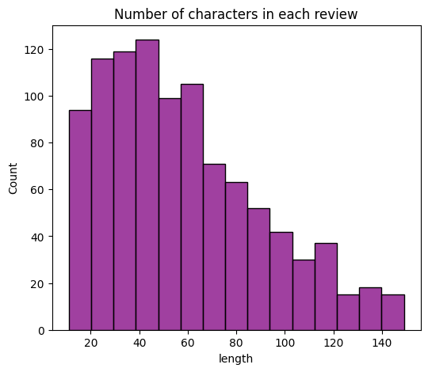
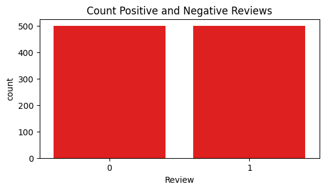
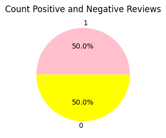
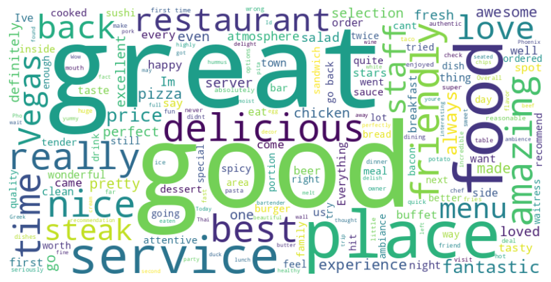
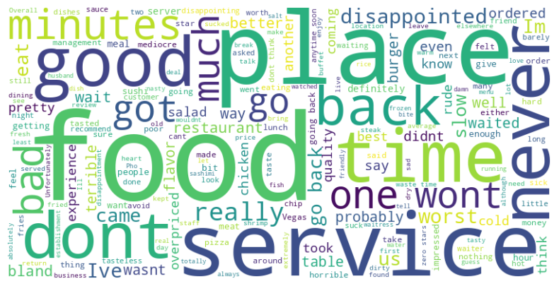

<h1>Sentiment Analysis for Restaurant Reviews (NLP)</h1>

**GOAL**

To build a machine learning model for predicting the Sentiments of Customer based on their review on a Restaurant.

**DATASET**

[https://www.kaggle.com/datasets/d4rklucif3r/restaurant-reviews]

**DESCRIPTION**

This Dataset contains two COLUMNS Customer Reviews and Liked. It has 1000 rows/entries.
Customer reviews tells us about the reviews given by the customers for a food in restaurant and liked column tells about whether they liked the food or not.

### Visualization and EDA of different attributes:

**Positive Review WordCloud**

**Negative Review WordCloud**

**MODELS USED**

| Model                     | accuracy_train(%) | precision_train(%) | accuracy_test(%)  | precision_test(%)   |
|---------------------------|-------------------|--------------------|-------------------|---------------------|
|SVM		                    |97.57          	  |94.25	             |92.86	             |85.5                 |
|Logistic Regression	      |93.51	            |90.38	             |88.66	             |87.0                 |
|Random Forest	            |91.84	            |80.88	             |87.18	             |78.5                 |
|Decision Tree	            |99.22	            |97.50	             |79.09	             |81.5                 |
|Guassian Naive Bayes	      |69.61	            |77.88	             |68.61	             |75.0                 |

**WHAT I HAD DONE**

* Load the dataset which is CSV format.
* It has 1000 entries(Rows), 2 columns.
* Checked for missing values and cleaned the data accordingly.
* Analyzed the data, found insights and visualized them accordingly.
* Found detailed insights of different columns with target variable using plotting libraries.
* Train the datasets by different models and saves their accuracies into a dataframe.

**LIBRARIES NEEDED**

1. Pandas
2. Matplotlib
3. Sklearn
4. NumPy
5. nltk
6. Seaborn
7. wordcloud

**CONCLUSION**

- ML Model predicts sentiments are positive or negative too correctly even if negation words such as not, no, nay are present in our review. Generally negation words opposes positive condition, so considering them is important in order to train our model correctly. Hence I didn't remove negation stopwords.
- We got highest testing accuracy using SVM algorithm which is around 93%
- We got good accuracy for other algorithms also

**YOUR NAME**

*Ghousiya Begum*

  
