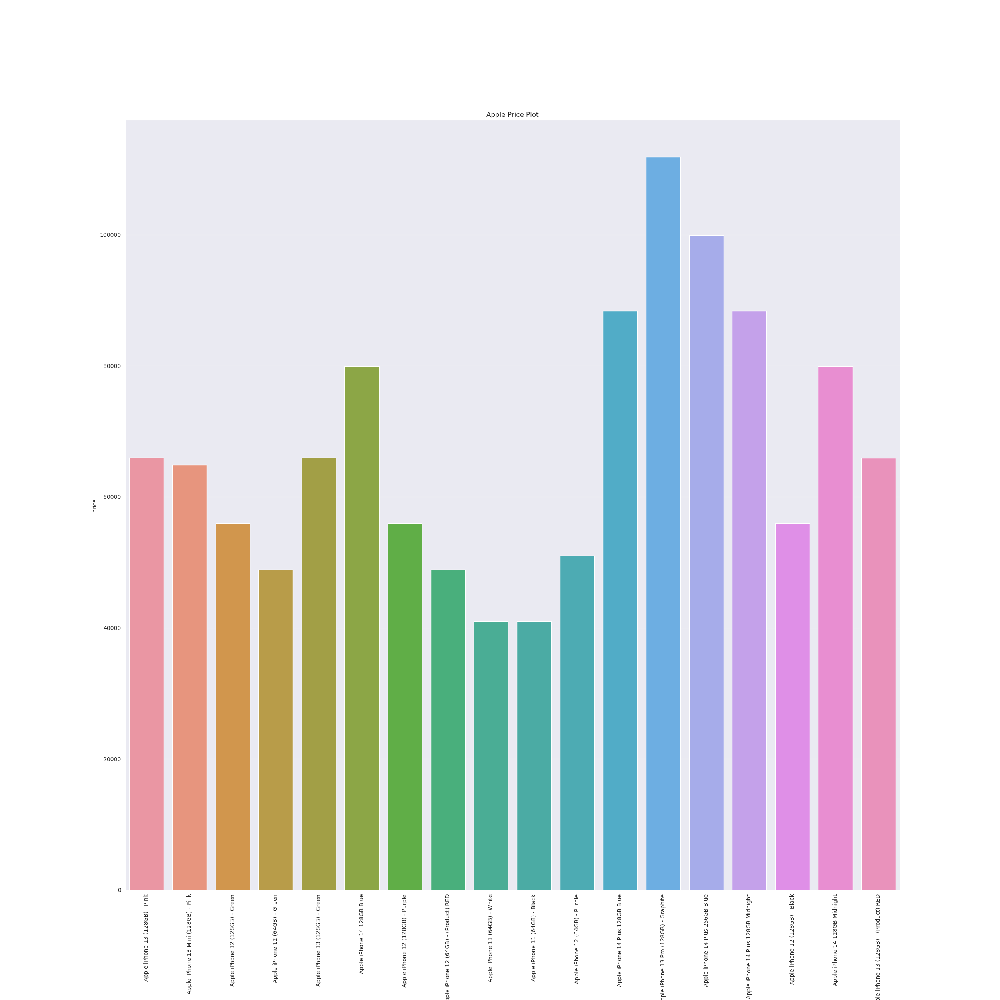
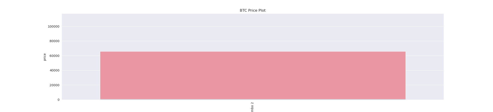
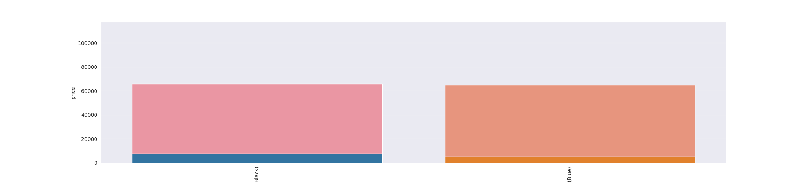
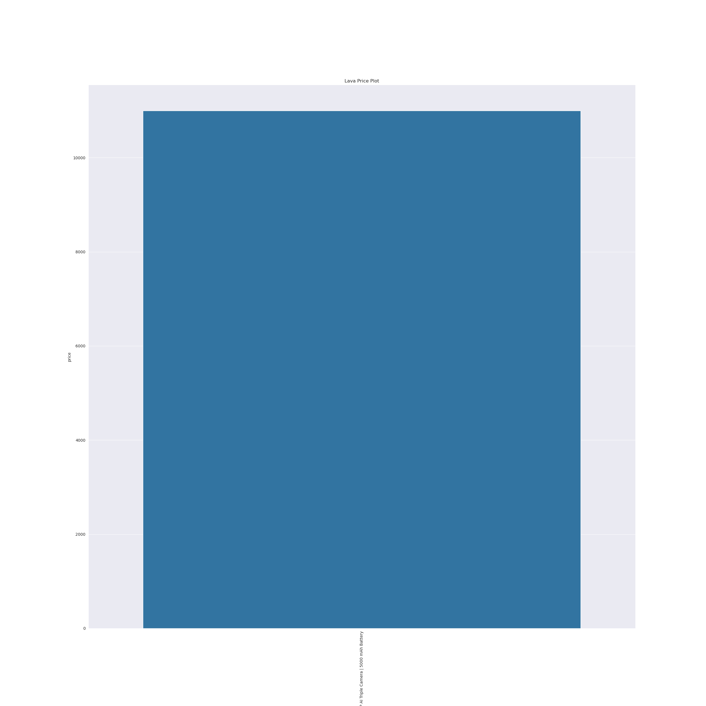
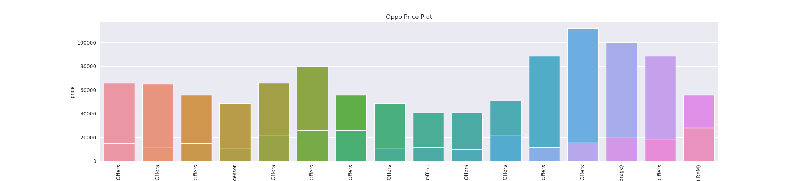
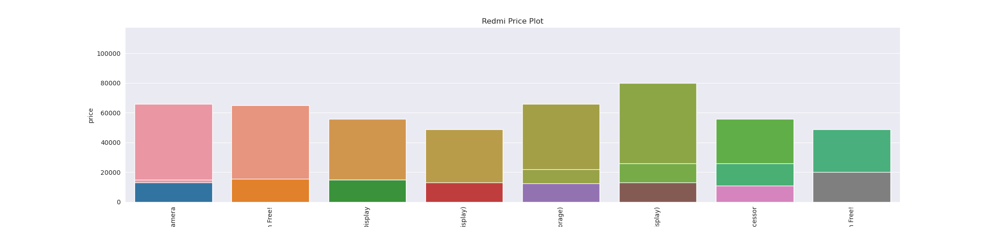
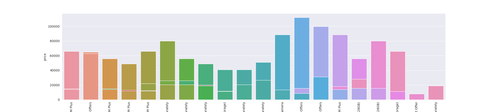
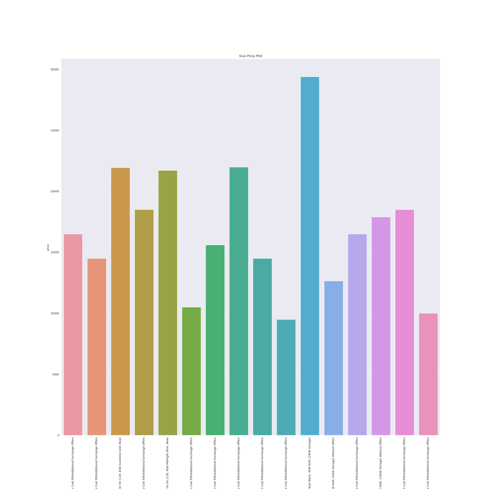

# **Smartphone Brand Analysis**

### **AIM**
Perform exploratory data analysis and Predictive Analysis on the power consumption dataset and analysethe price and rating of various smartphone brand models listed on amazon.

### **DATASET:**
https://www.kaggle.com/datasets/shreyamishra0307/top-5-mobile-brands-amazon-dataset

### DESCRIPTION

The project is a collection of all the possible statistical applications and metrics to derieve useful insights and properly visualize the use of price factors of the various mobile brands. Also perform a predictive analysis on the same using month as a parameter of prediction. Below are the actions performed on the dataset.

### **Steps taken**:
+ Importing all the required libraries
+ Understanding the dataset by viewing top 5 rows and viewing table statistical metrics like mean, count, std using `describe().T`
+ Getting the shape of the dataset.
+ **Data pre-processing**:
    - Changing the column names to lower case.
    -Filling null values as `0` in rating column.
    - Dropping the `url` column as it is not necessary for EDA.
    - Converting categorical rating column data into numerical `dtype=float32`
    - Converting categorical reviewcount column into numerical(removing `commas` )
    - Creating a new column `brand` which groups all the different brands' models under single brand name.
    - Rearranging the columns in clean order.

+ Performed Visualisations using `seaborn`:
    * Correlation heatmap
    * count plot
    * bar plot 

### **CONCLUSION**

From this dataset, we can draw inferences that Samsung has largest variety of models in Amazon website

Most smartphone models(140-160) are priced in the range: `13999-15499`

Most smartphone models(350-400) are rated in the range: `4.0-4.1`

Redmi brand has most total number of reviews: `657691400`

Apple brand has a very high average smartphone price: `Rs. 67222` while BTC has the least: `Rs.760.00`.

LAVA has highest average rating = `5.0`

Prices of brands other than apple fall in the range: `Rs.10000-40000`

More the rating, more the price(from the postive correlation values in the heatmap).

The price charts of each brand can be seen below:
<pre><h3>Price Chart of Apple brand models               Price Chart of BTC brand models</h3>

Costliest: Apple Iphone 13 Pro(128GB)- Graphite             Costliest: NIL
Cheapest: Apple Iphone 11(64GB)- Black                      Cheapest: NIL
</pre>
 
<pre><h3>Price Chart of IKALL brand models               Price Chart of Lava brand models</h3>

Costliest: Ikall Z20 Smartphone                             Costliest: NIL
Cheapest: Ikall Z9 Smartphone                               Cheapest: NIL
</pre>
 
<pre><h3>Price Chart Oppo brand models                   Price Chart of Redmi brand models</h3>

Costliest: Oppo Reno8 (8GB, 128GB)                          Costliest: Redmi Note11 Pro + 5G
Cheapest: Oppo A15s (Rainbow Silver, 4GBRAM, 64GB)          Cheapest: Redmi 9 (4GB RAM, 64GB)
</pre>
 
<pre><h3>Price Chart of Samsung brand models             Price Chart of Vivo brand models</h3>

Costliest: Samsung Galaxy S22                               Costliest: Vivo V23 5G
Cheapest: Samsung Galaxy A03 Core                           Cheapest: Vivo Y15s Mystic Blue
</pre>
 
<pre><h3>Price Chart of Xiaomi brand models</h3>

Costliest: Xiaomi 12 Pro (12GB RAM, 256GB)
Cheapest: (Renewed)Mi Redmi Note 6 Pro
</pre>

## **Contributed by:**
*Adithya Awati* 

