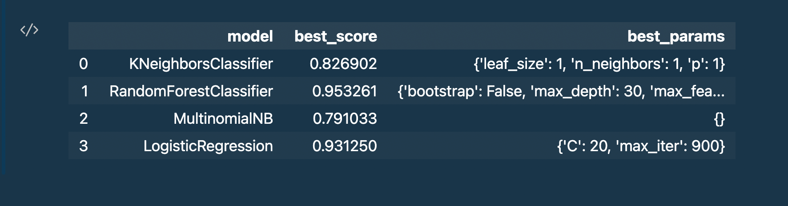

**Spam Email Detection**

**GOAL**

To build a model that can identify your emails as spam or non-spam

**DATASET**

https://archive.ics.uci.edu/ml/datasets/Spambase

**DESCRIPTION**

In this project we aim to find the most accurate algorithm which correctly categorizes our emails as spam or non-spam. \
For this project we'll be using the *spambase dataset*. This dataset has about 4.6K rows and the each row contains numerical information regarding the email. So there is no need for us to process the data. \

**WHAT I HAD DONE**
1. Load the dataset
2. Analyse the dataset
<u>Since there is no need for data processing</u>
3. Train/Test Split 
4. Selecting A Model
5. Generating Predictions
(Optional, recommended)
6. Save the model

**LIBRARIES NEEDED**

- Numpy 
- pandas
- sklearn

**Model Used and Their ACCURACIES**   

  

**CONCLUSION**

As we can see that the KMeansClustering algorithm has the highest accuracy of ~95%, and logistic regression also has has a pretty high accuracy, despite it's simplicity it's a very effective model and this why in many of the classification problems the first approach is always Logistic regression.   

**CONTRIBUTION BY**  

*Yagyesh Bobde*  

  
 

