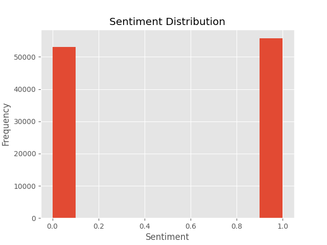
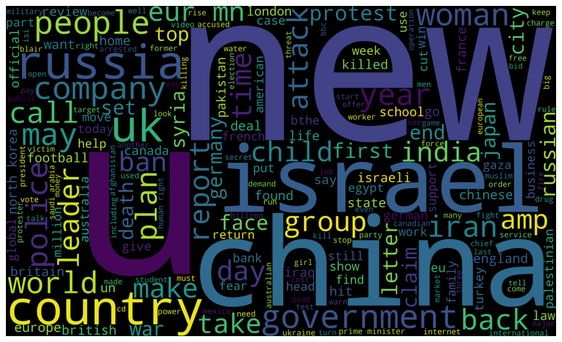
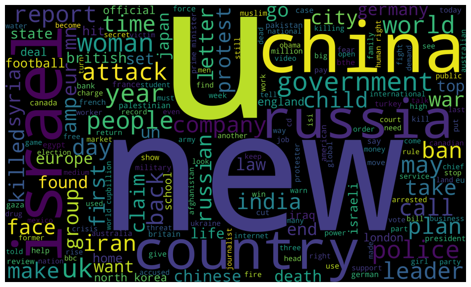

# Stock News Sentiment Analysis

**PROJECT TITLE**

**GOAL**

The goal is to perform sentiment analysis on stock market news. It is a binary classification problem, where 
- label==1 signifies positive sentiment, and, 
- label==0 signifies neutral or negative sentiment.

**DATASET**

https://www.kaggle.com/datasets/avisheksood/stock-news-sentiment-analysismassive-dataset

**DESCRIPTION**

**WHAT HAVE I DONE**

- Removed stopwords, punctuations, made text lowercase, and lemmatized text to base form.
- Made WordClouds for:
    - The entire dataset
    - Words featured in positive sentiments
    - Words featured in negative sentiments
- Vectorized text using TF-IDF vectorizer
- Applied classification on a dataset with:
    - Parameter: TF-IDF vectors
    - Label: Encoded sentiment

**MODELS USED**

Classification algorithms like:
- Logistic regression
- Naive-Bayes classifier
- SVM classifier
- Random Forest Regressor

**LIBRARIES NEEDED**

- numpy
- pandas
- matplotlib
- nltk
- textblob
- wordcloud
- sklearn
- tensorflow

**VISUALIZATION**
- Sentiment distribution (1 and 0)

- WordCloud for overall dataset

- WordCloud for negative sentiment text only

- WordCloud for positive sentiment text only

**ACCURACIES**

Ranking models based on accuracy:

- Naive-Bayes: 54.42%
- SVM: 53.67%
- Random Forest Classifier: 53.86%
- Logistic Regression: 53.17%

**CONCLUSION**

All used models give a similar performance while using TF-IDF vectorization. 

**YOUR NAME**

- Name:       Shobhit Bandhu
- College:    JU B.Prod '27
- LinkedIn:   https://www.linkedin.com/in/shobhit-bandhu/