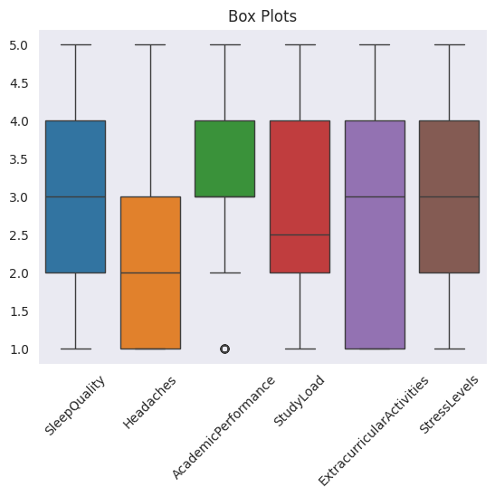
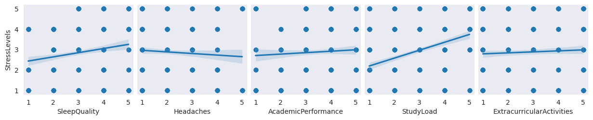
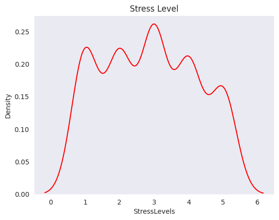

## Student Stress Levels Detection

### 🎯 **Goal**

To understand the influence of the headache, study load, academic performance etc on students stress level.

### 🧵 **Dataset**

https://www.kaggle.com/datasets/samyakb/student-stress-factors/data

### 🧾 **Description**

By using Data Analysis, Data Visualization and then applying various Regression Algorithms from Machine Learning to predict a students stress level.

### 🧮 **What I had done!**

1. Checked the shape of dataset, types of columns and basic statistics
2. Then checked the histplots and boxplot of all the features
3. Then checked distribution of stress level
4. Then checked reg plots of other features with stress level
5. Then checked pair plots and correlation heatmap of all the features
6. Then divided the dataset into features and target and normalised features and splitted dataset into training and testing sets
7. Then trained on each model and checked the MAE and R2 on testing dataset
8. Then selected Decision Tree Regressor and did hyper parameter tuning on that and got the best model and saved it.

### 🚀 **Models Implemented**

- Linear Regression
- Decision Tree
- Random Forest
- Gradient Boosting
- Support Vector Regressor
- XGBoost Regressor

### 📚 **Libraries Needed**

- matplotlib
- seaborn
- numpy
- pandas
- scikit_learn
- xgboost

### 📊 **Exploratory Data Analysis Results**

### 📈 **Performance of the Models based on the Accuracy Scores**

| Model                   | R^2 Score | MAE  |
|-------------------------|-----------|------|
| Linear Regression       | 0.23      | 1.01 |
| Decision Tree           | 0.91      | 0.13 |
| Random Forest           | 0.90      | 0.18 |
| Gradient Boosting       | 0.74      | 0.55 |
| Support Vector Regressor| 0.60      | 0.60 |
| XGBoost Regressor       | 0.91      | 0.13 |

### 📢 **Conclusion**

Both Decision Tree and XGBoost have similar performance in terms of R^2 score and MAE.
Selecting **Decision Tree Regressor** as its easier to interpret as you can visualize the tree and understand the decision-making process.

### ✒️ **Your Signature**

K Om Senapati  

