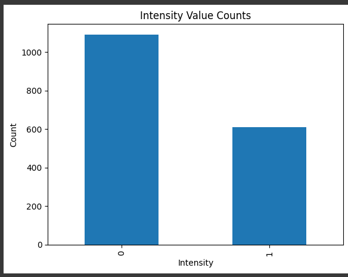
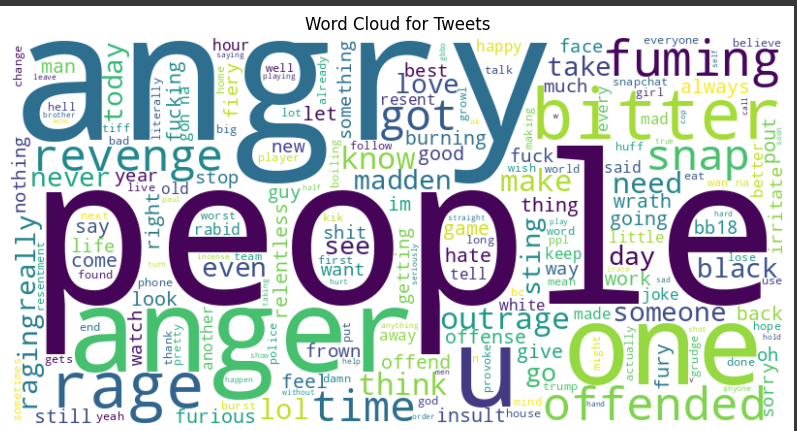

# TOXIC COMMENT ANALYSIS

## GOAL
Develop a machine learning model to tell whether a comment is toxic or not

## DATASET
Explore https://www.kaggle.com/datasets/devkhant24/toxic-comment

## MODELS USED
- Naive Bayes
- Random Forest
- Catboost
- Decision Tree
- Bidirectional LSTM
- RNN
- Logistic Regression

## LIBRARIES
- Pandas
- Numpy
- TensorFlow
- Seaborn
- Matplotlib
- Scikit-Learn
- OS
- Re
- Math
- Beautiful Soup
- NLTK
- Spacy

## IMPLEMENTATION
1. Loaded Dataset
2. Converted into standard csv file and renamed columns for ease.
3. Implemented cleaning and preprocessing to remove any emojis,symbols,links,etc
4. Classified toxic comment on the basis if intensity of angered comment > 0.55 then its toxic.
5. Implement tokenization for sequence conversion.
6. Trained models with various algorithms.

## Models and Accuracies

| Model             | Accuracy   | 
| ----------------- |:----------:| 
| Naive Bayes       | 0.77       |                    
| Random Forest     | 0.76       |                    
| Catboost          | 0.74       |                    
| Logistic Regression| 0.77      | 
| Decision Tree      | 0.73      |
| RNN                | 0.69      |
| Bidirectional LSTM | 0.68      |

**VISUALISATION**

**CONCLUSION**

Naive Bayes and Logistic Regression Model have the best accuracy in detecting toxicity of a comment

**NAME**

Keshav Arora
